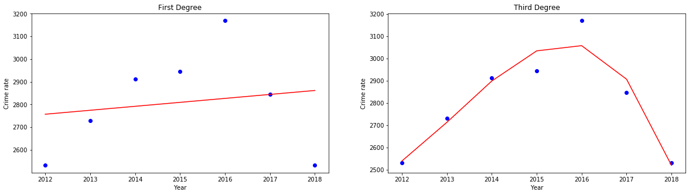

```python
import numpy as np # library to handle data in a vectorized manner
import pandas as pd # library for data analsysis
pd.set_option('display.max_columns', None)
pd.set_option('display.max_rows', None)

# sciKit libraries
from sklearn import preprocessing
from sklearn.model_selection import train_test_split
from sklearn.neighbors import KNeighborsClassifier
from sklearn import metrics
from sklearn.model_selection import KFold, cross_val_score
# import k-means from clustering stage
from sklearn.cluster import KMeans

# import regression
from sklearn.preprocessing import PolynomialFeatures
from sklearn import linear_model

# Matplotlib and associated plotting modules
import matplotlib.cm as cm
import matplotlib.colors as colors
import matplotlib.pyplot as plt
import pylab as pl
from matplotlib.ticker import NullFormatter
import matplotlib.ticker as ticker

%matplotlib inline
#!conda install -c conda-forge folium=0.5.0 --yes # uncomment this line
import folium # map rendering library

```


```python
# read crime data
cw_data=pd.read_pickle('cw_data.pkl')
cw_data.sort_values(by=['Neighborhood'],inplace=True)
cw_data.head(3)
```


<div>
<style scoped>
    .dataframe tbody tr th:only-of-type {
        vertical-align: middle;
    }

    .dataframe tbody tr th {
        vertical-align: top;
    }

    .dataframe thead th {
        text-align: right;
    }
</style>
<table border="1" class="dataframe">
  <thead>
    <tr style="text-align: right;">
      <th></th>
      <th>Latitude</th>
      <th>Longitude</th>
      <th>Borough</th>
      <th>Neighborhood</th>
    </tr>
  </thead>
  <tbody>
    <tr>
      <th>14</th>
      <td>52.48547</td>
      <td>13.31476</td>
      <td>Charlottenburg-Wilmersdorf</td>
      <td>Barstraße</td>
    </tr>
    <tr>
      <th>0</th>
      <td>52.53045</td>
      <td>13.29610</td>
      <td>Charlottenburg-Wilmersdorf</td>
      <td>Charlottenburg-Nord</td>
    </tr>
    <tr>
      <th>13</th>
      <td>52.49644</td>
      <td>13.31653</td>
      <td>Charlottenburg-Wilmersdorf</td>
      <td>Düsseldorfer Straße</td>
    </tr>
  </tbody>
</table>
</div>


```python
# load rental data
sr_data=pd.read_pickle("rentals_cw.pkl")
sr_data.head(3)
```


<div>
<style scoped>
    .dataframe tbody tr th:only-of-type {
        vertical-align: middle;
    }

    .dataframe tbody tr th {
        vertical-align: top;
    }

    .dataframe thead th {
        text-align: right;
    }
</style>
<table border="1" class="dataframe">
  <thead>
    <tr style="text-align: right;">
      <th></th>
      <th>Neighborhood</th>
      <th>Rental costs</th>
      <th>Borough</th>
      <th>Postcode</th>
      <th>Longitude</th>
      <th>Latitude</th>
    </tr>
  </thead>
  <tbody>
    <tr>
      <th>0</th>
      <td>Charlottenburg</td>
      <td>15.61</td>
      <td>Charlottenburg-Wilmersdorf</td>
      <td>10585</td>
      <td>13.30767</td>
      <td>52.516531</td>
    </tr>
    <tr>
      <th>1</th>
      <td>Grunewald</td>
      <td>16.53</td>
      <td>Charlottenburg-Wilmersdorf</td>
      <td>10711</td>
      <td>13.26580</td>
      <td>52.483379</td>
    </tr>
    <tr>
      <th>2</th>
      <td>Halensee</td>
      <td>14.94</td>
      <td>Charlottenburg-Wilmersdorf</td>
      <td>10709</td>
      <td>13.29569</td>
      <td>52.495972</td>
    </tr>
  </tbody>
</table>
</div>


```python
# load school data
sc_data=pd.read_pickle("schools_cw.pkl")
sc_data.head(3)
```


<div>
<style scoped>
    .dataframe tbody tr th:only-of-type {
        vertical-align: middle;
    }

    .dataframe tbody tr th {
        vertical-align: top;
    }

    .dataframe thead th {
        text-align: right;
    }
</style>
<table border="1" class="dataframe">
  <thead>
    <tr style="text-align: right;">
      <th></th>
      <th>Postcode</th>
      <th>Grade</th>
      <th>Borough</th>
      <th>Neighborhood</th>
      <th>Longitude</th>
      <th>Latitude</th>
    </tr>
  </thead>
  <tbody>
    <tr>
      <th>0</th>
      <td>10589</td>
      <td>2.75</td>
      <td>Charlottenburg-Wilmersdorf</td>
      <td>Charlottenburg-Nord</td>
      <td>13.308494</td>
      <td>52.529399</td>
    </tr>
    <tr>
      <th>1</th>
      <td>14193</td>
      <td>2.28</td>
      <td>Charlottenburg-Wilmersdorf</td>
      <td>Schmargendorf</td>
      <td>13.290050</td>
      <td>52.475800</td>
    </tr>
    <tr>
      <th>2</th>
      <td>14193</td>
      <td>2.51</td>
      <td>Charlottenburg-Wilmersdorf</td>
      <td>Schmargendorf</td>
      <td>13.290050</td>
      <td>52.475800</td>
    </tr>
  </tbody>
</table>
</div>


#### Create a column based on the distance to a school


```python
from math import sin, cos, sqrt, atan2, radians

def calculate_distance(x1, y1, x2, y2): # calculate distance from the schools to each Neighborhood
    lat1 = radians(x1)
    lon1 = radians(y1)
    lat2 = radians(x2)
    lon2 = radians(y2)

    # approximate radius of earth in km 
    R = 6373.0
    dlon = lon2 - lon1
    dlat = lat2 - lat1
    a = sin(dlat / 2)**2 + cos(lat1) * cos(lat2) * sin(dlon / 2)**2
    c = 2 * atan2(sqrt(a), sqrt(1 - a))
    distance = R * c

    return distance

```


```python
# calculate distances to schools for every neighborhood, then threshold based on the distance radius
mySchools=[]
x1=52.529399 # school one
y1=13.308494
x2=52.475800 # school two 
y2=13.290050
for lan,lat in zip(cw_data['Longitude'],cw_data['Latitude']):
    dist1=calculate_distance(lat, lan, x1, y1)
    dist2=calculate_distance(lat, lan, x2, y2)
    dist=min(dist1,dist2)
    mySchools.append(dist)
print(mySchools)
```

    [1.9896928028352823, 0.8467650291555382, 2.91334726755236, 1.8465127920050264, 1.8465127920050264, 2.275798279008654, 3.7664224980112344, 2.6095855612969836, 3.168187038812842, 0.48484618779382094, 3.0585701402674372, 1.4714438690213099, 1.783108688730541, 0.0, 2.5532776394501933, 3.607090946702519, 1.3725503013513376]


```python
# determine the max distamce to a school
maxDist=1.5
weightedSchools=[ 0 if x >= maxDist else 1 for x in mySchools]
print(weightedSchools)
```

    [0, 1, 0, 0, 0, 0, 0, 0, 0, 1, 0, 1, 0, 1, 0, 0, 1]


#### Create a column based on the average rental costs using kNN method


```python
X = sr_data[['Longitude','Latitude']] .values  #.astype(float)
X[0:5]
```


    array([[13.30766996, 52.51653136],
           [13.2658    , 52.483379  ],
           [13.29569   , 52.495972  ],
           [13.29005   , 52.4758    ],
           [13.25981   , 52.516201  ]])


```python
# contineous 
yc = sr_data['Rental costs'].values
# discrete
y=np.arange(1,7,1)
print(yc,y)
```

    [15.61 16.53 14.94 14.34 13.2  14.71] [1 2 3 4 5 6]


```python
X = preprocessing.StandardScaler().fit(X).transform(X.astype(float))
X[0:5]
```


    array([[ 0.82801329,  1.32551494],
           [-1.12278568, -0.729144  ],
           [ 0.2698448 ,  0.05132298],
           [ 0.00706675, -1.19886205],
           [-1.40187088,  1.30504066]])


```python
# Training model: no evaluation due to the limited amount of data
k = 3 
neigh = KNeighborsClassifier(n_neighbors = k).fit(X,y)
neigh
```


    KNeighborsClassifier(algorithm='auto', leaf_size=30, metric='minkowski',
               metric_params=None, n_jobs=None, n_neighbors=3, p=2,
               weights='uniform')


```python
# Predict missing rental costs
X_test = cw_data[['Longitude','Latitude']] .values
X_test = preprocessing.StandardScaler().fit(X_test).transform(X_test.astype(float))
yhat = neigh.predict(X_test)
yhat[0:5]
```


    array([3, 1, 3, 2, 2])


```python
weightedRents=yhat/6
```

#### Prediction of the crime in the corresponding neighborhood


```python
# load crime years data to use in the predictions
pred_data=pd.read_pickle("crimeprediction_cw.pkl")
pred_data.sort_index(axis=0,inplace=True)
pred_data = pred_data.replace(' ','', regex=True)
pred_data=pred_data.astype(float)
pred_data.head()
```


<div>
<style scoped>
    .dataframe tbody tr th:only-of-type {
        vertical-align: middle;
    }

    .dataframe tbody tr th {
        vertical-align: top;
    }

    .dataframe thead th {
        text-align: right;
    }
</style>
<table border="1" class="dataframe">
  <thead>
    <tr style="text-align: right;">
      <th></th>
      <th>Year 2012</th>
      <th>Year 2013</th>
      <th>Year 2014</th>
      <th>Year 2015</th>
      <th>Year 2016</th>
      <th>Year 2017</th>
      <th>Year 2018</th>
    </tr>
    <tr>
      <th>Neighborhood</th>
      <th></th>
      <th></th>
      <th></th>
      <th></th>
      <th></th>
      <th></th>
      <th></th>
    </tr>
  </thead>
  <tbody>
    <tr>
      <th>Barstraße</th>
      <td>1634.0</td>
      <td>1726.0</td>
      <td>1696.0</td>
      <td>1732.0</td>
      <td>1604.0</td>
      <td>1596.0</td>
      <td>1634.0</td>
    </tr>
    <tr>
      <th>Charlottenburg-Nord</th>
      <td>2532.0</td>
      <td>2730.0</td>
      <td>2913.0</td>
      <td>2945.0</td>
      <td>3169.0</td>
      <td>2846.0</td>
      <td>2532.0</td>
    </tr>
    <tr>
      <th>Düsseldorfer Straße</th>
      <td>4094.0</td>
      <td>3855.0</td>
      <td>4059.0</td>
      <td>4483.0</td>
      <td>3961.0</td>
      <td>3940.0</td>
      <td>4094.0</td>
    </tr>
    <tr>
      <th>Forst Grunewald</th>
      <td>105.0</td>
      <td>147.0</td>
      <td>92.0</td>
      <td>108.0</td>
      <td>131.0</td>
      <td>72.0</td>
      <td>105.0</td>
    </tr>
    <tr>
      <th>Grunewald</th>
      <td>1754.0</td>
      <td>1667.0</td>
      <td>1652.0</td>
      <td>1679.0</td>
      <td>1630.0</td>
      <td>1675.0</td>
      <td>1754.0</td>
    </tr>
  </tbody>
</table>
</div>


```python
# apply polynomial regression
X=np.arange(2012,2019,1.0)
X=np.expand_dims(X, axis=1)
train_y =  np.asanyarray(pred_data.loc['Charlottenburg-Nord'].to_list())
```


```python
# model one degree
poly1 = PolynomialFeatures(degree=1)
train_x_poly1 = poly1.fit_transform(X)
clf1 = linear_model.LinearRegression()
train_y_ = clf1.fit(train_x_poly1, train_y)
# The coefficients
print ('Coefficients: ', clf1.coef_)
print ('Intercept: ',clf1.intercept_)
```

    Coefficients:  [ 0.         17.42857143]
    Intercept:  -32308.999999999993


```python
# model 3 degree
poly3 = PolynomialFeatures(degree=3)
train_x_poly3 = poly3.fit_transform(X)
clf3 = linear_model.LinearRegression()
train_y_ = clf3.fit(train_x_poly3, train_y)
# The coefficients
print ('Coefficients: ', clf3.coef_)
print ('Intercept: ',clf3.intercept_)
```

    Coefficients:  [ 0.00000000e+00 -1.25610343e+08  6.23937121e+04 -1.03308091e+01]
    Intercept:  84292333054.34557


```python
yy1 = clf1.intercept_ + clf1.coef_[1]*X
yy3 = clf3.intercept_ + clf3.coef_[1]*X + clf3.coef_[2]*np.power(X, 2) + clf3.coef_[3]*np.power(X, 3)
```


```python
fig, (ax1, ax2) = plt.subplots(1, 2, figsize=(20,5))
ax1.scatter( X,train_y, color='blue')
ax1.plot(X, yy1, '-r' )
ax1.set(xlabel="Year", ylabel="Crime rate")
ax1.title.set_text('First Degree')

ax2.scatter( X,train_y, color='blue')
ax2.plot(X, yy3, '-r' )
ax2.set(xlabel="Year", ylabel="Crime rate") #,fontsize = 20.0)
ax2.title.set_text('Third Degree')
#ax2.xaxis.set_tick_params(labelsize=20)
#Axis.set_label_text(self, label, fontdict=None)
```





```python
nname=pred_data.index.values.tolist()
#pred_data.reset_index(drop=False, inplace=False)
len(nname)
```


    17


```python
# The better fit is provided by a polinomial of the third degree. However, a trend is better to see by linear regression
train_x=X
myCoeff=[]
for name in nname:
    clf = linear_model.LinearRegression()
    train_y =  np.asanyarray(pred_data.loc[name].to_list())
    train_y_ = clf.fit(train_x, train_y)
    myCoeff.append(clf.coef_[0])
print(nname, myCoeff)
```

    ['Barstraße', 'Charlottenburg-Nord', 'Düsseldorfer Straße', 'Forst Grunewald', 'Grunewald', 'Halensee', 'Heerstrasse', 'Kantstraße', 'Kurfürstendamm', 'Mierendorffplatz', 'Neue Kantstraße', 'Otto-Suhr-Allee', 'Schloß Charlottenburg', 'Schmargendorf', 'Volkspark Wilmersdorf', 'Westend', 'Wiesbadener Straße'] [-12.57142857142857, 17.428571428571438, 2.57142857142857, -3.964285714285714, -0.21428571428571508, -19.64285714285714, -4.2857142857142865, -43.857142857142875, -110.32142857142856, 15.64285714285714, 21.678571428571423, -2.5000000000000093, 0.678571428571427, -14.678571428571429, 271.25, 40.21428571428571, -5.82142857142857]


```python
# we wonna have either a negative coef or one with a small positive slope
weightedCrimes=[ 1 if x >= 4 else 0 for x in myCoeff]
weightedCrimes
```


    [0, 1, 0, 0, 0, 0, 0, 0, 0, 1, 1, 0, 0, 0, 1, 1, 0]


```python
# create one more column based on the total crime rite
def color(elev): 
    if elev in range(0,2000): 
        col = 0
    elif elev in range(2001,3999): 
        col = 1
    elif elev in range(4000,5999): 
        col = 2
    else: 
        col=  3
    return col

weightedRates=[color(x) for x in pred_data['Year 2018'].to_list()]
print(weightedRates)
```

    [0, 1, 2, 0, 0, 1, 0, 2, 3, 0, 1, 2, 1, 0, 3, 1, 0]


#### Explore Neighborhoods in CW: Segmenting


```python
cw_venues=pd.read_pickle('cw_venues.pkl')
cw_venues.head()
```


<div>
<style scoped>
    .dataframe tbody tr th:only-of-type {
        vertical-align: middle;
    }

    .dataframe tbody tr th {
        vertical-align: top;
    }

    .dataframe thead th {
        text-align: right;
    }
</style>
<table border="1" class="dataframe">
  <thead>
    <tr style="text-align: right;">
      <th></th>
      <th>Neighborhood</th>
      <th>Neighborhood Latitude</th>
      <th>Neighborhood Longitude</th>
      <th>Venue</th>
      <th>Venue Latitude</th>
      <th>Venue Longitude</th>
      <th>Venue Category</th>
    </tr>
  </thead>
  <tbody>
    <tr>
      <th>0</th>
      <td>Charlottenburg-Nord</td>
      <td>52.53045</td>
      <td>13.2961</td>
      <td>Ristorante Dante</td>
      <td>52.526276</td>
      <td>13.297480</td>
      <td>Italian Restaurant</td>
    </tr>
    <tr>
      <th>1</th>
      <td>Charlottenburg-Nord</td>
      <td>52.53045</td>
      <td>13.2961</td>
      <td>Belvedere</td>
      <td>52.527567</td>
      <td>13.295475</td>
      <td>Museum</td>
    </tr>
    <tr>
      <th>2</th>
      <td>Charlottenburg-Nord</td>
      <td>52.53045</td>
      <td>13.2961</td>
      <td>H Tegeler Weg / S Jungfernheide</td>
      <td>52.530291</td>
      <td>13.296355</td>
      <td>Bus Stop</td>
    </tr>
    <tr>
      <th>3</th>
      <td>Charlottenburg-Nord</td>
      <td>52.53045</td>
      <td>13.2961</td>
      <td>Curry König</td>
      <td>52.530841</td>
      <td>13.299841</td>
      <td>Fast Food Restaurant</td>
    </tr>
    <tr>
      <th>4</th>
      <td>Charlottenburg-Nord</td>
      <td>52.53045</td>
      <td>13.2961</td>
      <td>Back Lady</td>
      <td>52.530452</td>
      <td>13.299959</td>
      <td>Bakery</td>
    </tr>
  </tbody>
</table>
</div>


```python
# one hot encoding
cw_onehot = pd.get_dummies(cw_venues[['Venue Category']], prefix="", prefix_sep="")

# add neighborhood column back to dataframe
cw_onehot['Neighborhood'] = cw_venues['Neighborhood'] 

# move neighborhood column to the first column
fixed_columns = [cw_onehot.columns[-1]] + list(cw_onehot.columns[:-1])
cw_onehot = cw_onehot[fixed_columns]

cw_onehot.head()
```


<div>
<style scoped>
    .dataframe tbody tr th:only-of-type {
        vertical-align: middle;
    }

    .dataframe tbody tr th {
        vertical-align: top;
    }

    .dataframe thead th {
        text-align: right;
    }
</style>
<table border="1" class="dataframe">
  <thead>
    <tr style="text-align: right;">
      <th></th>
      <th>Neighborhood</th>
      <th>ATM</th>
      <th>Art Museum</th>
      <th>Asian Restaurant</th>
      <th>Bakery</th>
      <th>Bank</th>
      <th>Bar</th>
      <th>Bavarian Restaurant</th>
      <th>Bistro</th>
      <th>Boarding House</th>
      <th>Bookstore</th>
      <th>Boutique</th>
      <th>Brasserie</th>
      <th>Breakfast Spot</th>
      <th>Buffet</th>
      <th>Burger Joint</th>
      <th>Bus Stop</th>
      <th>Butcher</th>
      <th>Café</th>
      <th>Candy Store</th>
      <th>Chinese Restaurant</th>
      <th>Climbing Gym</th>
      <th>Clothing Store</th>
      <th>Cocktail Bar</th>
      <th>Coffee Shop</th>
      <th>Deli / Bodega</th>
      <th>Department Store</th>
      <th>Dessert Shop</th>
      <th>Diner</th>
      <th>Doner Restaurant</th>
      <th>Donut Shop</th>
      <th>Drugstore</th>
      <th>Eastern European Restaurant</th>
      <th>Fabric Shop</th>
      <th>Falafel Restaurant</th>
      <th>Farmers Market</th>
      <th>Fast Food Restaurant</th>
      <th>Filipino Restaurant</th>
      <th>Flower Shop</th>
      <th>Food Truck</th>
      <th>French Restaurant</th>
      <th>Furniture / Home Store</th>
      <th>Gas Station</th>
      <th>German Restaurant</th>
      <th>Gourmet Shop</th>
      <th>Greek Restaurant</th>
      <th>Gym</th>
      <th>Gym / Fitness Center</th>
      <th>Halal Restaurant</th>
      <th>Health &amp; Beauty Service</th>
      <th>Hookah Bar</th>
      <th>Hot Spring</th>
      <th>Hotel</th>
      <th>Ice Cream Shop</th>
      <th>Indian Restaurant</th>
      <th>Indie Movie Theater</th>
      <th>Indonesian Restaurant</th>
      <th>Italian Restaurant</th>
      <th>Japanese Restaurant</th>
      <th>Jazz Club</th>
      <th>Juice Bar</th>
      <th>Kids Store</th>
      <th>Korean Restaurant</th>
      <th>Laser Tag</th>
      <th>Lebanese Restaurant</th>
      <th>Light Rail Station</th>
      <th>Liquor Store</th>
      <th>Mattress Store</th>
      <th>Mediterranean Restaurant</th>
      <th>Metro Station</th>
      <th>Mexican Restaurant</th>
      <th>Middle Eastern Restaurant</th>
      <th>Movie Theater</th>
      <th>Moving Target</th>
      <th>Museum</th>
      <th>Noodle House</th>
      <th>Opera House</th>
      <th>Organic Grocery</th>
      <th>Park</th>
      <th>Pastry Shop</th>
      <th>Perfume Shop</th>
      <th>Persian Restaurant</th>
      <th>Peruvian Restaurant</th>
      <th>Pet Café</th>
      <th>Pet Store</th>
      <th>Pharmacy</th>
      <th>Piano Bar</th>
      <th>Pie Shop</th>
      <th>Pizza Place</th>
      <th>Platform</th>
      <th>Playground</th>
      <th>Plaza</th>
      <th>Pool</th>
      <th>Portuguese Restaurant</th>
      <th>Pub</th>
      <th>Restaurant</th>
      <th>Sandwich Place</th>
      <th>Scenic Lookout</th>
      <th>Schnitzel Restaurant</th>
      <th>Seafood Restaurant</th>
      <th>Snack Place</th>
      <th>Soup Place</th>
      <th>South American Restaurant</th>
      <th>Spa</th>
      <th>Spanish Restaurant</th>
      <th>Sports Club</th>
      <th>Stadium</th>
      <th>Steakhouse</th>
      <th>Street Food Gathering</th>
      <th>Supermarket</th>
      <th>Sushi Restaurant</th>
      <th>Swabian Restaurant</th>
      <th>Szechuan Restaurant</th>
      <th>Tapas Restaurant</th>
      <th>Taverna</th>
      <th>Tennis Court</th>
      <th>Thai Restaurant</th>
      <th>Toy / Game Store</th>
      <th>Trattoria/Osteria</th>
      <th>Turkish Restaurant</th>
      <th>Vietnamese Restaurant</th>
      <th>Whisky Bar</th>
      <th>Wine Shop</th>
    </tr>
  </thead>
  <tbody>
    <tr>
      <th>0</th>
      <td>Charlottenburg-Nord</td>
      <td>0</td>
      <td>0</td>
      <td>0</td>
      <td>0</td>
      <td>0</td>
      <td>0</td>
      <td>0</td>
      <td>0</td>
      <td>0</td>
      <td>0</td>
      <td>0</td>
      <td>0</td>
      <td>0</td>
      <td>0</td>
      <td>0</td>
      <td>0</td>
      <td>0</td>
      <td>0</td>
      <td>0</td>
      <td>0</td>
      <td>0</td>
      <td>0</td>
      <td>0</td>
      <td>0</td>
      <td>0</td>
      <td>0</td>
      <td>0</td>
      <td>0</td>
      <td>0</td>
      <td>0</td>
      <td>0</td>
      <td>0</td>
      <td>0</td>
      <td>0</td>
      <td>0</td>
      <td>0</td>
      <td>0</td>
      <td>0</td>
      <td>0</td>
      <td>0</td>
      <td>0</td>
      <td>0</td>
      <td>0</td>
      <td>0</td>
      <td>0</td>
      <td>0</td>
      <td>0</td>
      <td>0</td>
      <td>0</td>
      <td>0</td>
      <td>0</td>
      <td>0</td>
      <td>0</td>
      <td>0</td>
      <td>0</td>
      <td>0</td>
      <td>1</td>
      <td>0</td>
      <td>0</td>
      <td>0</td>
      <td>0</td>
      <td>0</td>
      <td>0</td>
      <td>0</td>
      <td>0</td>
      <td>0</td>
      <td>0</td>
      <td>0</td>
      <td>0</td>
      <td>0</td>
      <td>0</td>
      <td>0</td>
      <td>0</td>
      <td>0</td>
      <td>0</td>
      <td>0</td>
      <td>0</td>
      <td>0</td>
      <td>0</td>
      <td>0</td>
      <td>0</td>
      <td>0</td>
      <td>0</td>
      <td>0</td>
      <td>0</td>
      <td>0</td>
      <td>0</td>
      <td>0</td>
      <td>0</td>
      <td>0</td>
      <td>0</td>
      <td>0</td>
      <td>0</td>
      <td>0</td>
      <td>0</td>
      <td>0</td>
      <td>0</td>
      <td>0</td>
      <td>0</td>
      <td>0</td>
      <td>0</td>
      <td>0</td>
      <td>0</td>
      <td>0</td>
      <td>0</td>
      <td>0</td>
      <td>0</td>
      <td>0</td>
      <td>0</td>
      <td>0</td>
      <td>0</td>
      <td>0</td>
      <td>0</td>
      <td>0</td>
      <td>0</td>
      <td>0</td>
      <td>0</td>
      <td>0</td>
      <td>0</td>
      <td>0</td>
      <td>0</td>
      <td>0</td>
    </tr>
    <tr>
      <th>1</th>
      <td>Charlottenburg-Nord</td>
      <td>0</td>
      <td>0</td>
      <td>0</td>
      <td>0</td>
      <td>0</td>
      <td>0</td>
      <td>0</td>
      <td>0</td>
      <td>0</td>
      <td>0</td>
      <td>0</td>
      <td>0</td>
      <td>0</td>
      <td>0</td>
      <td>0</td>
      <td>0</td>
      <td>0</td>
      <td>0</td>
      <td>0</td>
      <td>0</td>
      <td>0</td>
      <td>0</td>
      <td>0</td>
      <td>0</td>
      <td>0</td>
      <td>0</td>
      <td>0</td>
      <td>0</td>
      <td>0</td>
      <td>0</td>
      <td>0</td>
      <td>0</td>
      <td>0</td>
      <td>0</td>
      <td>0</td>
      <td>0</td>
      <td>0</td>
      <td>0</td>
      <td>0</td>
      <td>0</td>
      <td>0</td>
      <td>0</td>
      <td>0</td>
      <td>0</td>
      <td>0</td>
      <td>0</td>
      <td>0</td>
      <td>0</td>
      <td>0</td>
      <td>0</td>
      <td>0</td>
      <td>0</td>
      <td>0</td>
      <td>0</td>
      <td>0</td>
      <td>0</td>
      <td>0</td>
      <td>0</td>
      <td>0</td>
      <td>0</td>
      <td>0</td>
      <td>0</td>
      <td>0</td>
      <td>0</td>
      <td>0</td>
      <td>0</td>
      <td>0</td>
      <td>0</td>
      <td>0</td>
      <td>0</td>
      <td>0</td>
      <td>0</td>
      <td>0</td>
      <td>1</td>
      <td>0</td>
      <td>0</td>
      <td>0</td>
      <td>0</td>
      <td>0</td>
      <td>0</td>
      <td>0</td>
      <td>0</td>
      <td>0</td>
      <td>0</td>
      <td>0</td>
      <td>0</td>
      <td>0</td>
      <td>0</td>
      <td>0</td>
      <td>0</td>
      <td>0</td>
      <td>0</td>
      <td>0</td>
      <td>0</td>
      <td>0</td>
      <td>0</td>
      <td>0</td>
      <td>0</td>
      <td>0</td>
      <td>0</td>
      <td>0</td>
      <td>0</td>
      <td>0</td>
      <td>0</td>
      <td>0</td>
      <td>0</td>
      <td>0</td>
      <td>0</td>
      <td>0</td>
      <td>0</td>
      <td>0</td>
      <td>0</td>
      <td>0</td>
      <td>0</td>
      <td>0</td>
      <td>0</td>
      <td>0</td>
      <td>0</td>
      <td>0</td>
      <td>0</td>
      <td>0</td>
      <td>0</td>
    </tr>
    <tr>
      <th>2</th>
      <td>Charlottenburg-Nord</td>
      <td>0</td>
      <td>0</td>
      <td>0</td>
      <td>0</td>
      <td>0</td>
      <td>0</td>
      <td>0</td>
      <td>0</td>
      <td>0</td>
      <td>0</td>
      <td>0</td>
      <td>0</td>
      <td>0</td>
      <td>0</td>
      <td>0</td>
      <td>1</td>
      <td>0</td>
      <td>0</td>
      <td>0</td>
      <td>0</td>
      <td>0</td>
      <td>0</td>
      <td>0</td>
      <td>0</td>
      <td>0</td>
      <td>0</td>
      <td>0</td>
      <td>0</td>
      <td>0</td>
      <td>0</td>
      <td>0</td>
      <td>0</td>
      <td>0</td>
      <td>0</td>
      <td>0</td>
      <td>0</td>
      <td>0</td>
      <td>0</td>
      <td>0</td>
      <td>0</td>
      <td>0</td>
      <td>0</td>
      <td>0</td>
      <td>0</td>
      <td>0</td>
      <td>0</td>
      <td>0</td>
      <td>0</td>
      <td>0</td>
      <td>0</td>
      <td>0</td>
      <td>0</td>
      <td>0</td>
      <td>0</td>
      <td>0</td>
      <td>0</td>
      <td>0</td>
      <td>0</td>
      <td>0</td>
      <td>0</td>
      <td>0</td>
      <td>0</td>
      <td>0</td>
      <td>0</td>
      <td>0</td>
      <td>0</td>
      <td>0</td>
      <td>0</td>
      <td>0</td>
      <td>0</td>
      <td>0</td>
      <td>0</td>
      <td>0</td>
      <td>0</td>
      <td>0</td>
      <td>0</td>
      <td>0</td>
      <td>0</td>
      <td>0</td>
      <td>0</td>
      <td>0</td>
      <td>0</td>
      <td>0</td>
      <td>0</td>
      <td>0</td>
      <td>0</td>
      <td>0</td>
      <td>0</td>
      <td>0</td>
      <td>0</td>
      <td>0</td>
      <td>0</td>
      <td>0</td>
      <td>0</td>
      <td>0</td>
      <td>0</td>
      <td>0</td>
      <td>0</td>
      <td>0</td>
      <td>0</td>
      <td>0</td>
      <td>0</td>
      <td>0</td>
      <td>0</td>
      <td>0</td>
      <td>0</td>
      <td>0</td>
      <td>0</td>
      <td>0</td>
      <td>0</td>
      <td>0</td>
      <td>0</td>
      <td>0</td>
      <td>0</td>
      <td>0</td>
      <td>0</td>
      <td>0</td>
      <td>0</td>
      <td>0</td>
      <td>0</td>
      <td>0</td>
      <td>0</td>
    </tr>
    <tr>
      <th>3</th>
      <td>Charlottenburg-Nord</td>
      <td>0</td>
      <td>0</td>
      <td>0</td>
      <td>0</td>
      <td>0</td>
      <td>0</td>
      <td>0</td>
      <td>0</td>
      <td>0</td>
      <td>0</td>
      <td>0</td>
      <td>0</td>
      <td>0</td>
      <td>0</td>
      <td>0</td>
      <td>0</td>
      <td>0</td>
      <td>0</td>
      <td>0</td>
      <td>0</td>
      <td>0</td>
      <td>0</td>
      <td>0</td>
      <td>0</td>
      <td>0</td>
      <td>0</td>
      <td>0</td>
      <td>0</td>
      <td>0</td>
      <td>0</td>
      <td>0</td>
      <td>0</td>
      <td>0</td>
      <td>0</td>
      <td>0</td>
      <td>1</td>
      <td>0</td>
      <td>0</td>
      <td>0</td>
      <td>0</td>
      <td>0</td>
      <td>0</td>
      <td>0</td>
      <td>0</td>
      <td>0</td>
      <td>0</td>
      <td>0</td>
      <td>0</td>
      <td>0</td>
      <td>0</td>
      <td>0</td>
      <td>0</td>
      <td>0</td>
      <td>0</td>
      <td>0</td>
      <td>0</td>
      <td>0</td>
      <td>0</td>
      <td>0</td>
      <td>0</td>
      <td>0</td>
      <td>0</td>
      <td>0</td>
      <td>0</td>
      <td>0</td>
      <td>0</td>
      <td>0</td>
      <td>0</td>
      <td>0</td>
      <td>0</td>
      <td>0</td>
      <td>0</td>
      <td>0</td>
      <td>0</td>
      <td>0</td>
      <td>0</td>
      <td>0</td>
      <td>0</td>
      <td>0</td>
      <td>0</td>
      <td>0</td>
      <td>0</td>
      <td>0</td>
      <td>0</td>
      <td>0</td>
      <td>0</td>
      <td>0</td>
      <td>0</td>
      <td>0</td>
      <td>0</td>
      <td>0</td>
      <td>0</td>
      <td>0</td>
      <td>0</td>
      <td>0</td>
      <td>0</td>
      <td>0</td>
      <td>0</td>
      <td>0</td>
      <td>0</td>
      <td>0</td>
      <td>0</td>
      <td>0</td>
      <td>0</td>
      <td>0</td>
      <td>0</td>
      <td>0</td>
      <td>0</td>
      <td>0</td>
      <td>0</td>
      <td>0</td>
      <td>0</td>
      <td>0</td>
      <td>0</td>
      <td>0</td>
      <td>0</td>
      <td>0</td>
      <td>0</td>
      <td>0</td>
      <td>0</td>
      <td>0</td>
      <td>0</td>
    </tr>
    <tr>
      <th>4</th>
      <td>Charlottenburg-Nord</td>
      <td>0</td>
      <td>0</td>
      <td>0</td>
      <td>1</td>
      <td>0</td>
      <td>0</td>
      <td>0</td>
      <td>0</td>
      <td>0</td>
      <td>0</td>
      <td>0</td>
      <td>0</td>
      <td>0</td>
      <td>0</td>
      <td>0</td>
      <td>0</td>
      <td>0</td>
      <td>0</td>
      <td>0</td>
      <td>0</td>
      <td>0</td>
      <td>0</td>
      <td>0</td>
      <td>0</td>
      <td>0</td>
      <td>0</td>
      <td>0</td>
      <td>0</td>
      <td>0</td>
      <td>0</td>
      <td>0</td>
      <td>0</td>
      <td>0</td>
      <td>0</td>
      <td>0</td>
      <td>0</td>
      <td>0</td>
      <td>0</td>
      <td>0</td>
      <td>0</td>
      <td>0</td>
      <td>0</td>
      <td>0</td>
      <td>0</td>
      <td>0</td>
      <td>0</td>
      <td>0</td>
      <td>0</td>
      <td>0</td>
      <td>0</td>
      <td>0</td>
      <td>0</td>
      <td>0</td>
      <td>0</td>
      <td>0</td>
      <td>0</td>
      <td>0</td>
      <td>0</td>
      <td>0</td>
      <td>0</td>
      <td>0</td>
      <td>0</td>
      <td>0</td>
      <td>0</td>
      <td>0</td>
      <td>0</td>
      <td>0</td>
      <td>0</td>
      <td>0</td>
      <td>0</td>
      <td>0</td>
      <td>0</td>
      <td>0</td>
      <td>0</td>
      <td>0</td>
      <td>0</td>
      <td>0</td>
      <td>0</td>
      <td>0</td>
      <td>0</td>
      <td>0</td>
      <td>0</td>
      <td>0</td>
      <td>0</td>
      <td>0</td>
      <td>0</td>
      <td>0</td>
      <td>0</td>
      <td>0</td>
      <td>0</td>
      <td>0</td>
      <td>0</td>
      <td>0</td>
      <td>0</td>
      <td>0</td>
      <td>0</td>
      <td>0</td>
      <td>0</td>
      <td>0</td>
      <td>0</td>
      <td>0</td>
      <td>0</td>
      <td>0</td>
      <td>0</td>
      <td>0</td>
      <td>0</td>
      <td>0</td>
      <td>0</td>
      <td>0</td>
      <td>0</td>
      <td>0</td>
      <td>0</td>
      <td>0</td>
      <td>0</td>
      <td>0</td>
      <td>0</td>
      <td>0</td>
      <td>0</td>
      <td>0</td>
      <td>0</td>
      <td>0</td>
      <td>0</td>
    </tr>
  </tbody>
</table>
</div>


```python
cw_onehot.shape
```


    (506, 123)


```python
# group rows by neighborhood and by taking the mean of the frequency of occurrence of each category
cw_grouped = cw_onehot.groupby('Neighborhood').mean().reset_index()
cw_grouped.head(3)
```


<div>
<style scoped>
    .dataframe tbody tr th:only-of-type {
        vertical-align: middle;
    }

    .dataframe tbody tr th {
        vertical-align: top;
    }

    .dataframe thead th {
        text-align: right;
    }
</style>
<table border="1" class="dataframe">
  <thead>
    <tr style="text-align: right;">
      <th></th>
      <th>Neighborhood</th>
      <th>ATM</th>
      <th>Art Museum</th>
      <th>Asian Restaurant</th>
      <th>Bakery</th>
      <th>Bank</th>
      <th>Bar</th>
      <th>Bavarian Restaurant</th>
      <th>Bistro</th>
      <th>Boarding House</th>
      <th>Bookstore</th>
      <th>Boutique</th>
      <th>Brasserie</th>
      <th>Breakfast Spot</th>
      <th>Buffet</th>
      <th>Burger Joint</th>
      <th>Bus Stop</th>
      <th>Butcher</th>
      <th>Café</th>
      <th>Candy Store</th>
      <th>Chinese Restaurant</th>
      <th>Climbing Gym</th>
      <th>Clothing Store</th>
      <th>Cocktail Bar</th>
      <th>Coffee Shop</th>
      <th>Deli / Bodega</th>
      <th>Department Store</th>
      <th>Dessert Shop</th>
      <th>Diner</th>
      <th>Doner Restaurant</th>
      <th>Donut Shop</th>
      <th>Drugstore</th>
      <th>Eastern European Restaurant</th>
      <th>Fabric Shop</th>
      <th>Falafel Restaurant</th>
      <th>Farmers Market</th>
      <th>Fast Food Restaurant</th>
      <th>Filipino Restaurant</th>
      <th>Flower Shop</th>
      <th>Food Truck</th>
      <th>French Restaurant</th>
      <th>Furniture / Home Store</th>
      <th>Gas Station</th>
      <th>German Restaurant</th>
      <th>Gourmet Shop</th>
      <th>Greek Restaurant</th>
      <th>Gym</th>
      <th>Gym / Fitness Center</th>
      <th>Halal Restaurant</th>
      <th>Health &amp; Beauty Service</th>
      <th>Hookah Bar</th>
      <th>Hot Spring</th>
      <th>Hotel</th>
      <th>Ice Cream Shop</th>
      <th>Indian Restaurant</th>
      <th>Indie Movie Theater</th>
      <th>Indonesian Restaurant</th>
      <th>Italian Restaurant</th>
      <th>Japanese Restaurant</th>
      <th>Jazz Club</th>
      <th>Juice Bar</th>
      <th>Kids Store</th>
      <th>Korean Restaurant</th>
      <th>Laser Tag</th>
      <th>Lebanese Restaurant</th>
      <th>Light Rail Station</th>
      <th>Liquor Store</th>
      <th>Mattress Store</th>
      <th>Mediterranean Restaurant</th>
      <th>Metro Station</th>
      <th>Mexican Restaurant</th>
      <th>Middle Eastern Restaurant</th>
      <th>Movie Theater</th>
      <th>Moving Target</th>
      <th>Museum</th>
      <th>Noodle House</th>
      <th>Opera House</th>
      <th>Organic Grocery</th>
      <th>Park</th>
      <th>Pastry Shop</th>
      <th>Perfume Shop</th>
      <th>Persian Restaurant</th>
      <th>Peruvian Restaurant</th>
      <th>Pet Café</th>
      <th>Pet Store</th>
      <th>Pharmacy</th>
      <th>Piano Bar</th>
      <th>Pie Shop</th>
      <th>Pizza Place</th>
      <th>Platform</th>
      <th>Playground</th>
      <th>Plaza</th>
      <th>Pool</th>
      <th>Portuguese Restaurant</th>
      <th>Pub</th>
      <th>Restaurant</th>
      <th>Sandwich Place</th>
      <th>Scenic Lookout</th>
      <th>Schnitzel Restaurant</th>
      <th>Seafood Restaurant</th>
      <th>Snack Place</th>
      <th>Soup Place</th>
      <th>South American Restaurant</th>
      <th>Spa</th>
      <th>Spanish Restaurant</th>
      <th>Sports Club</th>
      <th>Stadium</th>
      <th>Steakhouse</th>
      <th>Street Food Gathering</th>
      <th>Supermarket</th>
      <th>Sushi Restaurant</th>
      <th>Swabian Restaurant</th>
      <th>Szechuan Restaurant</th>
      <th>Tapas Restaurant</th>
      <th>Taverna</th>
      <th>Tennis Court</th>
      <th>Thai Restaurant</th>
      <th>Toy / Game Store</th>
      <th>Trattoria/Osteria</th>
      <th>Turkish Restaurant</th>
      <th>Vietnamese Restaurant</th>
      <th>Whisky Bar</th>
      <th>Wine Shop</th>
    </tr>
  </thead>
  <tbody>
    <tr>
      <th>0</th>
      <td>Barstraße</td>
      <td>0.0</td>
      <td>0.0</td>
      <td>0.0</td>
      <td>0.062500</td>
      <td>0.0</td>
      <td>0.000000</td>
      <td>0.0625</td>
      <td>0.0</td>
      <td>0.0</td>
      <td>0.0</td>
      <td>0.000000</td>
      <td>0.0</td>
      <td>0.0</td>
      <td>0.0</td>
      <td>0.0</td>
      <td>0.000000</td>
      <td>0.0</td>
      <td>0.000000</td>
      <td>0.0</td>
      <td>0.000000</td>
      <td>0.0625</td>
      <td>0.000000</td>
      <td>0.0</td>
      <td>0.0</td>
      <td>0.0</td>
      <td>0.0</td>
      <td>0.000000</td>
      <td>0.000000</td>
      <td>0.0625</td>
      <td>0.0</td>
      <td>0.0625</td>
      <td>0.0</td>
      <td>0.0</td>
      <td>0.000000</td>
      <td>0.0</td>
      <td>0.000000</td>
      <td>0.0</td>
      <td>0.0</td>
      <td>0.0</td>
      <td>0.0</td>
      <td>0.0</td>
      <td>0.0625</td>
      <td>0.000000</td>
      <td>0.000000</td>
      <td>0.000000</td>
      <td>0.0</td>
      <td>0.0</td>
      <td>0.0</td>
      <td>0.000000</td>
      <td>0.0</td>
      <td>0.0625</td>
      <td>0.125000</td>
      <td>0.0625</td>
      <td>0.0625</td>
      <td>0.0625</td>
      <td>0.000000</td>
      <td>0.062500</td>
      <td>0.0625</td>
      <td>0.0</td>
      <td>0.000000</td>
      <td>0.0</td>
      <td>0.0</td>
      <td>0.0</td>
      <td>0.000000</td>
      <td>0.0</td>
      <td>0.0</td>
      <td>0.0</td>
      <td>0.0</td>
      <td>0.0</td>
      <td>0.0625</td>
      <td>0.0</td>
      <td>0.0</td>
      <td>0.0625</td>
      <td>0.000000</td>
      <td>0.0</td>
      <td>0.0</td>
      <td>0.0</td>
      <td>0.000000</td>
      <td>0.000000</td>
      <td>0.0</td>
      <td>0.0</td>
      <td>0.0</td>
      <td>0.0</td>
      <td>0.0</td>
      <td>0.000000</td>
      <td>0.0</td>
      <td>0.0</td>
      <td>0.0</td>
      <td>0.000000</td>
      <td>0.0</td>
      <td>0.000000</td>
      <td>0.0</td>
      <td>0.000000</td>
      <td>0.0</td>
      <td>0.000000</td>
      <td>0.0</td>
      <td>0.0</td>
      <td>0.0</td>
      <td>0.0</td>
      <td>0.0</td>
      <td>0.0</td>
      <td>0.000000</td>
      <td>0.000000</td>
      <td>0.000000</td>
      <td>0.0</td>
      <td>0.0</td>
      <td>0.0</td>
      <td>0.000000</td>
      <td>0.000000</td>
      <td>0.000000</td>
      <td>0.0</td>
      <td>0.0</td>
      <td>0.000000</td>
      <td>0.0</td>
      <td>0.0</td>
      <td>0.000000</td>
      <td>0.0</td>
      <td>0.0</td>
      <td>0.0</td>
      <td>0.000000</td>
      <td>0.0</td>
      <td>0.000000</td>
    </tr>
    <tr>
      <th>1</th>
      <td>Charlottenburg-Nord</td>
      <td>0.0</td>
      <td>0.0</td>
      <td>0.0</td>
      <td>0.166667</td>
      <td>0.0</td>
      <td>0.000000</td>
      <td>0.0000</td>
      <td>0.0</td>
      <td>0.0</td>
      <td>0.0</td>
      <td>0.000000</td>
      <td>0.0</td>
      <td>0.0</td>
      <td>0.0</td>
      <td>0.0</td>
      <td>0.166667</td>
      <td>0.0</td>
      <td>0.000000</td>
      <td>0.0</td>
      <td>0.000000</td>
      <td>0.0000</td>
      <td>0.000000</td>
      <td>0.0</td>
      <td>0.0</td>
      <td>0.0</td>
      <td>0.0</td>
      <td>0.000000</td>
      <td>0.000000</td>
      <td>0.0000</td>
      <td>0.0</td>
      <td>0.0000</td>
      <td>0.0</td>
      <td>0.0</td>
      <td>0.000000</td>
      <td>0.0</td>
      <td>0.166667</td>
      <td>0.0</td>
      <td>0.0</td>
      <td>0.0</td>
      <td>0.0</td>
      <td>0.0</td>
      <td>0.0000</td>
      <td>0.000000</td>
      <td>0.000000</td>
      <td>0.000000</td>
      <td>0.0</td>
      <td>0.0</td>
      <td>0.0</td>
      <td>0.000000</td>
      <td>0.0</td>
      <td>0.0000</td>
      <td>0.000000</td>
      <td>0.0000</td>
      <td>0.0000</td>
      <td>0.0000</td>
      <td>0.000000</td>
      <td>0.166667</td>
      <td>0.0000</td>
      <td>0.0</td>
      <td>0.000000</td>
      <td>0.0</td>
      <td>0.0</td>
      <td>0.0</td>
      <td>0.000000</td>
      <td>0.0</td>
      <td>0.0</td>
      <td>0.0</td>
      <td>0.0</td>
      <td>0.0</td>
      <td>0.0000</td>
      <td>0.0</td>
      <td>0.0</td>
      <td>0.0000</td>
      <td>0.166667</td>
      <td>0.0</td>
      <td>0.0</td>
      <td>0.0</td>
      <td>0.000000</td>
      <td>0.000000</td>
      <td>0.0</td>
      <td>0.0</td>
      <td>0.0</td>
      <td>0.0</td>
      <td>0.0</td>
      <td>0.000000</td>
      <td>0.0</td>
      <td>0.0</td>
      <td>0.0</td>
      <td>0.166667</td>
      <td>0.0</td>
      <td>0.000000</td>
      <td>0.0</td>
      <td>0.000000</td>
      <td>0.0</td>
      <td>0.000000</td>
      <td>0.0</td>
      <td>0.0</td>
      <td>0.0</td>
      <td>0.0</td>
      <td>0.0</td>
      <td>0.0</td>
      <td>0.000000</td>
      <td>0.000000</td>
      <td>0.000000</td>
      <td>0.0</td>
      <td>0.0</td>
      <td>0.0</td>
      <td>0.000000</td>
      <td>0.000000</td>
      <td>0.000000</td>
      <td>0.0</td>
      <td>0.0</td>
      <td>0.000000</td>
      <td>0.0</td>
      <td>0.0</td>
      <td>0.000000</td>
      <td>0.0</td>
      <td>0.0</td>
      <td>0.0</td>
      <td>0.000000</td>
      <td>0.0</td>
      <td>0.000000</td>
    </tr>
    <tr>
      <th>2</th>
      <td>Düsseldorfer Straße</td>
      <td>0.0</td>
      <td>0.0</td>
      <td>0.0</td>
      <td>0.055556</td>
      <td>0.0</td>
      <td>0.037037</td>
      <td>0.0000</td>
      <td>0.0</td>
      <td>0.0</td>
      <td>0.0</td>
      <td>0.037037</td>
      <td>0.0</td>
      <td>0.0</td>
      <td>0.0</td>
      <td>0.0</td>
      <td>0.000000</td>
      <td>0.0</td>
      <td>0.037037</td>
      <td>0.0</td>
      <td>0.018519</td>
      <td>0.0000</td>
      <td>0.018519</td>
      <td>0.0</td>
      <td>0.0</td>
      <td>0.0</td>
      <td>0.0</td>
      <td>0.037037</td>
      <td>0.018519</td>
      <td>0.0000</td>
      <td>0.0</td>
      <td>0.0000</td>
      <td>0.0</td>
      <td>0.0</td>
      <td>0.018519</td>
      <td>0.0</td>
      <td>0.000000</td>
      <td>0.0</td>
      <td>0.0</td>
      <td>0.0</td>
      <td>0.0</td>
      <td>0.0</td>
      <td>0.0000</td>
      <td>0.037037</td>
      <td>0.018519</td>
      <td>0.018519</td>
      <td>0.0</td>
      <td>0.0</td>
      <td>0.0</td>
      <td>0.018519</td>
      <td>0.0</td>
      <td>0.0000</td>
      <td>0.148148</td>
      <td>0.0000</td>
      <td>0.0000</td>
      <td>0.0000</td>
      <td>0.018519</td>
      <td>0.055556</td>
      <td>0.0000</td>
      <td>0.0</td>
      <td>0.018519</td>
      <td>0.0</td>
      <td>0.0</td>
      <td>0.0</td>
      <td>0.018519</td>
      <td>0.0</td>
      <td>0.0</td>
      <td>0.0</td>
      <td>0.0</td>
      <td>0.0</td>
      <td>0.0000</td>
      <td>0.0</td>
      <td>0.0</td>
      <td>0.0000</td>
      <td>0.000000</td>
      <td>0.0</td>
      <td>0.0</td>
      <td>0.0</td>
      <td>0.018519</td>
      <td>0.018519</td>
      <td>0.0</td>
      <td>0.0</td>
      <td>0.0</td>
      <td>0.0</td>
      <td>0.0</td>
      <td>0.018519</td>
      <td>0.0</td>
      <td>0.0</td>
      <td>0.0</td>
      <td>0.000000</td>
      <td>0.0</td>
      <td>0.037037</td>
      <td>0.0</td>
      <td>0.018519</td>
      <td>0.0</td>
      <td>0.018519</td>
      <td>0.0</td>
      <td>0.0</td>
      <td>0.0</td>
      <td>0.0</td>
      <td>0.0</td>
      <td>0.0</td>
      <td>0.018519</td>
      <td>0.018519</td>
      <td>0.018519</td>
      <td>0.0</td>
      <td>0.0</td>
      <td>0.0</td>
      <td>0.018519</td>
      <td>0.018519</td>
      <td>0.037037</td>
      <td>0.0</td>
      <td>0.0</td>
      <td>0.018519</td>
      <td>0.0</td>
      <td>0.0</td>
      <td>0.018519</td>
      <td>0.0</td>
      <td>0.0</td>
      <td>0.0</td>
      <td>0.055556</td>
      <td>0.0</td>
      <td>0.018519</td>
    </tr>
  </tbody>
</table>
</div>


```python
cw_grouped.sort_values(by=['Neighborhood'])
cw_grouped.head(3)
```


<div>
<style scoped>
    .dataframe tbody tr th:only-of-type {
        vertical-align: middle;
    }

    .dataframe tbody tr th {
        vertical-align: top;
    }

    .dataframe thead th {
        text-align: right;
    }
</style>
<table border="1" class="dataframe">
  <thead>
    <tr style="text-align: right;">
      <th></th>
      <th>Neighborhood</th>
      <th>ATM</th>
      <th>Art Museum</th>
      <th>Asian Restaurant</th>
      <th>Bakery</th>
      <th>Bank</th>
      <th>Bar</th>
      <th>Bavarian Restaurant</th>
      <th>Bistro</th>
      <th>Boarding House</th>
      <th>Bookstore</th>
      <th>Boutique</th>
      <th>Brasserie</th>
      <th>Breakfast Spot</th>
      <th>Buffet</th>
      <th>Burger Joint</th>
      <th>Bus Stop</th>
      <th>Butcher</th>
      <th>Café</th>
      <th>Candy Store</th>
      <th>Chinese Restaurant</th>
      <th>Climbing Gym</th>
      <th>Clothing Store</th>
      <th>Cocktail Bar</th>
      <th>Coffee Shop</th>
      <th>Deli / Bodega</th>
      <th>Department Store</th>
      <th>Dessert Shop</th>
      <th>Diner</th>
      <th>Doner Restaurant</th>
      <th>Donut Shop</th>
      <th>Drugstore</th>
      <th>Eastern European Restaurant</th>
      <th>Fabric Shop</th>
      <th>Falafel Restaurant</th>
      <th>Farmers Market</th>
      <th>Fast Food Restaurant</th>
      <th>Filipino Restaurant</th>
      <th>Flower Shop</th>
      <th>Food Truck</th>
      <th>French Restaurant</th>
      <th>Furniture / Home Store</th>
      <th>Gas Station</th>
      <th>German Restaurant</th>
      <th>Gourmet Shop</th>
      <th>Greek Restaurant</th>
      <th>Gym</th>
      <th>Gym / Fitness Center</th>
      <th>Halal Restaurant</th>
      <th>Health &amp; Beauty Service</th>
      <th>Hookah Bar</th>
      <th>Hot Spring</th>
      <th>Hotel</th>
      <th>Ice Cream Shop</th>
      <th>Indian Restaurant</th>
      <th>Indie Movie Theater</th>
      <th>Indonesian Restaurant</th>
      <th>Italian Restaurant</th>
      <th>Japanese Restaurant</th>
      <th>Jazz Club</th>
      <th>Juice Bar</th>
      <th>Kids Store</th>
      <th>Korean Restaurant</th>
      <th>Laser Tag</th>
      <th>Lebanese Restaurant</th>
      <th>Light Rail Station</th>
      <th>Liquor Store</th>
      <th>Mattress Store</th>
      <th>Mediterranean Restaurant</th>
      <th>Metro Station</th>
      <th>Mexican Restaurant</th>
      <th>Middle Eastern Restaurant</th>
      <th>Movie Theater</th>
      <th>Moving Target</th>
      <th>Museum</th>
      <th>Noodle House</th>
      <th>Opera House</th>
      <th>Organic Grocery</th>
      <th>Park</th>
      <th>Pastry Shop</th>
      <th>Perfume Shop</th>
      <th>Persian Restaurant</th>
      <th>Peruvian Restaurant</th>
      <th>Pet Café</th>
      <th>Pet Store</th>
      <th>Pharmacy</th>
      <th>Piano Bar</th>
      <th>Pie Shop</th>
      <th>Pizza Place</th>
      <th>Platform</th>
      <th>Playground</th>
      <th>Plaza</th>
      <th>Pool</th>
      <th>Portuguese Restaurant</th>
      <th>Pub</th>
      <th>Restaurant</th>
      <th>Sandwich Place</th>
      <th>Scenic Lookout</th>
      <th>Schnitzel Restaurant</th>
      <th>Seafood Restaurant</th>
      <th>Snack Place</th>
      <th>Soup Place</th>
      <th>South American Restaurant</th>
      <th>Spa</th>
      <th>Spanish Restaurant</th>
      <th>Sports Club</th>
      <th>Stadium</th>
      <th>Steakhouse</th>
      <th>Street Food Gathering</th>
      <th>Supermarket</th>
      <th>Sushi Restaurant</th>
      <th>Swabian Restaurant</th>
      <th>Szechuan Restaurant</th>
      <th>Tapas Restaurant</th>
      <th>Taverna</th>
      <th>Tennis Court</th>
      <th>Thai Restaurant</th>
      <th>Toy / Game Store</th>
      <th>Trattoria/Osteria</th>
      <th>Turkish Restaurant</th>
      <th>Vietnamese Restaurant</th>
      <th>Whisky Bar</th>
      <th>Wine Shop</th>
    </tr>
  </thead>
  <tbody>
    <tr>
      <th>0</th>
      <td>Barstraße</td>
      <td>0.0</td>
      <td>0.0</td>
      <td>0.0</td>
      <td>0.062500</td>
      <td>0.0</td>
      <td>0.000000</td>
      <td>0.0625</td>
      <td>0.0</td>
      <td>0.0</td>
      <td>0.0</td>
      <td>0.000000</td>
      <td>0.0</td>
      <td>0.0</td>
      <td>0.0</td>
      <td>0.0</td>
      <td>0.000000</td>
      <td>0.0</td>
      <td>0.000000</td>
      <td>0.0</td>
      <td>0.000000</td>
      <td>0.0625</td>
      <td>0.000000</td>
      <td>0.0</td>
      <td>0.0</td>
      <td>0.0</td>
      <td>0.0</td>
      <td>0.000000</td>
      <td>0.000000</td>
      <td>0.0625</td>
      <td>0.0</td>
      <td>0.0625</td>
      <td>0.0</td>
      <td>0.0</td>
      <td>0.000000</td>
      <td>0.0</td>
      <td>0.000000</td>
      <td>0.0</td>
      <td>0.0</td>
      <td>0.0</td>
      <td>0.0</td>
      <td>0.0</td>
      <td>0.0625</td>
      <td>0.000000</td>
      <td>0.000000</td>
      <td>0.000000</td>
      <td>0.0</td>
      <td>0.0</td>
      <td>0.0</td>
      <td>0.000000</td>
      <td>0.0</td>
      <td>0.0625</td>
      <td>0.125000</td>
      <td>0.0625</td>
      <td>0.0625</td>
      <td>0.0625</td>
      <td>0.000000</td>
      <td>0.062500</td>
      <td>0.0625</td>
      <td>0.0</td>
      <td>0.000000</td>
      <td>0.0</td>
      <td>0.0</td>
      <td>0.0</td>
      <td>0.000000</td>
      <td>0.0</td>
      <td>0.0</td>
      <td>0.0</td>
      <td>0.0</td>
      <td>0.0</td>
      <td>0.0625</td>
      <td>0.0</td>
      <td>0.0</td>
      <td>0.0625</td>
      <td>0.000000</td>
      <td>0.0</td>
      <td>0.0</td>
      <td>0.0</td>
      <td>0.000000</td>
      <td>0.000000</td>
      <td>0.0</td>
      <td>0.0</td>
      <td>0.0</td>
      <td>0.0</td>
      <td>0.0</td>
      <td>0.000000</td>
      <td>0.0</td>
      <td>0.0</td>
      <td>0.0</td>
      <td>0.000000</td>
      <td>0.0</td>
      <td>0.000000</td>
      <td>0.0</td>
      <td>0.000000</td>
      <td>0.0</td>
      <td>0.000000</td>
      <td>0.0</td>
      <td>0.0</td>
      <td>0.0</td>
      <td>0.0</td>
      <td>0.0</td>
      <td>0.0</td>
      <td>0.000000</td>
      <td>0.000000</td>
      <td>0.000000</td>
      <td>0.0</td>
      <td>0.0</td>
      <td>0.0</td>
      <td>0.000000</td>
      <td>0.000000</td>
      <td>0.000000</td>
      <td>0.0</td>
      <td>0.0</td>
      <td>0.000000</td>
      <td>0.0</td>
      <td>0.0</td>
      <td>0.000000</td>
      <td>0.0</td>
      <td>0.0</td>
      <td>0.0</td>
      <td>0.000000</td>
      <td>0.0</td>
      <td>0.000000</td>
    </tr>
    <tr>
      <th>1</th>
      <td>Charlottenburg-Nord</td>
      <td>0.0</td>
      <td>0.0</td>
      <td>0.0</td>
      <td>0.166667</td>
      <td>0.0</td>
      <td>0.000000</td>
      <td>0.0000</td>
      <td>0.0</td>
      <td>0.0</td>
      <td>0.0</td>
      <td>0.000000</td>
      <td>0.0</td>
      <td>0.0</td>
      <td>0.0</td>
      <td>0.0</td>
      <td>0.166667</td>
      <td>0.0</td>
      <td>0.000000</td>
      <td>0.0</td>
      <td>0.000000</td>
      <td>0.0000</td>
      <td>0.000000</td>
      <td>0.0</td>
      <td>0.0</td>
      <td>0.0</td>
      <td>0.0</td>
      <td>0.000000</td>
      <td>0.000000</td>
      <td>0.0000</td>
      <td>0.0</td>
      <td>0.0000</td>
      <td>0.0</td>
      <td>0.0</td>
      <td>0.000000</td>
      <td>0.0</td>
      <td>0.166667</td>
      <td>0.0</td>
      <td>0.0</td>
      <td>0.0</td>
      <td>0.0</td>
      <td>0.0</td>
      <td>0.0000</td>
      <td>0.000000</td>
      <td>0.000000</td>
      <td>0.000000</td>
      <td>0.0</td>
      <td>0.0</td>
      <td>0.0</td>
      <td>0.000000</td>
      <td>0.0</td>
      <td>0.0000</td>
      <td>0.000000</td>
      <td>0.0000</td>
      <td>0.0000</td>
      <td>0.0000</td>
      <td>0.000000</td>
      <td>0.166667</td>
      <td>0.0000</td>
      <td>0.0</td>
      <td>0.000000</td>
      <td>0.0</td>
      <td>0.0</td>
      <td>0.0</td>
      <td>0.000000</td>
      <td>0.0</td>
      <td>0.0</td>
      <td>0.0</td>
      <td>0.0</td>
      <td>0.0</td>
      <td>0.0000</td>
      <td>0.0</td>
      <td>0.0</td>
      <td>0.0000</td>
      <td>0.166667</td>
      <td>0.0</td>
      <td>0.0</td>
      <td>0.0</td>
      <td>0.000000</td>
      <td>0.000000</td>
      <td>0.0</td>
      <td>0.0</td>
      <td>0.0</td>
      <td>0.0</td>
      <td>0.0</td>
      <td>0.000000</td>
      <td>0.0</td>
      <td>0.0</td>
      <td>0.0</td>
      <td>0.166667</td>
      <td>0.0</td>
      <td>0.000000</td>
      <td>0.0</td>
      <td>0.000000</td>
      <td>0.0</td>
      <td>0.000000</td>
      <td>0.0</td>
      <td>0.0</td>
      <td>0.0</td>
      <td>0.0</td>
      <td>0.0</td>
      <td>0.0</td>
      <td>0.000000</td>
      <td>0.000000</td>
      <td>0.000000</td>
      <td>0.0</td>
      <td>0.0</td>
      <td>0.0</td>
      <td>0.000000</td>
      <td>0.000000</td>
      <td>0.000000</td>
      <td>0.0</td>
      <td>0.0</td>
      <td>0.000000</td>
      <td>0.0</td>
      <td>0.0</td>
      <td>0.000000</td>
      <td>0.0</td>
      <td>0.0</td>
      <td>0.0</td>
      <td>0.000000</td>
      <td>0.0</td>
      <td>0.000000</td>
    </tr>
    <tr>
      <th>2</th>
      <td>Düsseldorfer Straße</td>
      <td>0.0</td>
      <td>0.0</td>
      <td>0.0</td>
      <td>0.055556</td>
      <td>0.0</td>
      <td>0.037037</td>
      <td>0.0000</td>
      <td>0.0</td>
      <td>0.0</td>
      <td>0.0</td>
      <td>0.037037</td>
      <td>0.0</td>
      <td>0.0</td>
      <td>0.0</td>
      <td>0.0</td>
      <td>0.000000</td>
      <td>0.0</td>
      <td>0.037037</td>
      <td>0.0</td>
      <td>0.018519</td>
      <td>0.0000</td>
      <td>0.018519</td>
      <td>0.0</td>
      <td>0.0</td>
      <td>0.0</td>
      <td>0.0</td>
      <td>0.037037</td>
      <td>0.018519</td>
      <td>0.0000</td>
      <td>0.0</td>
      <td>0.0000</td>
      <td>0.0</td>
      <td>0.0</td>
      <td>0.018519</td>
      <td>0.0</td>
      <td>0.000000</td>
      <td>0.0</td>
      <td>0.0</td>
      <td>0.0</td>
      <td>0.0</td>
      <td>0.0</td>
      <td>0.0000</td>
      <td>0.037037</td>
      <td>0.018519</td>
      <td>0.018519</td>
      <td>0.0</td>
      <td>0.0</td>
      <td>0.0</td>
      <td>0.018519</td>
      <td>0.0</td>
      <td>0.0000</td>
      <td>0.148148</td>
      <td>0.0000</td>
      <td>0.0000</td>
      <td>0.0000</td>
      <td>0.018519</td>
      <td>0.055556</td>
      <td>0.0000</td>
      <td>0.0</td>
      <td>0.018519</td>
      <td>0.0</td>
      <td>0.0</td>
      <td>0.0</td>
      <td>0.018519</td>
      <td>0.0</td>
      <td>0.0</td>
      <td>0.0</td>
      <td>0.0</td>
      <td>0.0</td>
      <td>0.0000</td>
      <td>0.0</td>
      <td>0.0</td>
      <td>0.0000</td>
      <td>0.000000</td>
      <td>0.0</td>
      <td>0.0</td>
      <td>0.0</td>
      <td>0.018519</td>
      <td>0.018519</td>
      <td>0.0</td>
      <td>0.0</td>
      <td>0.0</td>
      <td>0.0</td>
      <td>0.0</td>
      <td>0.018519</td>
      <td>0.0</td>
      <td>0.0</td>
      <td>0.0</td>
      <td>0.000000</td>
      <td>0.0</td>
      <td>0.037037</td>
      <td>0.0</td>
      <td>0.018519</td>
      <td>0.0</td>
      <td>0.018519</td>
      <td>0.0</td>
      <td>0.0</td>
      <td>0.0</td>
      <td>0.0</td>
      <td>0.0</td>
      <td>0.0</td>
      <td>0.018519</td>
      <td>0.018519</td>
      <td>0.018519</td>
      <td>0.0</td>
      <td>0.0</td>
      <td>0.0</td>
      <td>0.018519</td>
      <td>0.018519</td>
      <td>0.037037</td>
      <td>0.0</td>
      <td>0.0</td>
      <td>0.018519</td>
      <td>0.0</td>
      <td>0.0</td>
      <td>0.018519</td>
      <td>0.0</td>
      <td>0.0</td>
      <td>0.0</td>
      <td>0.055556</td>
      <td>0.0</td>
      <td>0.018519</td>
    </tr>
  </tbody>
</table>
</div>


```python
cw_grouped['Schools']=weightedSchools
cw_grouped['Crimes'] =weightedRates #weightedCrimes
cw_grouped['Rentals']=weightedRents
cw_grouped.head(3)
```


<div>
<style scoped>
    .dataframe tbody tr th:only-of-type {
        vertical-align: middle;
    }

    .dataframe tbody tr th {
        vertical-align: top;
    }

    .dataframe thead th {
        text-align: right;
    }
</style>
<table border="1" class="dataframe">
  <thead>
    <tr style="text-align: right;">
      <th></th>
      <th>Neighborhood</th>
      <th>ATM</th>
      <th>Art Museum</th>
      <th>Asian Restaurant</th>
      <th>Bakery</th>
      <th>Bank</th>
      <th>Bar</th>
      <th>Bavarian Restaurant</th>
      <th>Bistro</th>
      <th>Boarding House</th>
      <th>Bookstore</th>
      <th>Boutique</th>
      <th>Brasserie</th>
      <th>Breakfast Spot</th>
      <th>Buffet</th>
      <th>Burger Joint</th>
      <th>Bus Stop</th>
      <th>Butcher</th>
      <th>Café</th>
      <th>Candy Store</th>
      <th>Chinese Restaurant</th>
      <th>Climbing Gym</th>
      <th>Clothing Store</th>
      <th>Cocktail Bar</th>
      <th>Coffee Shop</th>
      <th>Deli / Bodega</th>
      <th>Department Store</th>
      <th>Dessert Shop</th>
      <th>Diner</th>
      <th>Doner Restaurant</th>
      <th>Donut Shop</th>
      <th>Drugstore</th>
      <th>Eastern European Restaurant</th>
      <th>Fabric Shop</th>
      <th>Falafel Restaurant</th>
      <th>Farmers Market</th>
      <th>Fast Food Restaurant</th>
      <th>Filipino Restaurant</th>
      <th>Flower Shop</th>
      <th>Food Truck</th>
      <th>French Restaurant</th>
      <th>Furniture / Home Store</th>
      <th>Gas Station</th>
      <th>German Restaurant</th>
      <th>Gourmet Shop</th>
      <th>Greek Restaurant</th>
      <th>Gym</th>
      <th>Gym / Fitness Center</th>
      <th>Halal Restaurant</th>
      <th>Health &amp; Beauty Service</th>
      <th>Hookah Bar</th>
      <th>Hot Spring</th>
      <th>Hotel</th>
      <th>Ice Cream Shop</th>
      <th>Indian Restaurant</th>
      <th>Indie Movie Theater</th>
      <th>Indonesian Restaurant</th>
      <th>Italian Restaurant</th>
      <th>Japanese Restaurant</th>
      <th>Jazz Club</th>
      <th>Juice Bar</th>
      <th>Kids Store</th>
      <th>Korean Restaurant</th>
      <th>Laser Tag</th>
      <th>Lebanese Restaurant</th>
      <th>Light Rail Station</th>
      <th>Liquor Store</th>
      <th>Mattress Store</th>
      <th>Mediterranean Restaurant</th>
      <th>Metro Station</th>
      <th>Mexican Restaurant</th>
      <th>Middle Eastern Restaurant</th>
      <th>Movie Theater</th>
      <th>Moving Target</th>
      <th>Museum</th>
      <th>Noodle House</th>
      <th>Opera House</th>
      <th>Organic Grocery</th>
      <th>Park</th>
      <th>Pastry Shop</th>
      <th>Perfume Shop</th>
      <th>Persian Restaurant</th>
      <th>Peruvian Restaurant</th>
      <th>Pet Café</th>
      <th>Pet Store</th>
      <th>Pharmacy</th>
      <th>Piano Bar</th>
      <th>Pie Shop</th>
      <th>Pizza Place</th>
      <th>Platform</th>
      <th>Playground</th>
      <th>Plaza</th>
      <th>Pool</th>
      <th>Portuguese Restaurant</th>
      <th>Pub</th>
      <th>Restaurant</th>
      <th>Sandwich Place</th>
      <th>Scenic Lookout</th>
      <th>Schnitzel Restaurant</th>
      <th>Seafood Restaurant</th>
      <th>Snack Place</th>
      <th>Soup Place</th>
      <th>South American Restaurant</th>
      <th>Spa</th>
      <th>Spanish Restaurant</th>
      <th>Sports Club</th>
      <th>Stadium</th>
      <th>Steakhouse</th>
      <th>Street Food Gathering</th>
      <th>Supermarket</th>
      <th>Sushi Restaurant</th>
      <th>Swabian Restaurant</th>
      <th>Szechuan Restaurant</th>
      <th>Tapas Restaurant</th>
      <th>Taverna</th>
      <th>Tennis Court</th>
      <th>Thai Restaurant</th>
      <th>Toy / Game Store</th>
      <th>Trattoria/Osteria</th>
      <th>Turkish Restaurant</th>
      <th>Vietnamese Restaurant</th>
      <th>Whisky Bar</th>
      <th>Wine Shop</th>
      <th>Schools</th>
      <th>Crimes</th>
      <th>Rentals</th>
    </tr>
  </thead>
  <tbody>
    <tr>
      <th>0</th>
      <td>Barstraße</td>
      <td>0.0</td>
      <td>0.0</td>
      <td>0.0</td>
      <td>0.062500</td>
      <td>0.0</td>
      <td>0.000000</td>
      <td>0.0625</td>
      <td>0.0</td>
      <td>0.0</td>
      <td>0.0</td>
      <td>0.000000</td>
      <td>0.0</td>
      <td>0.0</td>
      <td>0.0</td>
      <td>0.0</td>
      <td>0.000000</td>
      <td>0.0</td>
      <td>0.000000</td>
      <td>0.0</td>
      <td>0.000000</td>
      <td>0.0625</td>
      <td>0.000000</td>
      <td>0.0</td>
      <td>0.0</td>
      <td>0.0</td>
      <td>0.0</td>
      <td>0.000000</td>
      <td>0.000000</td>
      <td>0.0625</td>
      <td>0.0</td>
      <td>0.0625</td>
      <td>0.0</td>
      <td>0.0</td>
      <td>0.000000</td>
      <td>0.0</td>
      <td>0.000000</td>
      <td>0.0</td>
      <td>0.0</td>
      <td>0.0</td>
      <td>0.0</td>
      <td>0.0</td>
      <td>0.0625</td>
      <td>0.000000</td>
      <td>0.000000</td>
      <td>0.000000</td>
      <td>0.0</td>
      <td>0.0</td>
      <td>0.0</td>
      <td>0.000000</td>
      <td>0.0</td>
      <td>0.0625</td>
      <td>0.125000</td>
      <td>0.0625</td>
      <td>0.0625</td>
      <td>0.0625</td>
      <td>0.000000</td>
      <td>0.062500</td>
      <td>0.0625</td>
      <td>0.0</td>
      <td>0.000000</td>
      <td>0.0</td>
      <td>0.0</td>
      <td>0.0</td>
      <td>0.000000</td>
      <td>0.0</td>
      <td>0.0</td>
      <td>0.0</td>
      <td>0.0</td>
      <td>0.0</td>
      <td>0.0625</td>
      <td>0.0</td>
      <td>0.0</td>
      <td>0.0625</td>
      <td>0.000000</td>
      <td>0.0</td>
      <td>0.0</td>
      <td>0.0</td>
      <td>0.000000</td>
      <td>0.000000</td>
      <td>0.0</td>
      <td>0.0</td>
      <td>0.0</td>
      <td>0.0</td>
      <td>0.0</td>
      <td>0.000000</td>
      <td>0.0</td>
      <td>0.0</td>
      <td>0.0</td>
      <td>0.000000</td>
      <td>0.0</td>
      <td>0.000000</td>
      <td>0.0</td>
      <td>0.000000</td>
      <td>0.0</td>
      <td>0.000000</td>
      <td>0.0</td>
      <td>0.0</td>
      <td>0.0</td>
      <td>0.0</td>
      <td>0.0</td>
      <td>0.0</td>
      <td>0.000000</td>
      <td>0.000000</td>
      <td>0.000000</td>
      <td>0.0</td>
      <td>0.0</td>
      <td>0.0</td>
      <td>0.000000</td>
      <td>0.000000</td>
      <td>0.000000</td>
      <td>0.0</td>
      <td>0.0</td>
      <td>0.000000</td>
      <td>0.0</td>
      <td>0.0</td>
      <td>0.000000</td>
      <td>0.0</td>
      <td>0.0</td>
      <td>0.0</td>
      <td>0.000000</td>
      <td>0.0</td>
      <td>0.000000</td>
      <td>0</td>
      <td>0</td>
      <td>0.500000</td>
    </tr>
    <tr>
      <th>1</th>
      <td>Charlottenburg-Nord</td>
      <td>0.0</td>
      <td>0.0</td>
      <td>0.0</td>
      <td>0.166667</td>
      <td>0.0</td>
      <td>0.000000</td>
      <td>0.0000</td>
      <td>0.0</td>
      <td>0.0</td>
      <td>0.0</td>
      <td>0.000000</td>
      <td>0.0</td>
      <td>0.0</td>
      <td>0.0</td>
      <td>0.0</td>
      <td>0.166667</td>
      <td>0.0</td>
      <td>0.000000</td>
      <td>0.0</td>
      <td>0.000000</td>
      <td>0.0000</td>
      <td>0.000000</td>
      <td>0.0</td>
      <td>0.0</td>
      <td>0.0</td>
      <td>0.0</td>
      <td>0.000000</td>
      <td>0.000000</td>
      <td>0.0000</td>
      <td>0.0</td>
      <td>0.0000</td>
      <td>0.0</td>
      <td>0.0</td>
      <td>0.000000</td>
      <td>0.0</td>
      <td>0.166667</td>
      <td>0.0</td>
      <td>0.0</td>
      <td>0.0</td>
      <td>0.0</td>
      <td>0.0</td>
      <td>0.0000</td>
      <td>0.000000</td>
      <td>0.000000</td>
      <td>0.000000</td>
      <td>0.0</td>
      <td>0.0</td>
      <td>0.0</td>
      <td>0.000000</td>
      <td>0.0</td>
      <td>0.0000</td>
      <td>0.000000</td>
      <td>0.0000</td>
      <td>0.0000</td>
      <td>0.0000</td>
      <td>0.000000</td>
      <td>0.166667</td>
      <td>0.0000</td>
      <td>0.0</td>
      <td>0.000000</td>
      <td>0.0</td>
      <td>0.0</td>
      <td>0.0</td>
      <td>0.000000</td>
      <td>0.0</td>
      <td>0.0</td>
      <td>0.0</td>
      <td>0.0</td>
      <td>0.0</td>
      <td>0.0000</td>
      <td>0.0</td>
      <td>0.0</td>
      <td>0.0000</td>
      <td>0.166667</td>
      <td>0.0</td>
      <td>0.0</td>
      <td>0.0</td>
      <td>0.000000</td>
      <td>0.000000</td>
      <td>0.0</td>
      <td>0.0</td>
      <td>0.0</td>
      <td>0.0</td>
      <td>0.0</td>
      <td>0.000000</td>
      <td>0.0</td>
      <td>0.0</td>
      <td>0.0</td>
      <td>0.166667</td>
      <td>0.0</td>
      <td>0.000000</td>
      <td>0.0</td>
      <td>0.000000</td>
      <td>0.0</td>
      <td>0.000000</td>
      <td>0.0</td>
      <td>0.0</td>
      <td>0.0</td>
      <td>0.0</td>
      <td>0.0</td>
      <td>0.0</td>
      <td>0.000000</td>
      <td>0.000000</td>
      <td>0.000000</td>
      <td>0.0</td>
      <td>0.0</td>
      <td>0.0</td>
      <td>0.000000</td>
      <td>0.000000</td>
      <td>0.000000</td>
      <td>0.0</td>
      <td>0.0</td>
      <td>0.000000</td>
      <td>0.0</td>
      <td>0.0</td>
      <td>0.000000</td>
      <td>0.0</td>
      <td>0.0</td>
      <td>0.0</td>
      <td>0.000000</td>
      <td>0.0</td>
      <td>0.000000</td>
      <td>1</td>
      <td>1</td>
      <td>0.166667</td>
    </tr>
    <tr>
      <th>2</th>
      <td>Düsseldorfer Straße</td>
      <td>0.0</td>
      <td>0.0</td>
      <td>0.0</td>
      <td>0.055556</td>
      <td>0.0</td>
      <td>0.037037</td>
      <td>0.0000</td>
      <td>0.0</td>
      <td>0.0</td>
      <td>0.0</td>
      <td>0.037037</td>
      <td>0.0</td>
      <td>0.0</td>
      <td>0.0</td>
      <td>0.0</td>
      <td>0.000000</td>
      <td>0.0</td>
      <td>0.037037</td>
      <td>0.0</td>
      <td>0.018519</td>
      <td>0.0000</td>
      <td>0.018519</td>
      <td>0.0</td>
      <td>0.0</td>
      <td>0.0</td>
      <td>0.0</td>
      <td>0.037037</td>
      <td>0.018519</td>
      <td>0.0000</td>
      <td>0.0</td>
      <td>0.0000</td>
      <td>0.0</td>
      <td>0.0</td>
      <td>0.018519</td>
      <td>0.0</td>
      <td>0.000000</td>
      <td>0.0</td>
      <td>0.0</td>
      <td>0.0</td>
      <td>0.0</td>
      <td>0.0</td>
      <td>0.0000</td>
      <td>0.037037</td>
      <td>0.018519</td>
      <td>0.018519</td>
      <td>0.0</td>
      <td>0.0</td>
      <td>0.0</td>
      <td>0.018519</td>
      <td>0.0</td>
      <td>0.0000</td>
      <td>0.148148</td>
      <td>0.0000</td>
      <td>0.0000</td>
      <td>0.0000</td>
      <td>0.018519</td>
      <td>0.055556</td>
      <td>0.0000</td>
      <td>0.0</td>
      <td>0.018519</td>
      <td>0.0</td>
      <td>0.0</td>
      <td>0.0</td>
      <td>0.018519</td>
      <td>0.0</td>
      <td>0.0</td>
      <td>0.0</td>
      <td>0.0</td>
      <td>0.0</td>
      <td>0.0000</td>
      <td>0.0</td>
      <td>0.0</td>
      <td>0.0000</td>
      <td>0.000000</td>
      <td>0.0</td>
      <td>0.0</td>
      <td>0.0</td>
      <td>0.018519</td>
      <td>0.018519</td>
      <td>0.0</td>
      <td>0.0</td>
      <td>0.0</td>
      <td>0.0</td>
      <td>0.0</td>
      <td>0.018519</td>
      <td>0.0</td>
      <td>0.0</td>
      <td>0.0</td>
      <td>0.000000</td>
      <td>0.0</td>
      <td>0.037037</td>
      <td>0.0</td>
      <td>0.018519</td>
      <td>0.0</td>
      <td>0.018519</td>
      <td>0.0</td>
      <td>0.0</td>
      <td>0.0</td>
      <td>0.0</td>
      <td>0.0</td>
      <td>0.0</td>
      <td>0.018519</td>
      <td>0.018519</td>
      <td>0.018519</td>
      <td>0.0</td>
      <td>0.0</td>
      <td>0.0</td>
      <td>0.018519</td>
      <td>0.018519</td>
      <td>0.037037</td>
      <td>0.0</td>
      <td>0.0</td>
      <td>0.018519</td>
      <td>0.0</td>
      <td>0.0</td>
      <td>0.018519</td>
      <td>0.0</td>
      <td>0.0</td>
      <td>0.0</td>
      <td>0.055556</td>
      <td>0.0</td>
      <td>0.018519</td>
      <td>0</td>
      <td>2</td>
      <td>0.500000</td>
    </tr>
  </tbody>
</table>
</div>


```python
# print each neighborhood along with the top 2 most common venues
num_top_venues = 2
for hood in cw_grouped['Neighborhood']:
    print("----"+hood+"----")
    temp = cw_grouped[cw_grouped['Neighborhood'] == hood].T.reset_index()
    temp.columns = ['venue','freq']
    temp = temp.iloc[1:]
    temp['freq'] = temp['freq'].astype(float)
    temp = temp.round({'freq': 2})
    print(temp.sort_values('freq', ascending=False).reset_index(drop=True).head(num_top_venues))
    print('\n')
```

    ----Barstraße----
         venue  freq
    0  Rentals  0.50
    1    Hotel  0.12
    
    
    ----Charlottenburg-Nord----
         venue  freq
    0   Crimes   1.0
    1  Schools   1.0
    
    
    ----Düsseldorfer Straße----
         venue  freq
    0   Crimes   2.0
    1  Rentals   0.5
    
    
    ----Forst Grunewald----
                    venue  freq
    0             Rentals  0.33
    1  Italian Restaurant  0.20
    
    
    ----Grunewald----
                    venue  freq
    0             Rentals  0.33
    1  Italian Restaurant  0.20
    
    
    ----Halensee----
         venue  freq
    0   Crimes  1.00
    1  Rentals  0.33
    
    
    ----Heerstrasse----
              venue  freq
    0       Rentals  0.33
    1  Tennis Court  0.12
    
    
    ----Kantstraße----
         venue  freq
    0   Crimes  2.00
    1  Rentals  0.17
    
    
    ----Kurfürstendamm----
         venue  freq
    0   Crimes  3.00
    1  Rentals  0.17
    
    
    ----Mierendorffplatz----
         venue  freq
    0  Schools  1.00
    1  Rentals  0.17
    
    
    ----Neue Kantstraße----
         venue  freq
    0   Crimes  1.00
    1  Rentals  0.33
    
    
    ----Otto-Suhr-Allee----
         venue  freq
    0   Crimes   2.0
    1  Schools   1.0
    
    
    ----Schloß Charlottenburg----
         venue  freq
    0   Crimes  1.00
    1  Rentals  0.17
    
    
    ----Schmargendorf----
         venue  freq
    0  Schools  1.00
    1  Rentals  0.33
    
    
    ----Volkspark Wilmersdorf----
         venue  freq
    0   Crimes   3.0
    1  Rentals   0.5
    
    
    ----Westend----
         venue  freq
    0   Crimes  1.00
    1  Rentals  0.33
    
    
    ----Wiesbadener Straße----
         venue  freq
    0  Schools   1.0
    1  Rentals   0.5
    
    


```python
# put that into a pandas dataframe
def return_most_common_venues(row, num_top_venues):
    row_categories = row.iloc[1:]
    row_categories_sorted = row_categories.sort_values(ascending=False)
    
    return row_categories_sorted.index.values[0:num_top_venues]
```


```python
# create the new dataframe and display the top 5 venues for each neighborhood
num_top_venues = 10

indicators = ['st', 'nd', 'rd']

# create columns according to number of top venues
columns = ['Neighborhood']
for ind in np.arange(num_top_venues):
    try:
        columns.append('{}{} Most Common Venue'.format(ind+1, indicators[ind]))
    except:
        columns.append('{}th Most Common Venue'.format(ind+1))

# create a new dataframe
neighborhoods_venues_sorted = pd.DataFrame(columns=columns)
neighborhoods_venues_sorted['Neighborhood'] = cw_grouped['Neighborhood']

for ind in np.arange(cw_grouped.shape[0]):
    neighborhoods_venues_sorted.iloc[ind, 1:] = return_most_common_venues(cw_grouped.iloc[ind, :], num_top_venues)

neighborhoods_venues_sorted.head(5)
```


<div>
<style scoped>
    .dataframe tbody tr th:only-of-type {
        vertical-align: middle;
    }

    .dataframe tbody tr th {
        vertical-align: top;
    }

    .dataframe thead th {
        text-align: right;
    }
</style>
<table border="1" class="dataframe">
  <thead>
    <tr style="text-align: right;">
      <th></th>
      <th>Neighborhood</th>
      <th>1st Most Common Venue</th>
      <th>2nd Most Common Venue</th>
      <th>3rd Most Common Venue</th>
      <th>4th Most Common Venue</th>
      <th>5th Most Common Venue</th>
      <th>6th Most Common Venue</th>
      <th>7th Most Common Venue</th>
      <th>8th Most Common Venue</th>
      <th>9th Most Common Venue</th>
      <th>10th Most Common Venue</th>
    </tr>
  </thead>
  <tbody>
    <tr>
      <th>0</th>
      <td>Barstraße</td>
      <td>Rentals</td>
      <td>Hotel</td>
      <td>Climbing Gym</td>
      <td>Japanese Restaurant</td>
      <td>Italian Restaurant</td>
      <td>Indie Movie Theater</td>
      <td>Indian Restaurant</td>
      <td>Mexican Restaurant</td>
      <td>Ice Cream Shop</td>
      <td>Moving Target</td>
    </tr>
    <tr>
      <th>1</th>
      <td>Charlottenburg-Nord</td>
      <td>Schools</td>
      <td>Crimes</td>
      <td>Rentals</td>
      <td>Platform</td>
      <td>Bakery</td>
      <td>Italian Restaurant</td>
      <td>Bus Stop</td>
      <td>Fast Food Restaurant</td>
      <td>Museum</td>
      <td>Furniture / Home Store</td>
    </tr>
    <tr>
      <th>2</th>
      <td>Düsseldorfer Straße</td>
      <td>Crimes</td>
      <td>Rentals</td>
      <td>Hotel</td>
      <td>Vietnamese Restaurant</td>
      <td>Bakery</td>
      <td>Italian Restaurant</td>
      <td>Plaza</td>
      <td>German Restaurant</td>
      <td>Café</td>
      <td>Bar</td>
    </tr>
    <tr>
      <th>3</th>
      <td>Forst Grunewald</td>
      <td>Rentals</td>
      <td>Italian Restaurant</td>
      <td>Hotel</td>
      <td>German Restaurant</td>
      <td>Sports Club</td>
      <td>Café</td>
      <td>Supermarket</td>
      <td>Bus Stop</td>
      <td>Plaza</td>
      <td>Bakery</td>
    </tr>
    <tr>
      <th>4</th>
      <td>Grunewald</td>
      <td>Rentals</td>
      <td>Italian Restaurant</td>
      <td>Hotel</td>
      <td>German Restaurant</td>
      <td>Sports Club</td>
      <td>Café</td>
      <td>Supermarket</td>
      <td>Bus Stop</td>
      <td>Plaza</td>
      <td>Bakery</td>
    </tr>
  </tbody>
</table>
</div>


#### Explore Neighborhoods in CW: Clustering


```python
# set number of clusters
kclusters = 5

cw_grouped_clustering = cw_grouped.drop('Neighborhood', 1)

# run k-means clustering
kmeans = KMeans(n_clusters=kclusters, random_state=0).fit(cw_grouped_clustering)

# check cluster labels generated for each row in the dataframe
kmeans.labels_[0:10] 
```


    array([3, 4, 1, 3, 3, 0, 3, 1, 1, 2], dtype=int32)


```python
# add clustering labels
neighborhoods_venues_sorted.insert(0, 'Cluster Labels', kmeans.labels_) #uncomment if exist
neighborhoods_venues_sorted['Cluster Labels']= kmeans.labels_

cw_merged = cw_data

# merge toronto_grouped with toronto_data to add latitude/longitude for each neighborhood
cw_merged = cw_merged.join(neighborhoods_venues_sorted.set_index('Neighborhood'), on='Neighborhood')

cw_merged.head() # check the last columns!
```


<div>
<style scoped>
    .dataframe tbody tr th:only-of-type {
        vertical-align: middle;
    }

    .dataframe tbody tr th {
        vertical-align: top;
    }

    .dataframe thead th {
        text-align: right;
    }
</style>
<table border="1" class="dataframe">
  <thead>
    <tr style="text-align: right;">
      <th></th>
      <th>Latitude</th>
      <th>Longitude</th>
      <th>Borough</th>
      <th>Neighborhood</th>
      <th>Cluster Labels</th>
      <th>1st Most Common Venue</th>
      <th>2nd Most Common Venue</th>
      <th>3rd Most Common Venue</th>
      <th>4th Most Common Venue</th>
      <th>5th Most Common Venue</th>
      <th>6th Most Common Venue</th>
      <th>7th Most Common Venue</th>
      <th>8th Most Common Venue</th>
      <th>9th Most Common Venue</th>
      <th>10th Most Common Venue</th>
    </tr>
  </thead>
  <tbody>
    <tr>
      <th>14</th>
      <td>52.48547</td>
      <td>13.31476</td>
      <td>Charlottenburg-Wilmersdorf</td>
      <td>Barstraße</td>
      <td>3</td>
      <td>Rentals</td>
      <td>Hotel</td>
      <td>Climbing Gym</td>
      <td>Japanese Restaurant</td>
      <td>Italian Restaurant</td>
      <td>Indie Movie Theater</td>
      <td>Indian Restaurant</td>
      <td>Mexican Restaurant</td>
      <td>Ice Cream Shop</td>
      <td>Moving Target</td>
    </tr>
    <tr>
      <th>0</th>
      <td>52.53045</td>
      <td>13.29610</td>
      <td>Charlottenburg-Wilmersdorf</td>
      <td>Charlottenburg-Nord</td>
      <td>4</td>
      <td>Schools</td>
      <td>Crimes</td>
      <td>Rentals</td>
      <td>Platform</td>
      <td>Bakery</td>
      <td>Italian Restaurant</td>
      <td>Bus Stop</td>
      <td>Fast Food Restaurant</td>
      <td>Museum</td>
      <td>Furniture / Home Store</td>
    </tr>
    <tr>
      <th>13</th>
      <td>52.49644</td>
      <td>13.31653</td>
      <td>Charlottenburg-Wilmersdorf</td>
      <td>Düsseldorfer Straße</td>
      <td>1</td>
      <td>Crimes</td>
      <td>Rentals</td>
      <td>Hotel</td>
      <td>Vietnamese Restaurant</td>
      <td>Bakery</td>
      <td>Italian Restaurant</td>
      <td>Plaza</td>
      <td>German Restaurant</td>
      <td>Café</td>
      <td>Bar</td>
    </tr>
    <tr>
      <th>16</th>
      <td>52.48338</td>
      <td>13.26580</td>
      <td>Charlottenburg-Wilmersdorf</td>
      <td>Forst Grunewald</td>
      <td>3</td>
      <td>Rentals</td>
      <td>Italian Restaurant</td>
      <td>Hotel</td>
      <td>German Restaurant</td>
      <td>Sports Club</td>
      <td>Café</td>
      <td>Supermarket</td>
      <td>Bus Stop</td>
      <td>Plaza</td>
      <td>Bakery</td>
    </tr>
    <tr>
      <th>10</th>
      <td>52.48338</td>
      <td>13.26580</td>
      <td>Charlottenburg-Wilmersdorf</td>
      <td>Grunewald</td>
      <td>3</td>
      <td>Rentals</td>
      <td>Italian Restaurant</td>
      <td>Hotel</td>
      <td>German Restaurant</td>
      <td>Sports Club</td>
      <td>Café</td>
      <td>Supermarket</td>
      <td>Bus Stop</td>
      <td>Plaza</td>
      <td>Bakery</td>
    </tr>
  </tbody>
</table>
</div>


```python
# create map
# coordinates of Charlottenburg-Wilmersdorf
latitude  = 52.500000  # neighborhood latitude value
longitude = 13.283333 # neighborhood longitude valu
map_clusters = folium.Map(location=[latitude, longitude], zoom_start=12)

# set color scheme for the clusters
x = np.arange(kclusters)
ys = [i + x + (i*x)**2 for i in range(kclusters)]
colors_array = cm.rainbow(np.linspace(0, 1, len(ys)))
rainbow = [colors.rgb2hex(i) for i in colors_array]

# add markers to the map
markers_colors = []
for lat, lon, poi, cluster in zip(cw_merged['Latitude'], cw_merged['Longitude'], cw_merged['Neighborhood'], cw_merged['Cluster Labels']):
    label = folium.Popup(str(poi) + ' Cluster ' + str(cluster), parse_html=True)
    folium.CircleMarker(
        [lat, lon],
        radius=10,
        popup=label,
        color=rainbow[cluster-1],
        fill=True,
        fill_color=rainbow[cluster-1],
        fill_opacity=0.7).add_to(map_clusters)
       
map_clusters
```


<div style="width:100%;"><div style="position:relative;width:100%;height:0;padding-bottom:60%;"><iframe src="data:text/html;charset=utf-8;base64,PCFET0NUWVBFIGh0bWw+CjxoZWFkPiAgICAKICAgIDxtZXRhIGh0dHAtZXF1aXY9ImNvbnRlbnQtdHlwZSIgY29udGVudD0idGV4dC9odG1sOyBjaGFyc2V0PVVURi04IiAvPgogICAgPHNjcmlwdD5MX1BSRUZFUl9DQU5WQVMgPSBmYWxzZTsgTF9OT19UT1VDSCA9IGZhbHNlOyBMX0RJU0FCTEVfM0QgPSBmYWxzZTs8L3NjcmlwdD4KICAgIDxzY3JpcHQgc3JjPSJodHRwczovL2Nkbi5qc2RlbGl2ci5uZXQvbnBtL2xlYWZsZXRAMS4yLjAvZGlzdC9sZWFmbGV0LmpzIj48L3NjcmlwdD4KICAgIDxzY3JpcHQgc3JjPSJodHRwczovL2FqYXguZ29vZ2xlYXBpcy5jb20vYWpheC9saWJzL2pxdWVyeS8xLjExLjEvanF1ZXJ5Lm1pbi5qcyI+PC9zY3JpcHQ+CiAgICA8c2NyaXB0IHNyYz0iaHR0cHM6Ly9tYXhjZG4uYm9vdHN0cmFwY2RuLmNvbS9ib290c3RyYXAvMy4yLjAvanMvYm9vdHN0cmFwLm1pbi5qcyI+PC9zY3JpcHQ+CiAgICA8c2NyaXB0IHNyYz0iaHR0cHM6Ly9jZG5qcy5jbG91ZGZsYXJlLmNvbS9hamF4L2xpYnMvTGVhZmxldC5hd2Vzb21lLW1hcmtlcnMvMi4wLjIvbGVhZmxldC5hd2Vzb21lLW1hcmtlcnMuanMiPjwvc2NyaXB0PgogICAgPGxpbmsgcmVsPSJzdHlsZXNoZWV0IiBocmVmPSJodHRwczovL2Nkbi5qc2RlbGl2ci5uZXQvbnBtL2xlYWZsZXRAMS4yLjAvZGlzdC9sZWFmbGV0LmNzcyIvPgogICAgPGxpbmsgcmVsPSJzdHlsZXNoZWV0IiBocmVmPSJodHRwczovL21heGNkbi5ib290c3RyYXBjZG4uY29tL2Jvb3RzdHJhcC8zLjIuMC9jc3MvYm9vdHN0cmFwLm1pbi5jc3MiLz4KICAgIDxsaW5rIHJlbD0ic3R5bGVzaGVldCIgaHJlZj0iaHR0cHM6Ly9tYXhjZG4uYm9vdHN0cmFwY2RuLmNvbS9ib290c3RyYXAvMy4yLjAvY3NzL2Jvb3RzdHJhcC10aGVtZS5taW4uY3NzIi8+CiAgICA8bGluayByZWw9InN0eWxlc2hlZXQiIGhyZWY9Imh0dHBzOi8vbWF4Y2RuLmJvb3RzdHJhcGNkbi5jb20vZm9udC1hd2Vzb21lLzQuNi4zL2Nzcy9mb250LWF3ZXNvbWUubWluLmNzcyIvPgogICAgPGxpbmsgcmVsPSJzdHlsZXNoZWV0IiBocmVmPSJodHRwczovL2NkbmpzLmNsb3VkZmxhcmUuY29tL2FqYXgvbGlicy9MZWFmbGV0LmF3ZXNvbWUtbWFya2Vycy8yLjAuMi9sZWFmbGV0LmF3ZXNvbWUtbWFya2Vycy5jc3MiLz4KICAgIDxsaW5rIHJlbD0ic3R5bGVzaGVldCIgaHJlZj0iaHR0cHM6Ly9yYXdnaXQuY29tL3B5dGhvbi12aXN1YWxpemF0aW9uL2ZvbGl1bS9tYXN0ZXIvZm9saXVtL3RlbXBsYXRlcy9sZWFmbGV0LmF3ZXNvbWUucm90YXRlLmNzcyIvPgogICAgPHN0eWxlPmh0bWwsIGJvZHkge3dpZHRoOiAxMDAlO2hlaWdodDogMTAwJTttYXJnaW46IDA7cGFkZGluZzogMDt9PC9zdHlsZT4KICAgIDxzdHlsZT4jbWFwIHtwb3NpdGlvbjphYnNvbHV0ZTt0b3A6MDtib3R0b206MDtyaWdodDowO2xlZnQ6MDt9PC9zdHlsZT4KICAgIAogICAgICAgICAgICA8c3R5bGU+ICNtYXBfZDY3ZWM2YjhkZTJjNDljOTllN2ZiMTg1ZWFlZjYxOTQgewogICAgICAgICAgICAgICAgcG9zaXRpb24gOiByZWxhdGl2ZTsKICAgICAgICAgICAgICAgIHdpZHRoIDogMTAwLjAlOwogICAgICAgICAgICAgICAgaGVpZ2h0OiAxMDAuMCU7CiAgICAgICAgICAgICAgICBsZWZ0OiAwLjAlOwogICAgICAgICAgICAgICAgdG9wOiAwLjAlOwogICAgICAgICAgICAgICAgfQogICAgICAgICAgICA8L3N0eWxlPgogICAgICAgIAo8L2hlYWQ+Cjxib2R5PiAgICAKICAgIAogICAgICAgICAgICA8ZGl2IGNsYXNzPSJmb2xpdW0tbWFwIiBpZD0ibWFwX2Q2N2VjNmI4ZGUyYzQ5Yzk5ZTdmYjE4NWVhZWY2MTk0IiA+PC9kaXY+CiAgICAgICAgCjwvYm9keT4KPHNjcmlwdD4gICAgCiAgICAKCiAgICAgICAgICAgIAogICAgICAgICAgICAgICAgdmFyIGJvdW5kcyA9IG51bGw7CiAgICAgICAgICAgIAoKICAgICAgICAgICAgdmFyIG1hcF9kNjdlYzZiOGRlMmM0OWM5OWU3ZmIxODVlYWVmNjE5NCA9IEwubWFwKAogICAgICAgICAgICAgICAgICAgICAgICAgICAgICAgICAgJ21hcF9kNjdlYzZiOGRlMmM0OWM5OWU3ZmIxODVlYWVmNjE5NCcsCiAgICAgICAgICAgICAgICAgICAgICAgICAgICAgICAgICB7Y2VudGVyOiBbNTIuNSwxMy4yODMzMzNdLAogICAgICAgICAgICAgICAgICAgICAgICAgICAgICAgICAgem9vbTogMTIsCiAgICAgICAgICAgICAgICAgICAgICAgICAgICAgICAgICBtYXhCb3VuZHM6IGJvdW5kcywKICAgICAgICAgICAgICAgICAgICAgICAgICAgICAgICAgIGxheWVyczogW10sCiAgICAgICAgICAgICAgICAgICAgICAgICAgICAgICAgICB3b3JsZENvcHlKdW1wOiBmYWxzZSwKICAgICAgICAgICAgICAgICAgICAgICAgICAgICAgICAgIGNyczogTC5DUlMuRVBTRzM4NTcKICAgICAgICAgICAgICAgICAgICAgICAgICAgICAgICAgfSk7CiAgICAgICAgICAgIAogICAgICAgIAogICAgCiAgICAgICAgICAgIHZhciB0aWxlX2xheWVyX2FkNDIxYzFkZTg2YTQ1ODFiMTUzMzcwNzE4Yzk1ZDUzID0gTC50aWxlTGF5ZXIoCiAgICAgICAgICAgICAgICAnaHR0cHM6Ly97c30udGlsZS5vcGVuc3RyZWV0bWFwLm9yZy97en0ve3h9L3t5fS5wbmcnLAogICAgICAgICAgICAgICAgewogICJhdHRyaWJ1dGlvbiI6IG51bGwsCiAgImRldGVjdFJldGluYSI6IGZhbHNlLAogICJtYXhab29tIjogMTgsCiAgIm1pblpvb20iOiAxLAogICJub1dyYXAiOiBmYWxzZSwKICAic3ViZG9tYWlucyI6ICJhYmMiCn0KICAgICAgICAgICAgICAgICkuYWRkVG8obWFwX2Q2N2VjNmI4ZGUyYzQ5Yzk5ZTdmYjE4NWVhZWY2MTk0KTsKICAgICAgICAKICAgIAogICAgICAgICAgICB2YXIgY2lyY2xlX21hcmtlcl82YTg5MTlmZTgzNjU0NTk4YTkyMjM5MmQxMjMwYWRjOCA9IEwuY2lyY2xlTWFya2VyKAogICAgICAgICAgICAgICAgWzUyLjQ4NTQ3LDEzLjMxNDc2XSwKICAgICAgICAgICAgICAgIHsKICAiYnViYmxpbmdNb3VzZUV2ZW50cyI6IHRydWUsCiAgImNvbG9yIjogIiM4MGZmYjQiLAogICJkYXNoQXJyYXkiOiBudWxsLAogICJkYXNoT2Zmc2V0IjogbnVsbCwKICAiZmlsbCI6IHRydWUsCiAgImZpbGxDb2xvciI6ICIjODBmZmI0IiwKICAiZmlsbE9wYWNpdHkiOiAwLjcsCiAgImZpbGxSdWxlIjogImV2ZW5vZGQiLAogICJsaW5lQ2FwIjogInJvdW5kIiwKICAibGluZUpvaW4iOiAicm91bmQiLAogICJvcGFjaXR5IjogMS4wLAogICJyYWRpdXMiOiAxMCwKICAic3Ryb2tlIjogdHJ1ZSwKICAid2VpZ2h0IjogMwp9CiAgICAgICAgICAgICAgICApLmFkZFRvKG1hcF9kNjdlYzZiOGRlMmM0OWM5OWU3ZmIxODVlYWVmNjE5NCk7CiAgICAgICAgICAgIAogICAgCiAgICAgICAgICAgIHZhciBwb3B1cF85ZDQ0ODVlYWYwNjA0MmE3OTM1MjBiM2JkYWM4OThiMSA9IEwucG9wdXAoe21heFdpZHRoOiAnMzAwJ30pOwoKICAgICAgICAgICAgCiAgICAgICAgICAgICAgICB2YXIgaHRtbF8xYmRiNWYwNmEwNWY0ZmM3OTVkNDIxMzBhMjlmNzEwNyA9ICQoJzxkaXYgaWQ9Imh0bWxfMWJkYjVmMDZhMDVmNGZjNzk1ZDQyMTMwYTI5ZjcxMDciIHN0eWxlPSJ3aWR0aDogMTAwLjAlOyBoZWlnaHQ6IDEwMC4wJTsiPkJhcnN0cmHDn2UgQ2x1c3RlciAzPC9kaXY+JylbMF07CiAgICAgICAgICAgICAgICBwb3B1cF85ZDQ0ODVlYWYwNjA0MmE3OTM1MjBiM2JkYWM4OThiMS5zZXRDb250ZW50KGh0bWxfMWJkYjVmMDZhMDVmNGZjNzk1ZDQyMTMwYTI5ZjcxMDcpOwogICAgICAgICAgICAKCiAgICAgICAgICAgIGNpcmNsZV9tYXJrZXJfNmE4OTE5ZmU4MzY1NDU5OGE5MjIzOTJkMTIzMGFkYzguYmluZFBvcHVwKHBvcHVwXzlkNDQ4NWVhZjA2MDQyYTc5MzUyMGIzYmRhYzg5OGIxKTsKCiAgICAgICAgICAgIAogICAgICAgIAogICAgCiAgICAgICAgICAgIHZhciBjaXJjbGVfbWFya2VyXzNjMzVhMzExNGUxMjQ0MDNiODJiM2Y3NGExZThkZjJmID0gTC5jaXJjbGVNYXJrZXIoCiAgICAgICAgICAgICAgICBbNTIuNTMwNDUsMTMuMjk2MV0sCiAgICAgICAgICAgICAgICB7CiAgImJ1YmJsaW5nTW91c2VFdmVudHMiOiB0cnVlLAogICJjb2xvciI6ICIjZmZiMzYwIiwKICAiZGFzaEFycmF5IjogbnVsbCwKICAiZGFzaE9mZnNldCI6IG51bGwsCiAgImZpbGwiOiB0cnVlLAogICJmaWxsQ29sb3IiOiAiI2ZmYjM2MCIsCiAgImZpbGxPcGFjaXR5IjogMC43LAogICJmaWxsUnVsZSI6ICJldmVub2RkIiwKICAibGluZUNhcCI6ICJyb3VuZCIsCiAgImxpbmVKb2luIjogInJvdW5kIiwKICAib3BhY2l0eSI6IDEuMCwKICAicmFkaXVzIjogMTAsCiAgInN0cm9rZSI6IHRydWUsCiAgIndlaWdodCI6IDMKfQogICAgICAgICAgICAgICAgKS5hZGRUbyhtYXBfZDY3ZWM2YjhkZTJjNDljOTllN2ZiMTg1ZWFlZjYxOTQpOwogICAgICAgICAgICAKICAgIAogICAgICAgICAgICB2YXIgcG9wdXBfNWVkMjIyMWFlMDkxNGM3ODk4NmM1NjcxNzYwOTgzZmYgPSBMLnBvcHVwKHttYXhXaWR0aDogJzMwMCd9KTsKCiAgICAgICAgICAgIAogICAgICAgICAgICAgICAgdmFyIGh0bWxfMDhkMGVmOTNiOWM4NDI1MGJhNGRlODIzMTI1MjdkZDkgPSAkKCc8ZGl2IGlkPSJodG1sXzA4ZDBlZjkzYjljODQyNTBiYTRkZTgyMzEyNTI3ZGQ5IiBzdHlsZT0id2lkdGg6IDEwMC4wJTsgaGVpZ2h0OiAxMDAuMCU7Ij5DaGFybG90dGVuYnVyZy1Ob3JkIENsdXN0ZXIgNDwvZGl2PicpWzBdOwogICAgICAgICAgICAgICAgcG9wdXBfNWVkMjIyMWFlMDkxNGM3ODk4NmM1NjcxNzYwOTgzZmYuc2V0Q29udGVudChodG1sXzA4ZDBlZjkzYjljODQyNTBiYTRkZTgyMzEyNTI3ZGQ5KTsKICAgICAgICAgICAgCgogICAgICAgICAgICBjaXJjbGVfbWFya2VyXzNjMzVhMzExNGUxMjQ0MDNiODJiM2Y3NGExZThkZjJmLmJpbmRQb3B1cChwb3B1cF81ZWQyMjIxYWUwOTE0Yzc4OTg2YzU2NzE3NjA5ODNmZik7CgogICAgICAgICAgICAKICAgICAgICAKICAgIAogICAgICAgICAgICB2YXIgY2lyY2xlX21hcmtlcl9mYTAxNDAxYmJmMWQ0NzZhOGE0YjVkYmYyZGY0YTk3NCA9IEwuY2lyY2xlTWFya2VyKAogICAgICAgICAgICAgICAgWzUyLjQ5NjQ0LDEzLjMxNjUzXSwKICAgICAgICAgICAgICAgIHsKICAiYnViYmxpbmdNb3VzZUV2ZW50cyI6IHRydWUsCiAgImNvbG9yIjogIiM4MDAwZmYiLAogICJkYXNoQXJyYXkiOiBudWxsLAogICJkYXNoT2Zmc2V0IjogbnVsbCwKICAiZmlsbCI6IHRydWUsCiAgImZpbGxDb2xvciI6ICIjODAwMGZmIiwKICAiZmlsbE9wYWNpdHkiOiAwLjcsCiAgImZpbGxSdWxlIjogImV2ZW5vZGQiLAogICJsaW5lQ2FwIjogInJvdW5kIiwKICAibGluZUpvaW4iOiAicm91bmQiLAogICJvcGFjaXR5IjogMS4wLAogICJyYWRpdXMiOiAxMCwKICAic3Ryb2tlIjogdHJ1ZSwKICAid2VpZ2h0IjogMwp9CiAgICAgICAgICAgICAgICApLmFkZFRvKG1hcF9kNjdlYzZiOGRlMmM0OWM5OWU3ZmIxODVlYWVmNjE5NCk7CiAgICAgICAgICAgIAogICAgCiAgICAgICAgICAgIHZhciBwb3B1cF8wNmYwZjBjYmQwNzI0M2Q2YTc3MGFiZjcxMjQ4ZDNlNSA9IEwucG9wdXAoe21heFdpZHRoOiAnMzAwJ30pOwoKICAgICAgICAgICAgCiAgICAgICAgICAgICAgICB2YXIgaHRtbF9jOTI3MTI0ZTkwZmU0MTgxODA5MTIxYjM4NGJhMzVhMiA9ICQoJzxkaXYgaWQ9Imh0bWxfYzkyNzEyNGU5MGZlNDE4MTgwOTEyMWIzODRiYTM1YTIiIHN0eWxlPSJ3aWR0aDogMTAwLjAlOyBoZWlnaHQ6IDEwMC4wJTsiPkTDvHNzZWxkb3JmZXIgU3RyYcOfZSBDbHVzdGVyIDE8L2Rpdj4nKVswXTsKICAgICAgICAgICAgICAgIHBvcHVwXzA2ZjBmMGNiZDA3MjQzZDZhNzcwYWJmNzEyNDhkM2U1LnNldENvbnRlbnQoaHRtbF9jOTI3MTI0ZTkwZmU0MTgxODA5MTIxYjM4NGJhMzVhMik7CiAgICAgICAgICAgIAoKICAgICAgICAgICAgY2lyY2xlX21hcmtlcl9mYTAxNDAxYmJmMWQ0NzZhOGE0YjVkYmYyZGY0YTk3NC5iaW5kUG9wdXAocG9wdXBfMDZmMGYwY2JkMDcyNDNkNmE3NzBhYmY3MTI0OGQzZTUpOwoKICAgICAgICAgICAgCiAgICAgICAgCiAgICAKICAgICAgICAgICAgdmFyIGNpcmNsZV9tYXJrZXJfYTBmNzViM2YxMmY2NDcxMGFmNDI3ZTIzMmMwZmM1OGEgPSBMLmNpcmNsZU1hcmtlcigKICAgICAgICAgICAgICAgIFs1Mi40ODMzOCwxMy4yNjU4XSwKICAgICAgICAgICAgICAgIHsKICAiYnViYmxpbmdNb3VzZUV2ZW50cyI6IHRydWUsCiAgImNvbG9yIjogIiM4MGZmYjQiLAogICJkYXNoQXJyYXkiOiBudWxsLAogICJkYXNoT2Zmc2V0IjogbnVsbCwKICAiZmlsbCI6IHRydWUsCiAgImZpbGxDb2xvciI6ICIjODBmZmI0IiwKICAiZmlsbE9wYWNpdHkiOiAwLjcsCiAgImZpbGxSdWxlIjogImV2ZW5vZGQiLAogICJsaW5lQ2FwIjogInJvdW5kIiwKICAibGluZUpvaW4iOiAicm91bmQiLAogICJvcGFjaXR5IjogMS4wLAogICJyYWRpdXMiOiAxMCwKICAic3Ryb2tlIjogdHJ1ZSwKICAid2VpZ2h0IjogMwp9CiAgICAgICAgICAgICAgICApLmFkZFRvKG1hcF9kNjdlYzZiOGRlMmM0OWM5OWU3ZmIxODVlYWVmNjE5NCk7CiAgICAgICAgICAgIAogICAgCiAgICAgICAgICAgIHZhciBwb3B1cF8xOGQyOTUxOGZiMzM0OTJlOTA5YWY0MDQ3Nzg1ZDY0NyA9IEwucG9wdXAoe21heFdpZHRoOiAnMzAwJ30pOwoKICAgICAgICAgICAgCiAgICAgICAgICAgICAgICB2YXIgaHRtbF83MzM2YzI0ZjllZDQ0MDhiOTkyODU3ODdlMzZiNmUzYyA9ICQoJzxkaXYgaWQ9Imh0bWxfNzMzNmMyNGY5ZWQ0NDA4Yjk5Mjg1Nzg3ZTM2YjZlM2MiIHN0eWxlPSJ3aWR0aDogMTAwLjAlOyBoZWlnaHQ6IDEwMC4wJTsiPkZvcnN0IEdydW5ld2FsZCBDbHVzdGVyIDM8L2Rpdj4nKVswXTsKICAgICAgICAgICAgICAgIHBvcHVwXzE4ZDI5NTE4ZmIzMzQ5MmU5MDlhZjQwNDc3ODVkNjQ3LnNldENvbnRlbnQoaHRtbF83MzM2YzI0ZjllZDQ0MDhiOTkyODU3ODdlMzZiNmUzYyk7CiAgICAgICAgICAgIAoKICAgICAgICAgICAgY2lyY2xlX21hcmtlcl9hMGY3NWIzZjEyZjY0NzEwYWY0MjdlMjMyYzBmYzU4YS5iaW5kUG9wdXAocG9wdXBfMThkMjk1MThmYjMzNDkyZTkwOWFmNDA0Nzc4NWQ2NDcpOwoKICAgICAgICAgICAgCiAgICAgICAgCiAgICAKICAgICAgICAgICAgdmFyIGNpcmNsZV9tYXJrZXJfZmZhOTJkZTY0YzNmNDZjYWEyZDMzYjg0MDJmM2ZlMzEgPSBMLmNpcmNsZU1hcmtlcigKICAgICAgICAgICAgICAgIFs1Mi40ODMzOCwxMy4yNjU4XSwKICAgICAgICAgICAgICAgIHsKICAiYnViYmxpbmdNb3VzZUV2ZW50cyI6IHRydWUsCiAgImNvbG9yIjogIiM4MGZmYjQiLAogICJkYXNoQXJyYXkiOiBudWxsLAogICJkYXNoT2Zmc2V0IjogbnVsbCwKICAiZmlsbCI6IHRydWUsCiAgImZpbGxDb2xvciI6ICIjODBmZmI0IiwKICAiZmlsbE9wYWNpdHkiOiAwLjcsCiAgImZpbGxSdWxlIjogImV2ZW5vZGQiLAogICJsaW5lQ2FwIjogInJvdW5kIiwKICAibGluZUpvaW4iOiAicm91bmQiLAogICJvcGFjaXR5IjogMS4wLAogICJyYWRpdXMiOiAxMCwKICAic3Ryb2tlIjogdHJ1ZSwKICAid2VpZ2h0IjogMwp9CiAgICAgICAgICAgICAgICApLmFkZFRvKG1hcF9kNjdlYzZiOGRlMmM0OWM5OWU3ZmIxODVlYWVmNjE5NCk7CiAgICAgICAgICAgIAogICAgCiAgICAgICAgICAgIHZhciBwb3B1cF9mZTFlMmU5YjMwMDM0Y2M5YWFkZDRjZWU3ODNkNDMxNCA9IEwucG9wdXAoe21heFdpZHRoOiAnMzAwJ30pOwoKICAgICAgICAgICAgCiAgICAgICAgICAgICAgICB2YXIgaHRtbF9iMDI0ZDZkZmQyOWM0MGEwYjVjMmFjYTY1N2Y2MmQ3MSA9ICQoJzxkaXYgaWQ9Imh0bWxfYjAyNGQ2ZGZkMjljNDBhMGI1YzJhY2E2NTdmNjJkNzEiIHN0eWxlPSJ3aWR0aDogMTAwLjAlOyBoZWlnaHQ6IDEwMC4wJTsiPkdydW5ld2FsZCBDbHVzdGVyIDM8L2Rpdj4nKVswXTsKICAgICAgICAgICAgICAgIHBvcHVwX2ZlMWUyZTliMzAwMzRjYzlhYWRkNGNlZTc4M2Q0MzE0LnNldENvbnRlbnQoaHRtbF9iMDI0ZDZkZmQyOWM0MGEwYjVjMmFjYTY1N2Y2MmQ3MSk7CiAgICAgICAgICAgIAoKICAgICAgICAgICAgY2lyY2xlX21hcmtlcl9mZmE5MmRlNjRjM2Y0NmNhYTJkMzNiODQwMmYzZmUzMS5iaW5kUG9wdXAocG9wdXBfZmUxZTJlOWIzMDAzNGNjOWFhZGQ0Y2VlNzgzZDQzMTQpOwoKICAgICAgICAgICAgCiAgICAgICAgCiAgICAKICAgICAgICAgICAgdmFyIGNpcmNsZV9tYXJrZXJfYjRiMzEwMDliM2NiNDBhMDg4N2M0Njg2MWVmMmRmYjQgPSBMLmNpcmNsZU1hcmtlcigKICAgICAgICAgICAgICAgIFs1Mi40OTU5NywxMy4yOTU2OV0sCiAgICAgICAgICAgICAgICB7CiAgImJ1YmJsaW5nTW91c2VFdmVudHMiOiB0cnVlLAogICJjb2xvciI6ICIjZmYwMDAwIiwKICAiZGFzaEFycmF5IjogbnVsbCwKICAiZGFzaE9mZnNldCI6IG51bGwsCiAgImZpbGwiOiB0cnVlLAogICJmaWxsQ29sb3IiOiAiI2ZmMDAwMCIsCiAgImZpbGxPcGFjaXR5IjogMC43LAogICJmaWxsUnVsZSI6ICJldmVub2RkIiwKICAibGluZUNhcCI6ICJyb3VuZCIsCiAgImxpbmVKb2luIjogInJvdW5kIiwKICAib3BhY2l0eSI6IDEuMCwKICAicmFkaXVzIjogMTAsCiAgInN0cm9rZSI6IHRydWUsCiAgIndlaWdodCI6IDMKfQogICAgICAgICAgICAgICAgKS5hZGRUbyhtYXBfZDY3ZWM2YjhkZTJjNDljOTllN2ZiMTg1ZWFlZjYxOTQpOwogICAgICAgICAgICAKICAgIAogICAgICAgICAgICB2YXIgcG9wdXBfYmU0NjcwYTY4MjBiNGI5ZGI5OGE0YjRmMDhmMGU5NzAgPSBMLnBvcHVwKHttYXhXaWR0aDogJzMwMCd9KTsKCiAgICAgICAgICAgIAogICAgICAgICAgICAgICAgdmFyIGh0bWxfNGFiMDRkNzhmOGI3NGNlOGEwYWY4NGRkNzMyNmRmMjcgPSAkKCc8ZGl2IGlkPSJodG1sXzRhYjA0ZDc4ZjhiNzRjZThhMGFmODRkZDczMjZkZjI3IiBzdHlsZT0id2lkdGg6IDEwMC4wJTsgaGVpZ2h0OiAxMDAuMCU7Ij5IYWxlbnNlZSBDbHVzdGVyIDA8L2Rpdj4nKVswXTsKICAgICAgICAgICAgICAgIHBvcHVwX2JlNDY3MGE2ODIwYjRiOWRiOThhNGI0ZjA4ZjBlOTcwLnNldENvbnRlbnQoaHRtbF80YWIwNGQ3OGY4Yjc0Y2U4YTBhZjg0ZGQ3MzI2ZGYyNyk7CiAgICAgICAgICAgIAoKICAgICAgICAgICAgY2lyY2xlX21hcmtlcl9iNGIzMTAwOWIzY2I0MGEwODg3YzQ2ODYxZWYyZGZiNC5iaW5kUG9wdXAocG9wdXBfYmU0NjcwYTY4MjBiNGI5ZGI5OGE0YjRmMDhmMGU5NzApOwoKICAgICAgICAgICAgCiAgICAgICAgCiAgICAKICAgICAgICAgICAgdmFyIGNpcmNsZV9tYXJrZXJfZDczMDg2YTQ0YzYwNDNjNTk0MzA5OTU0OTZiZmE0MzcgPSBMLmNpcmNsZU1hcmtlcigKICAgICAgICAgICAgICAgIFs1Mi41MDUwNiwxMy4yNjIwNl0sCiAgICAgICAgICAgICAgICB7CiAgImJ1YmJsaW5nTW91c2VFdmVudHMiOiB0cnVlLAogICJjb2xvciI6ICIjODBmZmI0IiwKICAiZGFzaEFycmF5IjogbnVsbCwKICAiZGFzaE9mZnNldCI6IG51bGwsCiAgImZpbGwiOiB0cnVlLAogICJmaWxsQ29sb3IiOiAiIzgwZmZiNCIsCiAgImZpbGxPcGFjaXR5IjogMC43LAogICJmaWxsUnVsZSI6ICJldmVub2RkIiwKICAibGluZUNhcCI6ICJyb3VuZCIsCiAgImxpbmVKb2luIjogInJvdW5kIiwKICAib3BhY2l0eSI6IDEuMCwKICAicmFkaXVzIjogMTAsCiAgInN0cm9rZSI6IHRydWUsCiAgIndlaWdodCI6IDMKfQogICAgICAgICAgICAgICAgKS5hZGRUbyhtYXBfZDY3ZWM2YjhkZTJjNDljOTllN2ZiMTg1ZWFlZjYxOTQpOwogICAgICAgICAgICAKICAgIAogICAgICAgICAgICB2YXIgcG9wdXBfOTE0NjViN2RjMjM1NDQwZDg1Y2IyYzI0YjRhZjlhZmUgPSBMLnBvcHVwKHttYXhXaWR0aDogJzMwMCd9KTsKCiAgICAgICAgICAgIAogICAgICAgICAgICAgICAgdmFyIGh0bWxfY2RmMTlkYTMyYjJhNGQxMjg2MDhhMjkyNWY4MzU0NGQgPSAkKCc8ZGl2IGlkPSJodG1sX2NkZjE5ZGEzMmIyYTRkMTI4NjA4YTI5MjVmODM1NDRkIiBzdHlsZT0id2lkdGg6IDEwMC4wJTsgaGVpZ2h0OiAxMDAuMCU7Ij5IZWVyc3RyYXNzZSBDbHVzdGVyIDM8L2Rpdj4nKVswXTsKICAgICAgICAgICAgICAgIHBvcHVwXzkxNDY1YjdkYzIzNTQ0MGQ4NWNiMmMyNGI0YWY5YWZlLnNldENvbnRlbnQoaHRtbF9jZGYxOWRhMzJiMmE0ZDEyODYwOGEyOTI1ZjgzNTQ0ZCk7CiAgICAgICAgICAgIAoKICAgICAgICAgICAgY2lyY2xlX21hcmtlcl9kNzMwODZhNDRjNjA0M2M1OTQzMDk5NTQ5NmJmYTQzNy5iaW5kUG9wdXAocG9wdXBfOTE0NjViN2RjMjM1NDQwZDg1Y2IyYzI0YjRhZjlhZmUpOwoKICAgICAgICAgICAgCiAgICAgICAgCiAgICAKICAgICAgICAgICAgdmFyIGNpcmNsZV9tYXJrZXJfNzMxY2FhYWE5OTYzNGQ5MGE0OTZkMWVlODFmMTAwMmQgPSBMLmNpcmNsZU1hcmtlcigKICAgICAgICAgICAgICAgIFs1Mi41MDYyMSwxMy4zMTQzNV0sCiAgICAgICAgICAgICAgICB7CiAgImJ1YmJsaW5nTW91c2VFdmVudHMiOiB0cnVlLAogICJjb2xvciI6ICIjODAwMGZmIiwKICAiZGFzaEFycmF5IjogbnVsbCwKICAiZGFzaE9mZnNldCI6IG51bGwsCiAgImZpbGwiOiB0cnVlLAogICJmaWxsQ29sb3IiOiAiIzgwMDBmZiIsCiAgImZpbGxPcGFjaXR5IjogMC43LAogICJmaWxsUnVsZSI6ICJldmVub2RkIiwKICAibGluZUNhcCI6ICJyb3VuZCIsCiAgImxpbmVKb2luIjogInJvdW5kIiwKICAib3BhY2l0eSI6IDEuMCwKICAicmFkaXVzIjogMTAsCiAgInN0cm9rZSI6IHRydWUsCiAgIndlaWdodCI6IDMKfQogICAgICAgICAgICAgICAgKS5hZGRUbyhtYXBfZDY3ZWM2YjhkZTJjNDljOTllN2ZiMTg1ZWFlZjYxOTQpOwogICAgICAgICAgICAKICAgIAogICAgICAgICAgICB2YXIgcG9wdXBfMmUzM2U4MjI2Yzg2NDVhZGExMGNlYjAwZjc2NTAzOWQgPSBMLnBvcHVwKHttYXhXaWR0aDogJzMwMCd9KTsKCiAgICAgICAgICAgIAogICAgICAgICAgICAgICAgdmFyIGh0bWxfNmJlM2Q2Y2QzZGM2NDlkN2E1M2VhMzU2MTc5OTk3NjkgPSAkKCc8ZGl2IGlkPSJodG1sXzZiZTNkNmNkM2RjNjQ5ZDdhNTNlYTM1NjE3OTk5NzY5IiBzdHlsZT0id2lkdGg6IDEwMC4wJTsgaGVpZ2h0OiAxMDAuMCU7Ij5LYW50c3RyYcOfZSBDbHVzdGVyIDE8L2Rpdj4nKVswXTsKICAgICAgICAgICAgICAgIHBvcHVwXzJlMzNlODIyNmM4NjQ1YWRhMTBjZWIwMGY3NjUwMzlkLnNldENvbnRlbnQoaHRtbF82YmUzZDZjZDNkYzY0OWQ3YTUzZWEzNTYxNzk5OTc2OSk7CiAgICAgICAgICAgIAoKICAgICAgICAgICAgY2lyY2xlX21hcmtlcl83MzFjYWFhYTk5NjM0ZDkwYTQ5NmQxZWU4MWYxMDAyZC5iaW5kUG9wdXAocG9wdXBfMmUzM2U4MjI2Yzg2NDVhZGExMGNlYjAwZjc2NTAzOWQpOwoKICAgICAgICAgICAgCiAgICAgICAgCiAgICAKICAgICAgICAgICAgdmFyIGNpcmNsZV9tYXJrZXJfN2Y0YzBkMmZhZjYxNGM1NGFkNzY4OTg2MTkyZTJlZDEgPSBMLmNpcmNsZU1hcmtlcigKICAgICAgICAgICAgICAgIFs1Mi41MDE2MywxMy4zMTg5MV0sCiAgICAgICAgICAgICAgICB7CiAgImJ1YmJsaW5nTW91c2VFdmVudHMiOiB0cnVlLAogICJjb2xvciI6ICIjODAwMGZmIiwKICAiZGFzaEFycmF5IjogbnVsbCwKICAiZGFzaE9mZnNldCI6IG51bGwsCiAgImZpbGwiOiB0cnVlLAogICJmaWxsQ29sb3IiOiAiIzgwMDBmZiIsCiAgImZpbGxPcGFjaXR5IjogMC43LAogICJmaWxsUnVsZSI6ICJldmVub2RkIiwKICAibGluZUNhcCI6ICJyb3VuZCIsCiAgImxpbmVKb2luIjogInJvdW5kIiwKICAib3BhY2l0eSI6IDEuMCwKICAicmFkaXVzIjogMTAsCiAgInN0cm9rZSI6IHRydWUsCiAgIndlaWdodCI6IDMKfQogICAgICAgICAgICAgICAgKS5hZGRUbyhtYXBfZDY3ZWM2YjhkZTJjNDljOTllN2ZiMTg1ZWFlZjYxOTQpOwogICAgICAgICAgICAKICAgIAogICAgICAgICAgICB2YXIgcG9wdXBfNDQ2MzZlYmFmNzYyNDNiZGIxMWMxNzQ1ZmRlOWE3ZGUgPSBMLnBvcHVwKHttYXhXaWR0aDogJzMwMCd9KTsKCiAgICAgICAgICAgIAogICAgICAgICAgICAgICAgdmFyIGh0bWxfYjkxZGQyMDM0ZTczNDRlMjk0Y2EwODVhMGU3NjQ5MWQgPSAkKCc8ZGl2IGlkPSJodG1sX2I5MWRkMjAzNGU3MzQ0ZTI5NGNhMDg1YTBlNzY0OTFkIiBzdHlsZT0id2lkdGg6IDEwMC4wJTsgaGVpZ2h0OiAxMDAuMCU7Ij5LdXJmw7xyc3RlbmRhbW0gQ2x1c3RlciAxPC9kaXY+JylbMF07CiAgICAgICAgICAgICAgICBwb3B1cF80NDYzNmViYWY3NjI0M2JkYjExYzE3NDVmZGU5YTdkZS5zZXRDb250ZW50KGh0bWxfYjkxZGQyMDM0ZTczNDRlMjk0Y2EwODVhMGU3NjQ5MWQpOwogICAgICAgICAgICAKCiAgICAgICAgICAgIGNpcmNsZV9tYXJrZXJfN2Y0YzBkMmZhZjYxNGM1NGFkNzY4OTg2MTkyZTJlZDEuYmluZFBvcHVwKHBvcHVwXzQ0NjM2ZWJhZjc2MjQzYmRiMTFjMTc0NWZkZTlhN2RlKTsKCiAgICAgICAgICAgIAogICAgICAgIAogICAgCiAgICAgICAgICAgIHZhciBjaXJjbGVfbWFya2VyX2E2ZDE3NTVmMjc1MTRlNzlhODE4NjVlOTEwYTJhNmU5ID0gTC5jaXJjbGVNYXJrZXIoCiAgICAgICAgICAgICAgICBbNTIuNTI1NjksMTMuMzA0NzNdLAogICAgICAgICAgICAgICAgewogICJidWJibGluZ01vdXNlRXZlbnRzIjogdHJ1ZSwKICAiY29sb3IiOiAiIzAwYjVlYiIsCiAgImRhc2hBcnJheSI6IG51bGwsCiAgImRhc2hPZmZzZXQiOiBudWxsLAogICJmaWxsIjogdHJ1ZSwKICAiZmlsbENvbG9yIjogIiMwMGI1ZWIiLAogICJmaWxsT3BhY2l0eSI6IDAuNywKICAiZmlsbFJ1bGUiOiAiZXZlbm9kZCIsCiAgImxpbmVDYXAiOiAicm91bmQiLAogICJsaW5lSm9pbiI6ICJyb3VuZCIsCiAgIm9wYWNpdHkiOiAxLjAsCiAgInJhZGl1cyI6IDEwLAogICJzdHJva2UiOiB0cnVlLAogICJ3ZWlnaHQiOiAzCn0KICAgICAgICAgICAgICAgICkuYWRkVG8obWFwX2Q2N2VjNmI4ZGUyYzQ5Yzk5ZTdmYjE4NWVhZWY2MTk0KTsKICAgICAgICAgICAgCiAgICAKICAgICAgICAgICAgdmFyIHBvcHVwXzBiYjhmYjA5Mjc5YjQ1NTA4NGNjZjNmNjYxNWVkNTUwID0gTC5wb3B1cCh7bWF4V2lkdGg6ICczMDAnfSk7CgogICAgICAgICAgICAKICAgICAgICAgICAgICAgIHZhciBodG1sXzFkZWI2YTE4MjAyMzQ1ZTFiNzhjYWZmZGVmY2UzY2VjID0gJCgnPGRpdiBpZD0iaHRtbF8xZGViNmExODIwMjM0NWUxYjc4Y2FmZmRlZmNlM2NlYyIgc3R5bGU9IndpZHRoOiAxMDAuMCU7IGhlaWdodDogMTAwLjAlOyI+TWllcmVuZG9yZmZwbGF0eiBDbHVzdGVyIDI8L2Rpdj4nKVswXTsKICAgICAgICAgICAgICAgIHBvcHVwXzBiYjhmYjA5Mjc5YjQ1NTA4NGNjZjNmNjYxNWVkNTUwLnNldENvbnRlbnQoaHRtbF8xZGViNmExODIwMjM0NWUxYjc4Y2FmZmRlZmNlM2NlYyk7CiAgICAgICAgICAgIAoKICAgICAgICAgICAgY2lyY2xlX21hcmtlcl9hNmQxNzU1ZjI3NTE0ZTc5YTgxODY1ZTkxMGEyYTZlOS5iaW5kUG9wdXAocG9wdXBfMGJiOGZiMDkyNzliNDU1MDg0Y2NmM2Y2NjE1ZWQ1NTApOwoKICAgICAgICAgICAgCiAgICAgICAgCiAgICAKICAgICAgICAgICAgdmFyIGNpcmNsZV9tYXJrZXJfNmRlZDlhMjZkMDBmNGE3Zjg4ZWMxNTE5YmVkMTA3YWIgPSBMLmNpcmNsZU1hcmtlcigKICAgICAgICAgICAgICAgIFs1Mi41MDY0MSwxMy4yODM3XSwKICAgICAgICAgICAgICAgIHsKICAiYnViYmxpbmdNb3VzZUV2ZW50cyI6IHRydWUsCiAgImNvbG9yIjogIiNmZjAwMDAiLAogICJkYXNoQXJyYXkiOiBudWxsLAogICJkYXNoT2Zmc2V0IjogbnVsbCwKICAiZmlsbCI6IHRydWUsCiAgImZpbGxDb2xvciI6ICIjZmYwMDAwIiwKICAiZmlsbE9wYWNpdHkiOiAwLjcsCiAgImZpbGxSdWxlIjogImV2ZW5vZGQiLAogICJsaW5lQ2FwIjogInJvdW5kIiwKICAibGluZUpvaW4iOiAicm91bmQiLAogICJvcGFjaXR5IjogMS4wLAogICJyYWRpdXMiOiAxMCwKICAic3Ryb2tlIjogdHJ1ZSwKICAid2VpZ2h0IjogMwp9CiAgICAgICAgICAgICAgICApLmFkZFRvKG1hcF9kNjdlYzZiOGRlMmM0OWM5OWU3ZmIxODVlYWVmNjE5NCk7CiAgICAgICAgICAgIAogICAgCiAgICAgICAgICAgIHZhciBwb3B1cF83NDIyNGQ3ZDkwN2Y0NGE4YmFlY2IzZGFmYmVjNjk3NSA9IEwucG9wdXAoe21heFdpZHRoOiAnMzAwJ30pOwoKICAgICAgICAgICAgCiAgICAgICAgICAgICAgICB2YXIgaHRtbF9hYmNmNjEyNzhhOWM0NGRmOTY3MTgwOTQ3ZDk0OTlmOCA9ICQoJzxkaXYgaWQ9Imh0bWxfYWJjZjYxMjc4YTljNDRkZjk2NzE4MDk0N2Q5NDk5ZjgiIHN0eWxlPSJ3aWR0aDogMTAwLjAlOyBoZWlnaHQ6IDEwMC4wJTsiPk5ldWUgS2FudHN0cmHDn2UgQ2x1c3RlciAwPC9kaXY+JylbMF07CiAgICAgICAgICAgICAgICBwb3B1cF83NDIyNGQ3ZDkwN2Y0NGE4YmFlY2IzZGFmYmVjNjk3NS5zZXRDb250ZW50KGh0bWxfYWJjZjYxMjc4YTljNDRkZjk2NzE4MDk0N2Q5NDk5ZjgpOwogICAgICAgICAgICAKCiAgICAgICAgICAgIGNpcmNsZV9tYXJrZXJfNmRlZDlhMjZkMDBmNGE3Zjg4ZWMxNTE5YmVkMTA3YWIuYmluZFBvcHVwKHBvcHVwXzc0MjI0ZDdkOTA3ZjQ0YThiYWVjYjNkYWZiZWM2OTc1KTsKCiAgICAgICAgICAgIAogICAgICAgIAogICAgCiAgICAgICAgICAgIHZhciBjaXJjbGVfbWFya2VyXzc4OGFmYTA4NzAyMzQxY2RiNTJhMzU2NDExZTA1OTViID0gTC5jaXJjbGVNYXJrZXIoCiAgICAgICAgICAgICAgICBbNTIuNTE2MjMsMTMuMzEwNTZdLAogICAgICAgICAgICAgICAgewogICJidWJibGluZ01vdXNlRXZlbnRzIjogdHJ1ZSwKICAiY29sb3IiOiAiI2ZmYjM2MCIsCiAgImRhc2hBcnJheSI6IG51bGwsCiAgImRhc2hPZmZzZXQiOiBudWxsLAogICJmaWxsIjogdHJ1ZSwKICAiZmlsbENvbG9yIjogIiNmZmIzNjAiLAogICJmaWxsT3BhY2l0eSI6IDAuNywKICAiZmlsbFJ1bGUiOiAiZXZlbm9kZCIsCiAgImxpbmVDYXAiOiAicm91bmQiLAogICJsaW5lSm9pbiI6ICJyb3VuZCIsCiAgIm9wYWNpdHkiOiAxLjAsCiAgInJhZGl1cyI6IDEwLAogICJzdHJva2UiOiB0cnVlLAogICJ3ZWlnaHQiOiAzCn0KICAgICAgICAgICAgICAgICkuYWRkVG8obWFwX2Q2N2VjNmI4ZGUyYzQ5Yzk5ZTdmYjE4NWVhZWY2MTk0KTsKICAgICAgICAgICAgCiAgICAKICAgICAgICAgICAgdmFyIHBvcHVwX2NjZjUxNDgwOGVkOTQ5NDJhN2NmNzQ3ODQwNzE5YzRmID0gTC5wb3B1cCh7bWF4V2lkdGg6ICczMDAnfSk7CgogICAgICAgICAgICAKICAgICAgICAgICAgICAgIHZhciBodG1sX2YwOGE0ZDg5OWQ0ZTRlYmY4MTJlY2MyNjNlMGQ5MGNiID0gJCgnPGRpdiBpZD0iaHRtbF9mMDhhNGQ4OTlkNGU0ZWJmODEyZWNjMjYzZTBkOTBjYiIgc3R5bGU9IndpZHRoOiAxMDAuMCU7IGhlaWdodDogMTAwLjAlOyI+T3R0by1TdWhyLUFsbGVlIENsdXN0ZXIgNDwvZGl2PicpWzBdOwogICAgICAgICAgICAgICAgcG9wdXBfY2NmNTE0ODA4ZWQ5NDk0MmE3Y2Y3NDc4NDA3MTljNGYuc2V0Q29udGVudChodG1sX2YwOGE0ZDg5OWQ0ZTRlYmY4MTJlY2MyNjNlMGQ5MGNiKTsKICAgICAgICAgICAgCgogICAgICAgICAgICBjaXJjbGVfbWFya2VyXzc4OGFmYTA4NzAyMzQxY2RiNTJhMzU2NDExZTA1OTViLmJpbmRQb3B1cChwb3B1cF9jY2Y1MTQ4MDhlZDk0OTQyYTdjZjc0Nzg0MDcxOWM0Zik7CgogICAgICAgICAgICAKICAgICAgICAKICAgIAogICAgICAgICAgICB2YXIgY2lyY2xlX21hcmtlcl81M2QwNjZiODQ3ODI0MjE0YTFlNjVjZDczZTQzNjYwMyA9IEwuY2lyY2xlTWFya2VyKAogICAgICAgICAgICAgICAgWzUyLjUxNTE2LDEzLjI5NjM5XSwKICAgICAgICAgICAgICAgIHsKICAiYnViYmxpbmdNb3VzZUV2ZW50cyI6IHRydWUsCiAgImNvbG9yIjogIiNmZjAwMDAiLAogICJkYXNoQXJyYXkiOiBudWxsLAogICJkYXNoT2Zmc2V0IjogbnVsbCwKICAiZmlsbCI6IHRydWUsCiAgImZpbGxDb2xvciI6ICIjZmYwMDAwIiwKICAiZmlsbE9wYWNpdHkiOiAwLjcsCiAgImZpbGxSdWxlIjogImV2ZW5vZGQiLAogICJsaW5lQ2FwIjogInJvdW5kIiwKICAibGluZUpvaW4iOiAicm91bmQiLAogICJvcGFjaXR5IjogMS4wLAogICJyYWRpdXMiOiAxMCwKICAic3Ryb2tlIjogdHJ1ZSwKICAid2VpZ2h0IjogMwp9CiAgICAgICAgICAgICAgICApLmFkZFRvKG1hcF9kNjdlYzZiOGRlMmM0OWM5OWU3ZmIxODVlYWVmNjE5NCk7CiAgICAgICAgICAgIAogICAgCiAgICAgICAgICAgIHZhciBwb3B1cF9kZDVmZmFmMGYyMzA0N2M2OGZiZGNkMDE2ZjNlOTk2MSA9IEwucG9wdXAoe21heFdpZHRoOiAnMzAwJ30pOwoKICAgICAgICAgICAgCiAgICAgICAgICAgICAgICB2YXIgaHRtbF85ZTU4NTNmNWVlMDA0YTQ4OTZjN2YzYzU2NTJmYzkzNCA9ICQoJzxkaXYgaWQ9Imh0bWxfOWU1ODUzZjVlZTAwNGE0ODk2YzdmM2M1NjUyZmM5MzQiIHN0eWxlPSJ3aWR0aDogMTAwLjAlOyBoZWlnaHQ6IDEwMC4wJTsiPlNjaGxvw58gQ2hhcmxvdHRlbmJ1cmcgQ2x1c3RlciAwPC9kaXY+JylbMF07CiAgICAgICAgICAgICAgICBwb3B1cF9kZDVmZmFmMGYyMzA0N2M2OGZiZGNkMDE2ZjNlOTk2MS5zZXRDb250ZW50KGh0bWxfOWU1ODUzZjVlZTAwNGE0ODk2YzdmM2M1NjUyZmM5MzQpOwogICAgICAgICAgICAKCiAgICAgICAgICAgIGNpcmNsZV9tYXJrZXJfNTNkMDY2Yjg0NzgyNDIxNGExZTY1Y2Q3M2U0MzY2MDMuYmluZFBvcHVwKHBvcHVwX2RkNWZmYWYwZjIzMDQ3YzY4ZmJkY2QwMTZmM2U5OTYxKTsKCiAgICAgICAgICAgIAogICAgICAgIAogICAgCiAgICAgICAgICAgIHZhciBjaXJjbGVfbWFya2VyX2I0YzY0NDNjNTJkNDRiYWRhM2NlYWEyNzQyNzZiNzk5ID0gTC5jaXJjbGVNYXJrZXIoCiAgICAgICAgICAgICAgICBbNTIuNDc1OCwxMy4yOTAwNV0sCiAgICAgICAgICAgICAgICB7CiAgImJ1YmJsaW5nTW91c2VFdmVudHMiOiB0cnVlLAogICJjb2xvciI6ICIjMDBiNWViIiwKICAiZGFzaEFycmF5IjogbnVsbCwKICAiZGFzaE9mZnNldCI6IG51bGwsCiAgImZpbGwiOiB0cnVlLAogICJmaWxsQ29sb3IiOiAiIzAwYjVlYiIsCiAgImZpbGxPcGFjaXR5IjogMC43LAogICJmaWxsUnVsZSI6ICJldmVub2RkIiwKICAibGluZUNhcCI6ICJyb3VuZCIsCiAgImxpbmVKb2luIjogInJvdW5kIiwKICAib3BhY2l0eSI6IDEuMCwKICAicmFkaXVzIjogMTAsCiAgInN0cm9rZSI6IHRydWUsCiAgIndlaWdodCI6IDMKfQogICAgICAgICAgICAgICAgKS5hZGRUbyhtYXBfZDY3ZWM2YjhkZTJjNDljOTllN2ZiMTg1ZWFlZjYxOTQpOwogICAgICAgICAgICAKICAgIAogICAgICAgICAgICB2YXIgcG9wdXBfYjAyY2U4OWFkOTY0NDI2YThkODk4YjQ3ODY4OTFlZTMgPSBMLnBvcHVwKHttYXhXaWR0aDogJzMwMCd9KTsKCiAgICAgICAgICAgIAogICAgICAgICAgICAgICAgdmFyIGh0bWxfNzVlN2VkMWEyYTg3NDhhYmJkZDNhZjYwOTlmNjU5OWEgPSAkKCc8ZGl2IGlkPSJodG1sXzc1ZTdlZDFhMmE4NzQ4YWJiZGQzYWY2MDk5ZjY1OTlhIiBzdHlsZT0id2lkdGg6IDEwMC4wJTsgaGVpZ2h0OiAxMDAuMCU7Ij5TY2htYXJnZW5kb3JmIENsdXN0ZXIgMjwvZGl2PicpWzBdOwogICAgICAgICAgICAgICAgcG9wdXBfYjAyY2U4OWFkOTY0NDI2YThkODk4YjQ3ODY4OTFlZTMuc2V0Q29udGVudChodG1sXzc1ZTdlZDFhMmE4NzQ4YWJiZGQzYWY2MDk5ZjY1OTlhKTsKICAgICAgICAgICAgCgogICAgICAgICAgICBjaXJjbGVfbWFya2VyX2I0YzY0NDNjNTJkNDRiYWRhM2NlYWEyNzQyNzZiNzk5LmJpbmRQb3B1cChwb3B1cF9iMDJjZTg5YWQ5NjQ0MjZhOGQ4OThiNDc4Njg5MWVlMyk7CgogICAgICAgICAgICAKICAgICAgICAKICAgIAogICAgICAgICAgICB2YXIgY2lyY2xlX21hcmtlcl9jYzAzYTUxZmU5MTc0MTU3YjlmYmZlMGI4ODY5NTM1YSA9IEwuY2lyY2xlTWFya2VyKAogICAgICAgICAgICAgICAgWzUyLjQ4Mjc5LDEzLjMyNTk1XSwKICAgICAgICAgICAgICAgIHsKICAiYnViYmxpbmdNb3VzZUV2ZW50cyI6IHRydWUsCiAgImNvbG9yIjogIiM4MDAwZmYiLAogICJkYXNoQXJyYXkiOiBudWxsLAogICJkYXNoT2Zmc2V0IjogbnVsbCwKICAiZmlsbCI6IHRydWUsCiAgImZpbGxDb2xvciI6ICIjODAwMGZmIiwKICAiZmlsbE9wYWNpdHkiOiAwLjcsCiAgImZpbGxSdWxlIjogImV2ZW5vZGQiLAogICJsaW5lQ2FwIjogInJvdW5kIiwKICAibGluZUpvaW4iOiAicm91bmQiLAogICJvcGFjaXR5IjogMS4wLAogICJyYWRpdXMiOiAxMCwKICAic3Ryb2tlIjogdHJ1ZSwKICAid2VpZ2h0IjogMwp9CiAgICAgICAgICAgICAgICApLmFkZFRvKG1hcF9kNjdlYzZiOGRlMmM0OWM5OWU3ZmIxODVlYWVmNjE5NCk7CiAgICAgICAgICAgIAogICAgCiAgICAgICAgICAgIHZhciBwb3B1cF85YWU5NmNkZWU2ODc0MTQ1YmY2MThhM2U0MGZjOTJiYyA9IEwucG9wdXAoe21heFdpZHRoOiAnMzAwJ30pOwoKICAgICAgICAgICAgCiAgICAgICAgICAgICAgICB2YXIgaHRtbF81OWM0Y2Q1MDY0ODM0YTMxYWI2ODlmNjRiZmUwOGI1OCA9ICQoJzxkaXYgaWQ9Imh0bWxfNTljNGNkNTA2NDgzNGEzMWFiNjg5ZjY0YmZlMDhiNTgiIHN0eWxlPSJ3aWR0aDogMTAwLjAlOyBoZWlnaHQ6IDEwMC4wJTsiPlZvbGtzcGFyayBXaWxtZXJzZG9yZiBDbHVzdGVyIDE8L2Rpdj4nKVswXTsKICAgICAgICAgICAgICAgIHBvcHVwXzlhZTk2Y2RlZTY4NzQxNDViZjYxOGEzZTQwZmM5MmJjLnNldENvbnRlbnQoaHRtbF81OWM0Y2Q1MDY0ODM0YTMxYWI2ODlmNjRiZmUwOGI1OCk7CiAgICAgICAgICAgIAoKICAgICAgICAgICAgY2lyY2xlX21hcmtlcl9jYzAzYTUxZmU5MTc0MTU3YjlmYmZlMGI4ODY5NTM1YS5iaW5kUG9wdXAocG9wdXBfOWFlOTZjZGVlNjg3NDE0NWJmNjE4YTNlNDBmYzkyYmMpOwoKICAgICAgICAgICAgCiAgICAgICAgCiAgICAKICAgICAgICAgICAgdmFyIGNpcmNsZV9tYXJrZXJfNTc0Yzc5ZDE0YjBjNDQzODlkNjY3ZjQyMDZmMThlNjcgPSBMLmNpcmNsZU1hcmtlcigKICAgICAgICAgICAgICAgIFs1Mi41MTYyLDEzLjI1OTgxXSwKICAgICAgICAgICAgICAgIHsKICAiYnViYmxpbmdNb3VzZUV2ZW50cyI6IHRydWUsCiAgImNvbG9yIjogIiNmZjAwMDAiLAogICJkYXNoQXJyYXkiOiBudWxsLAogICJkYXNoT2Zmc2V0IjogbnVsbCwKICAiZmlsbCI6IHRydWUsCiAgImZpbGxDb2xvciI6ICIjZmYwMDAwIiwKICAiZmlsbE9wYWNpdHkiOiAwLjcsCiAgImZpbGxSdWxlIjogImV2ZW5vZGQiLAogICJsaW5lQ2FwIjogInJvdW5kIiwKICAibGluZUpvaW4iOiAicm91bmQiLAogICJvcGFjaXR5IjogMS4wLAogICJyYWRpdXMiOiAxMCwKICAic3Ryb2tlIjogdHJ1ZSwKICAid2VpZ2h0IjogMwp9CiAgICAgICAgICAgICAgICApLmFkZFRvKG1hcF9kNjdlYzZiOGRlMmM0OWM5OWU3ZmIxODVlYWVmNjE5NCk7CiAgICAgICAgICAgIAogICAgCiAgICAgICAgICAgIHZhciBwb3B1cF9mYjA1YWZiODQyNWQ0NmFhYjVhMTA5MzY2N2E0MzhlMyA9IEwucG9wdXAoe21heFdpZHRoOiAnMzAwJ30pOwoKICAgICAgICAgICAgCiAgICAgICAgICAgICAgICB2YXIgaHRtbF9kYzM5YWRmNDgxYzI0ZGJkOWQzMjQxOGI4NGNkYjMyOCA9ICQoJzxkaXYgaWQ9Imh0bWxfZGMzOWFkZjQ4MWMyNGRiZDlkMzI0MThiODRjZGIzMjgiIHN0eWxlPSJ3aWR0aDogMTAwLjAlOyBoZWlnaHQ6IDEwMC4wJTsiPldlc3RlbmQgQ2x1c3RlciAwPC9kaXY+JylbMF07CiAgICAgICAgICAgICAgICBwb3B1cF9mYjA1YWZiODQyNWQ0NmFhYjVhMTA5MzY2N2E0MzhlMy5zZXRDb250ZW50KGh0bWxfZGMzOWFkZjQ4MWMyNGRiZDlkMzI0MThiODRjZGIzMjgpOwogICAgICAgICAgICAKCiAgICAgICAgICAgIGNpcmNsZV9tYXJrZXJfNTc0Yzc5ZDE0YjBjNDQzODlkNjY3ZjQyMDZmMThlNjcuYmluZFBvcHVwKHBvcHVwX2ZiMDVhZmI4NDI1ZDQ2YWFiNWExMDkzNjY3YTQzOGUzKTsKCiAgICAgICAgICAgIAogICAgICAgIAogICAgCiAgICAgICAgICAgIHZhciBjaXJjbGVfbWFya2VyX2I4Y2FjZjM2N2Y0ZTRmMzliMzE0NTJmNzk1NjZlZmJmID0gTC5jaXJjbGVNYXJrZXIoCiAgICAgICAgICAgICAgICBbNTIuNDcyMzcsMTMuMzA5NTFdLAogICAgICAgICAgICAgICAgewogICJidWJibGluZ01vdXNlRXZlbnRzIjogdHJ1ZSwKICAiY29sb3IiOiAiIzAwYjVlYiIsCiAgImRhc2hBcnJheSI6IG51bGwsCiAgImRhc2hPZmZzZXQiOiBudWxsLAogICJmaWxsIjogdHJ1ZSwKICAiZmlsbENvbG9yIjogIiMwMGI1ZWIiLAogICJmaWxsT3BhY2l0eSI6IDAuNywKICAiZmlsbFJ1bGUiOiAiZXZlbm9kZCIsCiAgImxpbmVDYXAiOiAicm91bmQiLAogICJsaW5lSm9pbiI6ICJyb3VuZCIsCiAgIm9wYWNpdHkiOiAxLjAsCiAgInJhZGl1cyI6IDEwLAogICJzdHJva2UiOiB0cnVlLAogICJ3ZWlnaHQiOiAzCn0KICAgICAgICAgICAgICAgICkuYWRkVG8obWFwX2Q2N2VjNmI4ZGUyYzQ5Yzk5ZTdmYjE4NWVhZWY2MTk0KTsKICAgICAgICAgICAgCiAgICAKICAgICAgICAgICAgdmFyIHBvcHVwXzcwYjYxMGNjZWUwYzQ2MjVhYWZkYWNmNjI5MDZkNTUzID0gTC5wb3B1cCh7bWF4V2lkdGg6ICczMDAnfSk7CgogICAgICAgICAgICAKICAgICAgICAgICAgICAgIHZhciBodG1sX2FhYTM5NjQ3MjViYzRjM2NiN2NlZDI4NjFiM2I3NjlhID0gJCgnPGRpdiBpZD0iaHRtbF9hYWEzOTY0NzI1YmM0YzNjYjdjZWQyODYxYjNiNzY5YSIgc3R5bGU9IndpZHRoOiAxMDAuMCU7IGhlaWdodDogMTAwLjAlOyI+V2llc2JhZGVuZXIgU3RyYcOfZSBDbHVzdGVyIDI8L2Rpdj4nKVswXTsKICAgICAgICAgICAgICAgIHBvcHVwXzcwYjYxMGNjZWUwYzQ2MjVhYWZkYWNmNjI5MDZkNTUzLnNldENvbnRlbnQoaHRtbF9hYWEzOTY0NzI1YmM0YzNjYjdjZWQyODYxYjNiNzY5YSk7CiAgICAgICAgICAgIAoKICAgICAgICAgICAgY2lyY2xlX21hcmtlcl9iOGNhY2YzNjdmNGU0ZjM5YjMxNDUyZjc5NTY2ZWZiZi5iaW5kUG9wdXAocG9wdXBfNzBiNjEwY2NlZTBjNDYyNWFhZmRhY2Y2MjkwNmQ1NTMpOwoKICAgICAgICAgICAgCiAgICAgICAgCjwvc2NyaXB0Pg==" style="position:absolute;width:100%;height:100%;left:0;top:0;border:none !important;" allowfullscreen webkitallowfullscreen mozallowfullscreen></iframe></div></div>


#### Examine Clusters


```python
# cluster 1
cw_merged.loc[cw_merged['Cluster Labels'] == 0, \
               cw_merged.columns[[1] + list(range(5, cw_merged.shape[1]))]]
```


<div>
<style scoped>
    .dataframe tbody tr th:only-of-type {
        vertical-align: middle;
    }

    .dataframe tbody tr th {
        vertical-align: top;
    }

    .dataframe thead th {
        text-align: right;
    }
</style>
<table border="1" class="dataframe">
  <thead>
    <tr style="text-align: right;">
      <th></th>
      <th>Longitude</th>
      <th>2nd Most Common Venue</th>
      <th>3rd Most Common Venue</th>
      <th>4th Most Common Venue</th>
      <th>5th Most Common Venue</th>
      <th>6th Most Common Venue</th>
      <th>7th Most Common Venue</th>
      <th>8th Most Common Venue</th>
      <th>9th Most Common Venue</th>
      <th>10th Most Common Venue</th>
      <th>Cluster Labels</th>
    </tr>
  </thead>
  <tbody>
    <tr>
      <th>9</th>
      <td>13.29569</td>
      <td>Rentals</td>
      <td>Supermarket</td>
      <td>Drugstore</td>
      <td>Italian Restaurant</td>
      <td>Café</td>
      <td>Plaza</td>
      <td>Japanese Restaurant</td>
      <td>German Restaurant</td>
      <td>Greek Restaurant</td>
      <td>0</td>
    </tr>
    <tr>
      <th>6</th>
      <td>13.28370</td>
      <td>Rentals</td>
      <td>Hotel</td>
      <td>Asian Restaurant</td>
      <td>Mexican Restaurant</td>
      <td>Doner Restaurant</td>
      <td>Boarding House</td>
      <td>Café</td>
      <td>Italian Restaurant</td>
      <td>Park</td>
      <td>0</td>
    </tr>
    <tr>
      <th>3</th>
      <td>13.29639</td>
      <td>Rentals</td>
      <td>Café</td>
      <td>Art Museum</td>
      <td>Trattoria/Osteria</td>
      <td>Ice Cream Shop</td>
      <td>German Restaurant</td>
      <td>Taverna</td>
      <td>Italian Restaurant</td>
      <td>Bakery</td>
      <td>0</td>
    </tr>
    <tr>
      <th>2</th>
      <td>13.25981</td>
      <td>Rentals</td>
      <td>Café</td>
      <td>Park</td>
      <td>Bus Stop</td>
      <td>Bakery</td>
      <td>Italian Restaurant</td>
      <td>Plaza</td>
      <td>Drugstore</td>
      <td>Thai Restaurant</td>
      <td>0</td>
    </tr>
  </tbody>
</table>
</div>


```python
# cluster 2
cw_merged.loc[cw_merged['Cluster Labels'] == 1, \
               cw_merged.columns[[1] + list(range(5, cw_merged.shape[1]))]]
```


<div>
<style scoped>
    .dataframe tbody tr th:only-of-type {
        vertical-align: middle;
    }

    .dataframe tbody tr th {
        vertical-align: top;
    }

    .dataframe thead th {
        text-align: right;
    }
</style>
<table border="1" class="dataframe">
  <thead>
    <tr style="text-align: right;">
      <th></th>
      <th>Longitude</th>
      <th>2nd Most Common Venue</th>
      <th>3rd Most Common Venue</th>
      <th>4th Most Common Venue</th>
      <th>5th Most Common Venue</th>
      <th>6th Most Common Venue</th>
      <th>7th Most Common Venue</th>
      <th>8th Most Common Venue</th>
      <th>9th Most Common Venue</th>
      <th>10th Most Common Venue</th>
      <th>Cluster Labels</th>
    </tr>
  </thead>
  <tbody>
    <tr>
      <th>13</th>
      <td>13.31653</td>
      <td>Rentals</td>
      <td>Hotel</td>
      <td>Vietnamese Restaurant</td>
      <td>Bakery</td>
      <td>Italian Restaurant</td>
      <td>Plaza</td>
      <td>German Restaurant</td>
      <td>Café</td>
      <td>Bar</td>
      <td>1</td>
    </tr>
    <tr>
      <th>7</th>
      <td>13.31435</td>
      <td>Rentals</td>
      <td>German Restaurant</td>
      <td>Vietnamese Restaurant</td>
      <td>Italian Restaurant</td>
      <td>Asian Restaurant</td>
      <td>Korean Restaurant</td>
      <td>Chinese Restaurant</td>
      <td>Doner Restaurant</td>
      <td>Restaurant</td>
      <td>1</td>
    </tr>
    <tr>
      <th>8</th>
      <td>13.31891</td>
      <td>Rentals</td>
      <td>Hotel</td>
      <td>Italian Restaurant</td>
      <td>German Restaurant</td>
      <td>Café</td>
      <td>Boutique</td>
      <td>Bookstore</td>
      <td>Vietnamese Restaurant</td>
      <td>Dessert Shop</td>
      <td>1</td>
    </tr>
    <tr>
      <th>15</th>
      <td>13.32595</td>
      <td>Rentals</td>
      <td>Bakery</td>
      <td>Supermarket</td>
      <td>Bus Stop</td>
      <td>Vietnamese Restaurant</td>
      <td>Indie Movie Theater</td>
      <td>Plaza</td>
      <td>Mexican Restaurant</td>
      <td>Greek Restaurant</td>
      <td>1</td>
    </tr>
  </tbody>
</table>
</div>


#### Hierarchical Clustering - Agglomerative


```python
from scipy import ndimage 
from scipy.cluster import hierarchy 
from scipy.spatial import distance_matrix
from sklearn import manifold, datasets 
from sklearn.cluster import AgglomerativeClustering 
```


```python
from sklearn.preprocessing import MinMaxScaler
min_max_scaler = MinMaxScaler()
feature_mtx = min_max_scaler.fit_transform(cw_grouped_clustering)
```

    /home/jupyterlab/conda/envs/python/lib/python3.6/site-packages/sklearn/preprocessing/data.py:323: DataConversionWarning: Data with input dtype int64, float64 were all converted to float64 by MinMaxScaler.
      return self.partial_fit(X, y)


```python
dist_matrix = distance_matrix(feature_mtx,feature_mtx) 
dist_matrix[0:3]
```


    array([[0.        , 4.12777654, 5.30331733, 3.83593055, 3.83593055,
            4.3603775 , 4.03331428, 5.52198823, 5.3869233 , 4.50552345,
            4.25939157, 4.51701269, 4.61696059, 4.1439143 , 4.38506652,
            4.0573521 , 4.30100386],
           [4.12777654, 0.        , 5.11138532, 3.01907349, 3.01907349,
            4.44921539, 3.38809491, 5.22129189, 5.05451685, 3.86803209,
            4.29715284, 3.69015087, 4.13830151, 3.60487536, 4.20092169,
            3.47220139, 3.68219264],
           [5.30331733, 5.11138532, 0.        , 4.68502777, 4.68502777,
            5.24207738, 5.10933831, 5.47874212, 4.43716202, 5.27590833,
            4.96805119, 5.08120821, 5.33993015, 5.37294469, 5.21341952,
            4.84351034, 5.26299838]])


```python
n_clusters = 5
agglom = AgglomerativeClustering(n_clusters = n_clusters, linkage = 'complete')
agglom.fit(feature_mtx)
agglom.labels_
```


    array([0, 0, 2, 0, 0, 1, 0, 3, 2, 0, 0, 0, 1, 0, 4, 0, 0])


```python
# add clustering labels
neighborhoods_venues_sorted['Cluster Labels']=agglom.labels_
cw_merged = cw_data

# merge toronto_grouped with toronto_data to add latitude/longitude for each neighborhood
cw_merged = cw_merged.join(neighborhoods_venues_sorted.set_index('Neighborhood'), on='Neighborhood')

cw_merged.head() # check the last columns!
```


<div>
<style scoped>
    .dataframe tbody tr th:only-of-type {
        vertical-align: middle;
    }

    .dataframe tbody tr th {
        vertical-align: top;
    }

    .dataframe thead th {
        text-align: right;
    }
</style>
<table border="1" class="dataframe">
  <thead>
    <tr style="text-align: right;">
      <th></th>
      <th>Latitude</th>
      <th>Longitude</th>
      <th>Borough</th>
      <th>Neighborhood</th>
      <th>Cluster Labels</th>
      <th>1st Most Common Venue</th>
      <th>2nd Most Common Venue</th>
      <th>3rd Most Common Venue</th>
      <th>4th Most Common Venue</th>
      <th>5th Most Common Venue</th>
      <th>6th Most Common Venue</th>
      <th>7th Most Common Venue</th>
      <th>8th Most Common Venue</th>
      <th>9th Most Common Venue</th>
      <th>10th Most Common Venue</th>
    </tr>
  </thead>
  <tbody>
    <tr>
      <th>14</th>
      <td>52.48547</td>
      <td>13.31476</td>
      <td>Charlottenburg-Wilmersdorf</td>
      <td>Barstraße</td>
      <td>0</td>
      <td>Rentals</td>
      <td>Hotel</td>
      <td>Climbing Gym</td>
      <td>Japanese Restaurant</td>
      <td>Italian Restaurant</td>
      <td>Indie Movie Theater</td>
      <td>Indian Restaurant</td>
      <td>Mexican Restaurant</td>
      <td>Ice Cream Shop</td>
      <td>Moving Target</td>
    </tr>
    <tr>
      <th>0</th>
      <td>52.53045</td>
      <td>13.29610</td>
      <td>Charlottenburg-Wilmersdorf</td>
      <td>Charlottenburg-Nord</td>
      <td>0</td>
      <td>Schools</td>
      <td>Crimes</td>
      <td>Rentals</td>
      <td>Platform</td>
      <td>Bakery</td>
      <td>Italian Restaurant</td>
      <td>Bus Stop</td>
      <td>Fast Food Restaurant</td>
      <td>Museum</td>
      <td>Furniture / Home Store</td>
    </tr>
    <tr>
      <th>13</th>
      <td>52.49644</td>
      <td>13.31653</td>
      <td>Charlottenburg-Wilmersdorf</td>
      <td>Düsseldorfer Straße</td>
      <td>2</td>
      <td>Crimes</td>
      <td>Rentals</td>
      <td>Hotel</td>
      <td>Vietnamese Restaurant</td>
      <td>Bakery</td>
      <td>Italian Restaurant</td>
      <td>Plaza</td>
      <td>German Restaurant</td>
      <td>Café</td>
      <td>Bar</td>
    </tr>
    <tr>
      <th>16</th>
      <td>52.48338</td>
      <td>13.26580</td>
      <td>Charlottenburg-Wilmersdorf</td>
      <td>Forst Grunewald</td>
      <td>0</td>
      <td>Rentals</td>
      <td>Italian Restaurant</td>
      <td>Hotel</td>
      <td>German Restaurant</td>
      <td>Sports Club</td>
      <td>Café</td>
      <td>Supermarket</td>
      <td>Bus Stop</td>
      <td>Plaza</td>
      <td>Bakery</td>
    </tr>
    <tr>
      <th>10</th>
      <td>52.48338</td>
      <td>13.26580</td>
      <td>Charlottenburg-Wilmersdorf</td>
      <td>Grunewald</td>
      <td>0</td>
      <td>Rentals</td>
      <td>Italian Restaurant</td>
      <td>Hotel</td>
      <td>German Restaurant</td>
      <td>Sports Club</td>
      <td>Café</td>
      <td>Supermarket</td>
      <td>Bus Stop</td>
      <td>Plaza</td>
      <td>Bakery</td>
    </tr>
  </tbody>
</table>
</div>


```python
# create map
# coordinates of Charlottenburg-Wilmersdorf
latitude  = 52.500000  # neighborhood latitude value
longitude = 13.283333 # neighborhood longitude valu
map_clusters2 = folium.Map(location=[latitude, longitude], zoom_start=12)

# set color scheme for the clusters
x = np.arange(n_clusters)
ys = [i + x + (i*x)**2 for i in range(n_clusters)]
colors_array = cm.rainbow(np.linspace(0, 1, len(ys)))
rainbow = [colors.rgb2hex(i) for i in colors_array]

# add markers to the map
markers_colors = []
for lat, lon, poi, cluster in zip(cw_merged['Latitude'], cw_merged['Longitude'], cw_merged['Neighborhood'], cw_merged['Cluster Labels']):
    label = folium.Popup(str(poi) + ' Cluster ' + str(cluster), parse_html=True)
    folium.CircleMarker(
        [lat, lon],
        radius=10,
        popup=label,
        color=rainbow[cluster-1],
        fill=True,
        fill_color=rainbow[cluster-1],
        fill_opacity=0.7).add_to(map_clusters2)
       
map_clusters2
```


<div style="width:100%;"><div style="position:relative;width:100%;height:0;padding-bottom:60%;"><iframe src="data:text/html;charset=utf-8;base64,PCFET0NUWVBFIGh0bWw+CjxoZWFkPiAgICAKICAgIDxtZXRhIGh0dHAtZXF1aXY9ImNvbnRlbnQtdHlwZSIgY29udGVudD0idGV4dC9odG1sOyBjaGFyc2V0PVVURi04IiAvPgogICAgPHNjcmlwdD5MX1BSRUZFUl9DQU5WQVMgPSBmYWxzZTsgTF9OT19UT1VDSCA9IGZhbHNlOyBMX0RJU0FCTEVfM0QgPSBmYWxzZTs8L3NjcmlwdD4KICAgIDxzY3JpcHQgc3JjPSJodHRwczovL2Nkbi5qc2RlbGl2ci5uZXQvbnBtL2xlYWZsZXRAMS4yLjAvZGlzdC9sZWFmbGV0LmpzIj48L3NjcmlwdD4KICAgIDxzY3JpcHQgc3JjPSJodHRwczovL2FqYXguZ29vZ2xlYXBpcy5jb20vYWpheC9saWJzL2pxdWVyeS8xLjExLjEvanF1ZXJ5Lm1pbi5qcyI+PC9zY3JpcHQ+CiAgICA8c2NyaXB0IHNyYz0iaHR0cHM6Ly9tYXhjZG4uYm9vdHN0cmFwY2RuLmNvbS9ib290c3RyYXAvMy4yLjAvanMvYm9vdHN0cmFwLm1pbi5qcyI+PC9zY3JpcHQ+CiAgICA8c2NyaXB0IHNyYz0iaHR0cHM6Ly9jZG5qcy5jbG91ZGZsYXJlLmNvbS9hamF4L2xpYnMvTGVhZmxldC5hd2Vzb21lLW1hcmtlcnMvMi4wLjIvbGVhZmxldC5hd2Vzb21lLW1hcmtlcnMuanMiPjwvc2NyaXB0PgogICAgPGxpbmsgcmVsPSJzdHlsZXNoZWV0IiBocmVmPSJodHRwczovL2Nkbi5qc2RlbGl2ci5uZXQvbnBtL2xlYWZsZXRAMS4yLjAvZGlzdC9sZWFmbGV0LmNzcyIvPgogICAgPGxpbmsgcmVsPSJzdHlsZXNoZWV0IiBocmVmPSJodHRwczovL21heGNkbi5ib290c3RyYXBjZG4uY29tL2Jvb3RzdHJhcC8zLjIuMC9jc3MvYm9vdHN0cmFwLm1pbi5jc3MiLz4KICAgIDxsaW5rIHJlbD0ic3R5bGVzaGVldCIgaHJlZj0iaHR0cHM6Ly9tYXhjZG4uYm9vdHN0cmFwY2RuLmNvbS9ib290c3RyYXAvMy4yLjAvY3NzL2Jvb3RzdHJhcC10aGVtZS5taW4uY3NzIi8+CiAgICA8bGluayByZWw9InN0eWxlc2hlZXQiIGhyZWY9Imh0dHBzOi8vbWF4Y2RuLmJvb3RzdHJhcGNkbi5jb20vZm9udC1hd2Vzb21lLzQuNi4zL2Nzcy9mb250LWF3ZXNvbWUubWluLmNzcyIvPgogICAgPGxpbmsgcmVsPSJzdHlsZXNoZWV0IiBocmVmPSJodHRwczovL2NkbmpzLmNsb3VkZmxhcmUuY29tL2FqYXgvbGlicy9MZWFmbGV0LmF3ZXNvbWUtbWFya2Vycy8yLjAuMi9sZWFmbGV0LmF3ZXNvbWUtbWFya2Vycy5jc3MiLz4KICAgIDxsaW5rIHJlbD0ic3R5bGVzaGVldCIgaHJlZj0iaHR0cHM6Ly9yYXdnaXQuY29tL3B5dGhvbi12aXN1YWxpemF0aW9uL2ZvbGl1bS9tYXN0ZXIvZm9saXVtL3RlbXBsYXRlcy9sZWFmbGV0LmF3ZXNvbWUucm90YXRlLmNzcyIvPgogICAgPHN0eWxlPmh0bWwsIGJvZHkge3dpZHRoOiAxMDAlO2hlaWdodDogMTAwJTttYXJnaW46IDA7cGFkZGluZzogMDt9PC9zdHlsZT4KICAgIDxzdHlsZT4jbWFwIHtwb3NpdGlvbjphYnNvbHV0ZTt0b3A6MDtib3R0b206MDtyaWdodDowO2xlZnQ6MDt9PC9zdHlsZT4KICAgIAogICAgICAgICAgICA8c3R5bGU+ICNtYXBfMWUzODUwNzU0ZjdkNDdmNmE3MWNlODViZDBlMDExNDcgewogICAgICAgICAgICAgICAgcG9zaXRpb24gOiByZWxhdGl2ZTsKICAgICAgICAgICAgICAgIHdpZHRoIDogMTAwLjAlOwogICAgICAgICAgICAgICAgaGVpZ2h0OiAxMDAuMCU7CiAgICAgICAgICAgICAgICBsZWZ0OiAwLjAlOwogICAgICAgICAgICAgICAgdG9wOiAwLjAlOwogICAgICAgICAgICAgICAgfQogICAgICAgICAgICA8L3N0eWxlPgogICAgICAgIAo8L2hlYWQ+Cjxib2R5PiAgICAKICAgIAogICAgICAgICAgICA8ZGl2IGNsYXNzPSJmb2xpdW0tbWFwIiBpZD0ibWFwXzFlMzg1MDc1NGY3ZDQ3ZjZhNzFjZTg1YmQwZTAxMTQ3IiA+PC9kaXY+CiAgICAgICAgCjwvYm9keT4KPHNjcmlwdD4gICAgCiAgICAKCiAgICAgICAgICAgIAogICAgICAgICAgICAgICAgdmFyIGJvdW5kcyA9IG51bGw7CiAgICAgICAgICAgIAoKICAgICAgICAgICAgdmFyIG1hcF8xZTM4NTA3NTRmN2Q0N2Y2YTcxY2U4NWJkMGUwMTE0NyA9IEwubWFwKAogICAgICAgICAgICAgICAgICAgICAgICAgICAgICAgICAgJ21hcF8xZTM4NTA3NTRmN2Q0N2Y2YTcxY2U4NWJkMGUwMTE0NycsCiAgICAgICAgICAgICAgICAgICAgICAgICAgICAgICAgICB7Y2VudGVyOiBbNTIuNSwxMy4yODMzMzNdLAogICAgICAgICAgICAgICAgICAgICAgICAgICAgICAgICAgem9vbTogMTIsCiAgICAgICAgICAgICAgICAgICAgICAgICAgICAgICAgICBtYXhCb3VuZHM6IGJvdW5kcywKICAgICAgICAgICAgICAgICAgICAgICAgICAgICAgICAgIGxheWVyczogW10sCiAgICAgICAgICAgICAgICAgICAgICAgICAgICAgICAgICB3b3JsZENvcHlKdW1wOiBmYWxzZSwKICAgICAgICAgICAgICAgICAgICAgICAgICAgICAgICAgIGNyczogTC5DUlMuRVBTRzM4NTcKICAgICAgICAgICAgICAgICAgICAgICAgICAgICAgICAgfSk7CiAgICAgICAgICAgIAogICAgICAgIAogICAgCiAgICAgICAgICAgIHZhciB0aWxlX2xheWVyXzE5NDIxNTlkN2I3MDQ2M2FhYjYzZjAwNGViMWU2ODM4ID0gTC50aWxlTGF5ZXIoCiAgICAgICAgICAgICAgICAnaHR0cHM6Ly97c30udGlsZS5vcGVuc3RyZWV0bWFwLm9yZy97en0ve3h9L3t5fS5wbmcnLAogICAgICAgICAgICAgICAgewogICJhdHRyaWJ1dGlvbiI6IG51bGwsCiAgImRldGVjdFJldGluYSI6IGZhbHNlLAogICJtYXhab29tIjogMTgsCiAgIm1pblpvb20iOiAxLAogICJub1dyYXAiOiBmYWxzZSwKICAic3ViZG9tYWlucyI6ICJhYmMiCn0KICAgICAgICAgICAgICAgICkuYWRkVG8obWFwXzFlMzg1MDc1NGY3ZDQ3ZjZhNzFjZTg1YmQwZTAxMTQ3KTsKICAgICAgICAKICAgIAogICAgICAgICAgICB2YXIgY2lyY2xlX21hcmtlcl9mM2Q5MmI5MjhmNTE0ZjRjODVjMmU2ZWI1NDFhOTY0NyA9IEwuY2lyY2xlTWFya2VyKAogICAgICAgICAgICAgICAgWzUyLjQ4NTQ3LDEzLjMxNDc2XSwKICAgICAgICAgICAgICAgIHsKICAiYnViYmxpbmdNb3VzZUV2ZW50cyI6IHRydWUsCiAgImNvbG9yIjogIiNmZjAwMDAiLAogICJkYXNoQXJyYXkiOiBudWxsLAogICJkYXNoT2Zmc2V0IjogbnVsbCwKICAiZmlsbCI6IHRydWUsCiAgImZpbGxDb2xvciI6ICIjZmYwMDAwIiwKICAiZmlsbE9wYWNpdHkiOiAwLjcsCiAgImZpbGxSdWxlIjogImV2ZW5vZGQiLAogICJsaW5lQ2FwIjogInJvdW5kIiwKICAibGluZUpvaW4iOiAicm91bmQiLAogICJvcGFjaXR5IjogMS4wLAogICJyYWRpdXMiOiAxMCwKICAic3Ryb2tlIjogdHJ1ZSwKICAid2VpZ2h0IjogMwp9CiAgICAgICAgICAgICAgICApLmFkZFRvKG1hcF8xZTM4NTA3NTRmN2Q0N2Y2YTcxY2U4NWJkMGUwMTE0Nyk7CiAgICAgICAgICAgIAogICAgCiAgICAgICAgICAgIHZhciBwb3B1cF9jNmQyODI0NGE3YWY0ZDZjOWIzM2U1ODJiNTk1ZmJjMyA9IEwucG9wdXAoe21heFdpZHRoOiAnMzAwJ30pOwoKICAgICAgICAgICAgCiAgICAgICAgICAgICAgICB2YXIgaHRtbF8zM2Y4ZjZkYTI0NmI0Mjg4YTM0ZTI1YmM5MDhjOWU4MCA9ICQoJzxkaXYgaWQ9Imh0bWxfMzNmOGY2ZGEyNDZiNDI4OGEzNGUyNWJjOTA4YzllODAiIHN0eWxlPSJ3aWR0aDogMTAwLjAlOyBoZWlnaHQ6IDEwMC4wJTsiPkJhcnN0cmHDn2UgQ2x1c3RlciAwPC9kaXY+JylbMF07CiAgICAgICAgICAgICAgICBwb3B1cF9jNmQyODI0NGE3YWY0ZDZjOWIzM2U1ODJiNTk1ZmJjMy5zZXRDb250ZW50KGh0bWxfMzNmOGY2ZGEyNDZiNDI4OGEzNGUyNWJjOTA4YzllODApOwogICAgICAgICAgICAKCiAgICAgICAgICAgIGNpcmNsZV9tYXJrZXJfZjNkOTJiOTI4ZjUxNGY0Yzg1YzJlNmViNTQxYTk2NDcuYmluZFBvcHVwKHBvcHVwX2M2ZDI4MjQ0YTdhZjRkNmM5YjMzZTU4MmI1OTVmYmMzKTsKCiAgICAgICAgICAgIAogICAgICAgIAogICAgCiAgICAgICAgICAgIHZhciBjaXJjbGVfbWFya2VyXzE3ZjExZTc3ZWU2ODQ1ZmU4MGU5NjhmOTZmNTU5OGQ0ID0gTC5jaXJjbGVNYXJrZXIoCiAgICAgICAgICAgICAgICBbNTIuNTMwNDUsMTMuMjk2MV0sCiAgICAgICAgICAgICAgICB7CiAgImJ1YmJsaW5nTW91c2VFdmVudHMiOiB0cnVlLAogICJjb2xvciI6ICIjZmYwMDAwIiwKICAiZGFzaEFycmF5IjogbnVsbCwKICAiZGFzaE9mZnNldCI6IG51bGwsCiAgImZpbGwiOiB0cnVlLAogICJmaWxsQ29sb3IiOiAiI2ZmMDAwMCIsCiAgImZpbGxPcGFjaXR5IjogMC43LAogICJmaWxsUnVsZSI6ICJldmVub2RkIiwKICAibGluZUNhcCI6ICJyb3VuZCIsCiAgImxpbmVKb2luIjogInJvdW5kIiwKICAib3BhY2l0eSI6IDEuMCwKICAicmFkaXVzIjogMTAsCiAgInN0cm9rZSI6IHRydWUsCiAgIndlaWdodCI6IDMKfQogICAgICAgICAgICAgICAgKS5hZGRUbyhtYXBfMWUzODUwNzU0ZjdkNDdmNmE3MWNlODViZDBlMDExNDcpOwogICAgICAgICAgICAKICAgIAogICAgICAgICAgICB2YXIgcG9wdXBfNGJkNjJlZTZhYmQxNDRiMGIwNmQyYzcwZmIxYmM1MTQgPSBMLnBvcHVwKHttYXhXaWR0aDogJzMwMCd9KTsKCiAgICAgICAgICAgIAogICAgICAgICAgICAgICAgdmFyIGh0bWxfNmRlZjk0NWYwNzFkNGVkOWJhMzVhZjcwY2VkNmZhMDQgPSAkKCc8ZGl2IGlkPSJodG1sXzZkZWY5NDVmMDcxZDRlZDliYTM1YWY3MGNlZDZmYTA0IiBzdHlsZT0id2lkdGg6IDEwMC4wJTsgaGVpZ2h0OiAxMDAuMCU7Ij5DaGFybG90dGVuYnVyZy1Ob3JkIENsdXN0ZXIgMDwvZGl2PicpWzBdOwogICAgICAgICAgICAgICAgcG9wdXBfNGJkNjJlZTZhYmQxNDRiMGIwNmQyYzcwZmIxYmM1MTQuc2V0Q29udGVudChodG1sXzZkZWY5NDVmMDcxZDRlZDliYTM1YWY3MGNlZDZmYTA0KTsKICAgICAgICAgICAgCgogICAgICAgICAgICBjaXJjbGVfbWFya2VyXzE3ZjExZTc3ZWU2ODQ1ZmU4MGU5NjhmOTZmNTU5OGQ0LmJpbmRQb3B1cChwb3B1cF80YmQ2MmVlNmFiZDE0NGIwYjA2ZDJjNzBmYjFiYzUxNCk7CgogICAgICAgICAgICAKICAgICAgICAKICAgIAogICAgICAgICAgICB2YXIgY2lyY2xlX21hcmtlcl82MDQ2ZGNjNzRkY2U0NGI0ODViZjFkZWZkZGFjNWVkMiA9IEwuY2lyY2xlTWFya2VyKAogICAgICAgICAgICAgICAgWzUyLjQ5NjQ0LDEzLjMxNjUzXSwKICAgICAgICAgICAgICAgIHsKICAiYnViYmxpbmdNb3VzZUV2ZW50cyI6IHRydWUsCiAgImNvbG9yIjogIiMwMGI1ZWIiLAogICJkYXNoQXJyYXkiOiBudWxsLAogICJkYXNoT2Zmc2V0IjogbnVsbCwKICAiZmlsbCI6IHRydWUsCiAgImZpbGxDb2xvciI6ICIjMDBiNWViIiwKICAiZmlsbE9wYWNpdHkiOiAwLjcsCiAgImZpbGxSdWxlIjogImV2ZW5vZGQiLAogICJsaW5lQ2FwIjogInJvdW5kIiwKICAibGluZUpvaW4iOiAicm91bmQiLAogICJvcGFjaXR5IjogMS4wLAogICJyYWRpdXMiOiAxMCwKICAic3Ryb2tlIjogdHJ1ZSwKICAid2VpZ2h0IjogMwp9CiAgICAgICAgICAgICAgICApLmFkZFRvKG1hcF8xZTM4NTA3NTRmN2Q0N2Y2YTcxY2U4NWJkMGUwMTE0Nyk7CiAgICAgICAgICAgIAogICAgCiAgICAgICAgICAgIHZhciBwb3B1cF82NjcwOGE5OThiNTE0MzVlYjE0MDhmOTU1ODU1N2Q0ZSA9IEwucG9wdXAoe21heFdpZHRoOiAnMzAwJ30pOwoKICAgICAgICAgICAgCiAgICAgICAgICAgICAgICB2YXIgaHRtbF81YTAxZWRlMmVhZTY0NDUwYmJlN2QxNTU5YTIzNWUxNiA9ICQoJzxkaXYgaWQ9Imh0bWxfNWEwMWVkZTJlYWU2NDQ1MGJiZTdkMTU1OWEyMzVlMTYiIHN0eWxlPSJ3aWR0aDogMTAwLjAlOyBoZWlnaHQ6IDEwMC4wJTsiPkTDvHNzZWxkb3JmZXIgU3RyYcOfZSBDbHVzdGVyIDI8L2Rpdj4nKVswXTsKICAgICAgICAgICAgICAgIHBvcHVwXzY2NzA4YTk5OGI1MTQzNWViMTQwOGY5NTU4NTU3ZDRlLnNldENvbnRlbnQoaHRtbF81YTAxZWRlMmVhZTY0NDUwYmJlN2QxNTU5YTIzNWUxNik7CiAgICAgICAgICAgIAoKICAgICAgICAgICAgY2lyY2xlX21hcmtlcl82MDQ2ZGNjNzRkY2U0NGI0ODViZjFkZWZkZGFjNWVkMi5iaW5kUG9wdXAocG9wdXBfNjY3MDhhOTk4YjUxNDM1ZWIxNDA4Zjk1NTg1NTdkNGUpOwoKICAgICAgICAgICAgCiAgICAgICAgCiAgICAKICAgICAgICAgICAgdmFyIGNpcmNsZV9tYXJrZXJfYzEwODhiNWE0OTE0NDI5Y2IwMzNkMmQ4Njk1ZWNhNjggPSBMLmNpcmNsZU1hcmtlcigKICAgICAgICAgICAgICAgIFs1Mi40ODMzOCwxMy4yNjU4XSwKICAgICAgICAgICAgICAgIHsKICAiYnViYmxpbmdNb3VzZUV2ZW50cyI6IHRydWUsCiAgImNvbG9yIjogIiNmZjAwMDAiLAogICJkYXNoQXJyYXkiOiBudWxsLAogICJkYXNoT2Zmc2V0IjogbnVsbCwKICAiZmlsbCI6IHRydWUsCiAgImZpbGxDb2xvciI6ICIjZmYwMDAwIiwKICAiZmlsbE9wYWNpdHkiOiAwLjcsCiAgImZpbGxSdWxlIjogImV2ZW5vZGQiLAogICJsaW5lQ2FwIjogInJvdW5kIiwKICAibGluZUpvaW4iOiAicm91bmQiLAogICJvcGFjaXR5IjogMS4wLAogICJyYWRpdXMiOiAxMCwKICAic3Ryb2tlIjogdHJ1ZSwKICAid2VpZ2h0IjogMwp9CiAgICAgICAgICAgICAgICApLmFkZFRvKG1hcF8xZTM4NTA3NTRmN2Q0N2Y2YTcxY2U4NWJkMGUwMTE0Nyk7CiAgICAgICAgICAgIAogICAgCiAgICAgICAgICAgIHZhciBwb3B1cF9iMTE4MGYzNmI3ZTI0N2I0OTdhYmYxN2RlZTNiNDhiOSA9IEwucG9wdXAoe21heFdpZHRoOiAnMzAwJ30pOwoKICAgICAgICAgICAgCiAgICAgICAgICAgICAgICB2YXIgaHRtbF9jYTgxZDI4NDNiMWE0NThiOTM1MjYzYjNkZjNkOGY2ZCA9ICQoJzxkaXYgaWQ9Imh0bWxfY2E4MWQyODQzYjFhNDU4YjkzNTI2M2IzZGYzZDhmNmQiIHN0eWxlPSJ3aWR0aDogMTAwLjAlOyBoZWlnaHQ6IDEwMC4wJTsiPkZvcnN0IEdydW5ld2FsZCBDbHVzdGVyIDA8L2Rpdj4nKVswXTsKICAgICAgICAgICAgICAgIHBvcHVwX2IxMTgwZjM2YjdlMjQ3YjQ5N2FiZjE3ZGVlM2I0OGI5LnNldENvbnRlbnQoaHRtbF9jYTgxZDI4NDNiMWE0NThiOTM1MjYzYjNkZjNkOGY2ZCk7CiAgICAgICAgICAgIAoKICAgICAgICAgICAgY2lyY2xlX21hcmtlcl9jMTA4OGI1YTQ5MTQ0MjljYjAzM2QyZDg2OTVlY2E2OC5iaW5kUG9wdXAocG9wdXBfYjExODBmMzZiN2UyNDdiNDk3YWJmMTdkZWUzYjQ4YjkpOwoKICAgICAgICAgICAgCiAgICAgICAgCiAgICAKICAgICAgICAgICAgdmFyIGNpcmNsZV9tYXJrZXJfNTVhNTBhMTFmNjUzNDkyOTk5ZTkyNjM5OTQ0MjExYzggPSBMLmNpcmNsZU1hcmtlcigKICAgICAgICAgICAgICAgIFs1Mi40ODMzOCwxMy4yNjU4XSwKICAgICAgICAgICAgICAgIHsKICAiYnViYmxpbmdNb3VzZUV2ZW50cyI6IHRydWUsCiAgImNvbG9yIjogIiNmZjAwMDAiLAogICJkYXNoQXJyYXkiOiBudWxsLAogICJkYXNoT2Zmc2V0IjogbnVsbCwKICAiZmlsbCI6IHRydWUsCiAgImZpbGxDb2xvciI6ICIjZmYwMDAwIiwKICAiZmlsbE9wYWNpdHkiOiAwLjcsCiAgImZpbGxSdWxlIjogImV2ZW5vZGQiLAogICJsaW5lQ2FwIjogInJvdW5kIiwKICAibGluZUpvaW4iOiAicm91bmQiLAogICJvcGFjaXR5IjogMS4wLAogICJyYWRpdXMiOiAxMCwKICAic3Ryb2tlIjogdHJ1ZSwKICAid2VpZ2h0IjogMwp9CiAgICAgICAgICAgICAgICApLmFkZFRvKG1hcF8xZTM4NTA3NTRmN2Q0N2Y2YTcxY2U4NWJkMGUwMTE0Nyk7CiAgICAgICAgICAgIAogICAgCiAgICAgICAgICAgIHZhciBwb3B1cF9jZjFmN2JmMmQ0N2E0NTU5YWI0ZDhhZTA4NzY2OTE5ZSA9IEwucG9wdXAoe21heFdpZHRoOiAnMzAwJ30pOwoKICAgICAgICAgICAgCiAgICAgICAgICAgICAgICB2YXIgaHRtbF9hNTdmM2U5ZDRkMzY0MGUxYjI2YmYxNWZlZDBjOGIzZiA9ICQoJzxkaXYgaWQ9Imh0bWxfYTU3ZjNlOWQ0ZDM2NDBlMWIyNmJmMTVmZWQwYzhiM2YiIHN0eWxlPSJ3aWR0aDogMTAwLjAlOyBoZWlnaHQ6IDEwMC4wJTsiPkdydW5ld2FsZCBDbHVzdGVyIDA8L2Rpdj4nKVswXTsKICAgICAgICAgICAgICAgIHBvcHVwX2NmMWY3YmYyZDQ3YTQ1NTlhYjRkOGFlMDg3NjY5MTllLnNldENvbnRlbnQoaHRtbF9hNTdmM2U5ZDRkMzY0MGUxYjI2YmYxNWZlZDBjOGIzZik7CiAgICAgICAgICAgIAoKICAgICAgICAgICAgY2lyY2xlX21hcmtlcl81NWE1MGExMWY2NTM0OTI5OTllOTI2Mzk5NDQyMTFjOC5iaW5kUG9wdXAocG9wdXBfY2YxZjdiZjJkNDdhNDU1OWFiNGQ4YWUwODc2NjkxOWUpOwoKICAgICAgICAgICAgCiAgICAgICAgCiAgICAKICAgICAgICAgICAgdmFyIGNpcmNsZV9tYXJrZXJfZjU3Mzg5NTI3ZTQ2NGQ3NmExMGVkODYyYzRjNTcyYzIgPSBMLmNpcmNsZU1hcmtlcigKICAgICAgICAgICAgICAgIFs1Mi40OTU5NywxMy4yOTU2OV0sCiAgICAgICAgICAgICAgICB7CiAgImJ1YmJsaW5nTW91c2VFdmVudHMiOiB0cnVlLAogICJjb2xvciI6ICIjODAwMGZmIiwKICAiZGFzaEFycmF5IjogbnVsbCwKICAiZGFzaE9mZnNldCI6IG51bGwsCiAgImZpbGwiOiB0cnVlLAogICJmaWxsQ29sb3IiOiAiIzgwMDBmZiIsCiAgImZpbGxPcGFjaXR5IjogMC43LAogICJmaWxsUnVsZSI6ICJldmVub2RkIiwKICAibGluZUNhcCI6ICJyb3VuZCIsCiAgImxpbmVKb2luIjogInJvdW5kIiwKICAib3BhY2l0eSI6IDEuMCwKICAicmFkaXVzIjogMTAsCiAgInN0cm9rZSI6IHRydWUsCiAgIndlaWdodCI6IDMKfQogICAgICAgICAgICAgICAgKS5hZGRUbyhtYXBfMWUzODUwNzU0ZjdkNDdmNmE3MWNlODViZDBlMDExNDcpOwogICAgICAgICAgICAKICAgIAogICAgICAgICAgICB2YXIgcG9wdXBfMjhhNjEzNmM2NjA5NDY4YWI3YjE2YWJmN2Q1OGNiYTAgPSBMLnBvcHVwKHttYXhXaWR0aDogJzMwMCd9KTsKCiAgICAgICAgICAgIAogICAgICAgICAgICAgICAgdmFyIGh0bWxfYjFlMDdiYzFiYmMwNDg1MWJhMWIxYWQ2ZDM0ZTNhZWIgPSAkKCc8ZGl2IGlkPSJodG1sX2IxZTA3YmMxYmJjMDQ4NTFiYTFiMWFkNmQzNGUzYWViIiBzdHlsZT0id2lkdGg6IDEwMC4wJTsgaGVpZ2h0OiAxMDAuMCU7Ij5IYWxlbnNlZSBDbHVzdGVyIDE8L2Rpdj4nKVswXTsKICAgICAgICAgICAgICAgIHBvcHVwXzI4YTYxMzZjNjYwOTQ2OGFiN2IxNmFiZjdkNThjYmEwLnNldENvbnRlbnQoaHRtbF9iMWUwN2JjMWJiYzA0ODUxYmExYjFhZDZkMzRlM2FlYik7CiAgICAgICAgICAgIAoKICAgICAgICAgICAgY2lyY2xlX21hcmtlcl9mNTczODk1MjdlNDY0ZDc2YTEwZWQ4NjJjNGM1NzJjMi5iaW5kUG9wdXAocG9wdXBfMjhhNjEzNmM2NjA5NDY4YWI3YjE2YWJmN2Q1OGNiYTApOwoKICAgICAgICAgICAgCiAgICAgICAgCiAgICAKICAgICAgICAgICAgdmFyIGNpcmNsZV9tYXJrZXJfZmVkMDBiMjk3OTEzNDZhYWI4N2E5ZmRkYmViNDgzOTggPSBMLmNpcmNsZU1hcmtlcigKICAgICAgICAgICAgICAgIFs1Mi41MDUwNiwxMy4yNjIwNl0sCiAgICAgICAgICAgICAgICB7CiAgImJ1YmJsaW5nTW91c2VFdmVudHMiOiB0cnVlLAogICJjb2xvciI6ICIjZmYwMDAwIiwKICAiZGFzaEFycmF5IjogbnVsbCwKICAiZGFzaE9mZnNldCI6IG51bGwsCiAgImZpbGwiOiB0cnVlLAogICJmaWxsQ29sb3IiOiAiI2ZmMDAwMCIsCiAgImZpbGxPcGFjaXR5IjogMC43LAogICJmaWxsUnVsZSI6ICJldmVub2RkIiwKICAibGluZUNhcCI6ICJyb3VuZCIsCiAgImxpbmVKb2luIjogInJvdW5kIiwKICAib3BhY2l0eSI6IDEuMCwKICAicmFkaXVzIjogMTAsCiAgInN0cm9rZSI6IHRydWUsCiAgIndlaWdodCI6IDMKfQogICAgICAgICAgICAgICAgKS5hZGRUbyhtYXBfMWUzODUwNzU0ZjdkNDdmNmE3MWNlODViZDBlMDExNDcpOwogICAgICAgICAgICAKICAgIAogICAgICAgICAgICB2YXIgcG9wdXBfZDcxNTgyOTNiM2E4NGRiY2FjZGEyMmQwZjVlOWM0MGEgPSBMLnBvcHVwKHttYXhXaWR0aDogJzMwMCd9KTsKCiAgICAgICAgICAgIAogICAgICAgICAgICAgICAgdmFyIGh0bWxfYmQyY2Q1MWVjNjM4NDdlY2FiNDUwZjZiNjE5MDVjMzcgPSAkKCc8ZGl2IGlkPSJodG1sX2JkMmNkNTFlYzYzODQ3ZWNhYjQ1MGY2YjYxOTA1YzM3IiBzdHlsZT0id2lkdGg6IDEwMC4wJTsgaGVpZ2h0OiAxMDAuMCU7Ij5IZWVyc3RyYXNzZSBDbHVzdGVyIDA8L2Rpdj4nKVswXTsKICAgICAgICAgICAgICAgIHBvcHVwX2Q3MTU4MjkzYjNhODRkYmNhY2RhMjJkMGY1ZTljNDBhLnNldENvbnRlbnQoaHRtbF9iZDJjZDUxZWM2Mzg0N2VjYWI0NTBmNmI2MTkwNWMzNyk7CiAgICAgICAgICAgIAoKICAgICAgICAgICAgY2lyY2xlX21hcmtlcl9mZWQwMGIyOTc5MTM0NmFhYjg3YTlmZGRiZWI0ODM5OC5iaW5kUG9wdXAocG9wdXBfZDcxNTgyOTNiM2E4NGRiY2FjZGEyMmQwZjVlOWM0MGEpOwoKICAgICAgICAgICAgCiAgICAgICAgCiAgICAKICAgICAgICAgICAgdmFyIGNpcmNsZV9tYXJrZXJfNjhlYjMzZTA1NTc5NDIwYWIxY2JiYzQxNTNjODc1NDIgPSBMLmNpcmNsZU1hcmtlcigKICAgICAgICAgICAgICAgIFs1Mi41MDYyMSwxMy4zMTQzNV0sCiAgICAgICAgICAgICAgICB7CiAgImJ1YmJsaW5nTW91c2VFdmVudHMiOiB0cnVlLAogICJjb2xvciI6ICIjODBmZmI0IiwKICAiZGFzaEFycmF5IjogbnVsbCwKICAiZGFzaE9mZnNldCI6IG51bGwsCiAgImZpbGwiOiB0cnVlLAogICJmaWxsQ29sb3IiOiAiIzgwZmZiNCIsCiAgImZpbGxPcGFjaXR5IjogMC43LAogICJmaWxsUnVsZSI6ICJldmVub2RkIiwKICAibGluZUNhcCI6ICJyb3VuZCIsCiAgImxpbmVKb2luIjogInJvdW5kIiwKICAib3BhY2l0eSI6IDEuMCwKICAicmFkaXVzIjogMTAsCiAgInN0cm9rZSI6IHRydWUsCiAgIndlaWdodCI6IDMKfQogICAgICAgICAgICAgICAgKS5hZGRUbyhtYXBfMWUzODUwNzU0ZjdkNDdmNmE3MWNlODViZDBlMDExNDcpOwogICAgICAgICAgICAKICAgIAogICAgICAgICAgICB2YXIgcG9wdXBfODNlOTg5ZjY2OGNiNDM3YTg2NzczZjUzMjM3ZDRjYzYgPSBMLnBvcHVwKHttYXhXaWR0aDogJzMwMCd9KTsKCiAgICAgICAgICAgIAogICAgICAgICAgICAgICAgdmFyIGh0bWxfYmViMDYxN2Y4NDg4NDE3ODgzZDYzMDViNGE3ZDZmYjQgPSAkKCc8ZGl2IGlkPSJodG1sX2JlYjA2MTdmODQ4ODQxNzg4M2Q2MzA1YjRhN2Q2ZmI0IiBzdHlsZT0id2lkdGg6IDEwMC4wJTsgaGVpZ2h0OiAxMDAuMCU7Ij5LYW50c3RyYcOfZSBDbHVzdGVyIDM8L2Rpdj4nKVswXTsKICAgICAgICAgICAgICAgIHBvcHVwXzgzZTk4OWY2NjhjYjQzN2E4Njc3M2Y1MzIzN2Q0Y2M2LnNldENvbnRlbnQoaHRtbF9iZWIwNjE3Zjg0ODg0MTc4ODNkNjMwNWI0YTdkNmZiNCk7CiAgICAgICAgICAgIAoKICAgICAgICAgICAgY2lyY2xlX21hcmtlcl82OGViMzNlMDU1Nzk0MjBhYjFjYmJjNDE1M2M4NzU0Mi5iaW5kUG9wdXAocG9wdXBfODNlOTg5ZjY2OGNiNDM3YTg2NzczZjUzMjM3ZDRjYzYpOwoKICAgICAgICAgICAgCiAgICAgICAgCiAgICAKICAgICAgICAgICAgdmFyIGNpcmNsZV9tYXJrZXJfODcwODNkN2M4OTlhNGE5ZGJjM2M1MjllM2Q5OWE0YzggPSBMLmNpcmNsZU1hcmtlcigKICAgICAgICAgICAgICAgIFs1Mi41MDE2MywxMy4zMTg5MV0sCiAgICAgICAgICAgICAgICB7CiAgImJ1YmJsaW5nTW91c2VFdmVudHMiOiB0cnVlLAogICJjb2xvciI6ICIjMDBiNWViIiwKICAiZGFzaEFycmF5IjogbnVsbCwKICAiZGFzaE9mZnNldCI6IG51bGwsCiAgImZpbGwiOiB0cnVlLAogICJmaWxsQ29sb3IiOiAiIzAwYjVlYiIsCiAgImZpbGxPcGFjaXR5IjogMC43LAogICJmaWxsUnVsZSI6ICJldmVub2RkIiwKICAibGluZUNhcCI6ICJyb3VuZCIsCiAgImxpbmVKb2luIjogInJvdW5kIiwKICAib3BhY2l0eSI6IDEuMCwKICAicmFkaXVzIjogMTAsCiAgInN0cm9rZSI6IHRydWUsCiAgIndlaWdodCI6IDMKfQogICAgICAgICAgICAgICAgKS5hZGRUbyhtYXBfMWUzODUwNzU0ZjdkNDdmNmE3MWNlODViZDBlMDExNDcpOwogICAgICAgICAgICAKICAgIAogICAgICAgICAgICB2YXIgcG9wdXBfYmE5NDBmZWY4MTk0NGVlY2I1NmQzMTYzZWM4NjAxNzMgPSBMLnBvcHVwKHttYXhXaWR0aDogJzMwMCd9KTsKCiAgICAgICAgICAgIAogICAgICAgICAgICAgICAgdmFyIGh0bWxfMmU1NTc1MzQzNmMzNDEzMmFhNDMzZmQ1MTc1NDg3MDQgPSAkKCc8ZGl2IGlkPSJodG1sXzJlNTU3NTM0MzZjMzQxMzJhYTQzM2ZkNTE3NTQ4NzA0IiBzdHlsZT0id2lkdGg6IDEwMC4wJTsgaGVpZ2h0OiAxMDAuMCU7Ij5LdXJmw7xyc3RlbmRhbW0gQ2x1c3RlciAyPC9kaXY+JylbMF07CiAgICAgICAgICAgICAgICBwb3B1cF9iYTk0MGZlZjgxOTQ0ZWVjYjU2ZDMxNjNlYzg2MDE3My5zZXRDb250ZW50KGh0bWxfMmU1NTc1MzQzNmMzNDEzMmFhNDMzZmQ1MTc1NDg3MDQpOwogICAgICAgICAgICAKCiAgICAgICAgICAgIGNpcmNsZV9tYXJrZXJfODcwODNkN2M4OTlhNGE5ZGJjM2M1MjllM2Q5OWE0YzguYmluZFBvcHVwKHBvcHVwX2JhOTQwZmVmODE5NDRlZWNiNTZkMzE2M2VjODYwMTczKTsKCiAgICAgICAgICAgIAogICAgICAgIAogICAgCiAgICAgICAgICAgIHZhciBjaXJjbGVfbWFya2VyX2IwODRiNjA5Yjk4ZDRhMTc4ODA0ZTU4YTNhM2JhYzk3ID0gTC5jaXJjbGVNYXJrZXIoCiAgICAgICAgICAgICAgICBbNTIuNTI1NjksMTMuMzA0NzNdLAogICAgICAgICAgICAgICAgewogICJidWJibGluZ01vdXNlRXZlbnRzIjogdHJ1ZSwKICAiY29sb3IiOiAiI2ZmMDAwMCIsCiAgImRhc2hBcnJheSI6IG51bGwsCiAgImRhc2hPZmZzZXQiOiBudWxsLAogICJmaWxsIjogdHJ1ZSwKICAiZmlsbENvbG9yIjogIiNmZjAwMDAiLAogICJmaWxsT3BhY2l0eSI6IDAuNywKICAiZmlsbFJ1bGUiOiAiZXZlbm9kZCIsCiAgImxpbmVDYXAiOiAicm91bmQiLAogICJsaW5lSm9pbiI6ICJyb3VuZCIsCiAgIm9wYWNpdHkiOiAxLjAsCiAgInJhZGl1cyI6IDEwLAogICJzdHJva2UiOiB0cnVlLAogICJ3ZWlnaHQiOiAzCn0KICAgICAgICAgICAgICAgICkuYWRkVG8obWFwXzFlMzg1MDc1NGY3ZDQ3ZjZhNzFjZTg1YmQwZTAxMTQ3KTsKICAgICAgICAgICAgCiAgICAKICAgICAgICAgICAgdmFyIHBvcHVwXzAzNGQ0YWUwNzMwNzRiMzViNTBjZTEwNzJkYThiYTRhID0gTC5wb3B1cCh7bWF4V2lkdGg6ICczMDAnfSk7CgogICAgICAgICAgICAKICAgICAgICAgICAgICAgIHZhciBodG1sXzhmY2QxYmQ0MmNhOTRmODI5YWMwMjAxMmI5YzY1N2JiID0gJCgnPGRpdiBpZD0iaHRtbF84ZmNkMWJkNDJjYTk0ZjgyOWFjMDIwMTJiOWM2NTdiYiIgc3R5bGU9IndpZHRoOiAxMDAuMCU7IGhlaWdodDogMTAwLjAlOyI+TWllcmVuZG9yZmZwbGF0eiBDbHVzdGVyIDA8L2Rpdj4nKVswXTsKICAgICAgICAgICAgICAgIHBvcHVwXzAzNGQ0YWUwNzMwNzRiMzViNTBjZTEwNzJkYThiYTRhLnNldENvbnRlbnQoaHRtbF84ZmNkMWJkNDJjYTk0ZjgyOWFjMDIwMTJiOWM2NTdiYik7CiAgICAgICAgICAgIAoKICAgICAgICAgICAgY2lyY2xlX21hcmtlcl9iMDg0YjYwOWI5OGQ0YTE3ODgwNGU1OGEzYTNiYWM5Ny5iaW5kUG9wdXAocG9wdXBfMDM0ZDRhZTA3MzA3NGIzNWI1MGNlMTA3MmRhOGJhNGEpOwoKICAgICAgICAgICAgCiAgICAgICAgCiAgICAKICAgICAgICAgICAgdmFyIGNpcmNsZV9tYXJrZXJfZjEwOTZhM2JmMTFmNDRhNmFiYjMxY2MzN2FmNDdhMmYgPSBMLmNpcmNsZU1hcmtlcigKICAgICAgICAgICAgICAgIFs1Mi41MDY0MSwxMy4yODM3XSwKICAgICAgICAgICAgICAgIHsKICAiYnViYmxpbmdNb3VzZUV2ZW50cyI6IHRydWUsCiAgImNvbG9yIjogIiNmZjAwMDAiLAogICJkYXNoQXJyYXkiOiBudWxsLAogICJkYXNoT2Zmc2V0IjogbnVsbCwKICAiZmlsbCI6IHRydWUsCiAgImZpbGxDb2xvciI6ICIjZmYwMDAwIiwKICAiZmlsbE9wYWNpdHkiOiAwLjcsCiAgImZpbGxSdWxlIjogImV2ZW5vZGQiLAogICJsaW5lQ2FwIjogInJvdW5kIiwKICAibGluZUpvaW4iOiAicm91bmQiLAogICJvcGFjaXR5IjogMS4wLAogICJyYWRpdXMiOiAxMCwKICAic3Ryb2tlIjogdHJ1ZSwKICAid2VpZ2h0IjogMwp9CiAgICAgICAgICAgICAgICApLmFkZFRvKG1hcF8xZTM4NTA3NTRmN2Q0N2Y2YTcxY2U4NWJkMGUwMTE0Nyk7CiAgICAgICAgICAgIAogICAgCiAgICAgICAgICAgIHZhciBwb3B1cF82ZjU1MjI1MzQyMzk0NTcyOWNjY2VkNDkzNTM2ZGY3NiA9IEwucG9wdXAoe21heFdpZHRoOiAnMzAwJ30pOwoKICAgICAgICAgICAgCiAgICAgICAgICAgICAgICB2YXIgaHRtbF83MjQ5NGExOTNhNDE0OTE2YTg3ODcwN2IzOGRjZmUzMSA9ICQoJzxkaXYgaWQ9Imh0bWxfNzI0OTRhMTkzYTQxNDkxNmE4Nzg3MDdiMzhkY2ZlMzEiIHN0eWxlPSJ3aWR0aDogMTAwLjAlOyBoZWlnaHQ6IDEwMC4wJTsiPk5ldWUgS2FudHN0cmHDn2UgQ2x1c3RlciAwPC9kaXY+JylbMF07CiAgICAgICAgICAgICAgICBwb3B1cF82ZjU1MjI1MzQyMzk0NTcyOWNjY2VkNDkzNTM2ZGY3Ni5zZXRDb250ZW50KGh0bWxfNzI0OTRhMTkzYTQxNDkxNmE4Nzg3MDdiMzhkY2ZlMzEpOwogICAgICAgICAgICAKCiAgICAgICAgICAgIGNpcmNsZV9tYXJrZXJfZjEwOTZhM2JmMTFmNDRhNmFiYjMxY2MzN2FmNDdhMmYuYmluZFBvcHVwKHBvcHVwXzZmNTUyMjUzNDIzOTQ1NzI5Y2NjZWQ0OTM1MzZkZjc2KTsKCiAgICAgICAgICAgIAogICAgICAgIAogICAgCiAgICAgICAgICAgIHZhciBjaXJjbGVfbWFya2VyX2ZiOGYxMmQzNjcwYTQ2NDQ5OTM1ZDcyZWIxYTYwZGY5ID0gTC5jaXJjbGVNYXJrZXIoCiAgICAgICAgICAgICAgICBbNTIuNTE2MjMsMTMuMzEwNTZdLAogICAgICAgICAgICAgICAgewogICJidWJibGluZ01vdXNlRXZlbnRzIjogdHJ1ZSwKICAiY29sb3IiOiAiI2ZmMDAwMCIsCiAgImRhc2hBcnJheSI6IG51bGwsCiAgImRhc2hPZmZzZXQiOiBudWxsLAogICJmaWxsIjogdHJ1ZSwKICAiZmlsbENvbG9yIjogIiNmZjAwMDAiLAogICJmaWxsT3BhY2l0eSI6IDAuNywKICAiZmlsbFJ1bGUiOiAiZXZlbm9kZCIsCiAgImxpbmVDYXAiOiAicm91bmQiLAogICJsaW5lSm9pbiI6ICJyb3VuZCIsCiAgIm9wYWNpdHkiOiAxLjAsCiAgInJhZGl1cyI6IDEwLAogICJzdHJva2UiOiB0cnVlLAogICJ3ZWlnaHQiOiAzCn0KICAgICAgICAgICAgICAgICkuYWRkVG8obWFwXzFlMzg1MDc1NGY3ZDQ3ZjZhNzFjZTg1YmQwZTAxMTQ3KTsKICAgICAgICAgICAgCiAgICAKICAgICAgICAgICAgdmFyIHBvcHVwX2FiMzI3NWM0YmFmNjRhNWNiZTI1YzEwZDFkNjAyZTlkID0gTC5wb3B1cCh7bWF4V2lkdGg6ICczMDAnfSk7CgogICAgICAgICAgICAKICAgICAgICAgICAgICAgIHZhciBodG1sXzM4ZDdiZjZhNDU5MTQ0YTlhNTkyMDU3MjIwOGQxOGIzID0gJCgnPGRpdiBpZD0iaHRtbF8zOGQ3YmY2YTQ1OTE0NGE5YTU5MjA1NzIyMDhkMThiMyIgc3R5bGU9IndpZHRoOiAxMDAuMCU7IGhlaWdodDogMTAwLjAlOyI+T3R0by1TdWhyLUFsbGVlIENsdXN0ZXIgMDwvZGl2PicpWzBdOwogICAgICAgICAgICAgICAgcG9wdXBfYWIzMjc1YzRiYWY2NGE1Y2JlMjVjMTBkMWQ2MDJlOWQuc2V0Q29udGVudChodG1sXzM4ZDdiZjZhNDU5MTQ0YTlhNTkyMDU3MjIwOGQxOGIzKTsKICAgICAgICAgICAgCgogICAgICAgICAgICBjaXJjbGVfbWFya2VyX2ZiOGYxMmQzNjcwYTQ2NDQ5OTM1ZDcyZWIxYTYwZGY5LmJpbmRQb3B1cChwb3B1cF9hYjMyNzVjNGJhZjY0YTVjYmUyNWMxMGQxZDYwMmU5ZCk7CgogICAgICAgICAgICAKICAgICAgICAKICAgIAogICAgICAgICAgICB2YXIgY2lyY2xlX21hcmtlcl80OGJhMzU0OTFhMTg0Yzg2YmM2MDljMzRkMzU3NzdjMyA9IEwuY2lyY2xlTWFya2VyKAogICAgICAgICAgICAgICAgWzUyLjUxNTE2LDEzLjI5NjM5XSwKICAgICAgICAgICAgICAgIHsKICAiYnViYmxpbmdNb3VzZUV2ZW50cyI6IHRydWUsCiAgImNvbG9yIjogIiM4MDAwZmYiLAogICJkYXNoQXJyYXkiOiBudWxsLAogICJkYXNoT2Zmc2V0IjogbnVsbCwKICAiZmlsbCI6IHRydWUsCiAgImZpbGxDb2xvciI6ICIjODAwMGZmIiwKICAiZmlsbE9wYWNpdHkiOiAwLjcsCiAgImZpbGxSdWxlIjogImV2ZW5vZGQiLAogICJsaW5lQ2FwIjogInJvdW5kIiwKICAibGluZUpvaW4iOiAicm91bmQiLAogICJvcGFjaXR5IjogMS4wLAogICJyYWRpdXMiOiAxMCwKICAic3Ryb2tlIjogdHJ1ZSwKICAid2VpZ2h0IjogMwp9CiAgICAgICAgICAgICAgICApLmFkZFRvKG1hcF8xZTM4NTA3NTRmN2Q0N2Y2YTcxY2U4NWJkMGUwMTE0Nyk7CiAgICAgICAgICAgIAogICAgCiAgICAgICAgICAgIHZhciBwb3B1cF85ZGZkZWIwZmQzMzA0OWVhYjMzMzBkOTBiNWYzZjk3YSA9IEwucG9wdXAoe21heFdpZHRoOiAnMzAwJ30pOwoKICAgICAgICAgICAgCiAgICAgICAgICAgICAgICB2YXIgaHRtbF85ZmI4NTkxM2ZkNWY0YThiYjFhYzVjNGJkNDFmYzcyNCA9ICQoJzxkaXYgaWQ9Imh0bWxfOWZiODU5MTNmZDVmNGE4YmIxYWM1YzRiZDQxZmM3MjQiIHN0eWxlPSJ3aWR0aDogMTAwLjAlOyBoZWlnaHQ6IDEwMC4wJTsiPlNjaGxvw58gQ2hhcmxvdHRlbmJ1cmcgQ2x1c3RlciAxPC9kaXY+JylbMF07CiAgICAgICAgICAgICAgICBwb3B1cF85ZGZkZWIwZmQzMzA0OWVhYjMzMzBkOTBiNWYzZjk3YS5zZXRDb250ZW50KGh0bWxfOWZiODU5MTNmZDVmNGE4YmIxYWM1YzRiZDQxZmM3MjQpOwogICAgICAgICAgICAKCiAgICAgICAgICAgIGNpcmNsZV9tYXJrZXJfNDhiYTM1NDkxYTE4NGM4NmJjNjA5YzM0ZDM1Nzc3YzMuYmluZFBvcHVwKHBvcHVwXzlkZmRlYjBmZDMzMDQ5ZWFiMzMzMGQ5MGI1ZjNmOTdhKTsKCiAgICAgICAgICAgIAogICAgICAgIAogICAgCiAgICAgICAgICAgIHZhciBjaXJjbGVfbWFya2VyXzc5MDgwOWY0NDQzMjRhZGNhMzY4OWVhYjcyMGFkZGEyID0gTC5jaXJjbGVNYXJrZXIoCiAgICAgICAgICAgICAgICBbNTIuNDc1OCwxMy4yOTAwNV0sCiAgICAgICAgICAgICAgICB7CiAgImJ1YmJsaW5nTW91c2VFdmVudHMiOiB0cnVlLAogICJjb2xvciI6ICIjZmYwMDAwIiwKICAiZGFzaEFycmF5IjogbnVsbCwKICAiZGFzaE9mZnNldCI6IG51bGwsCiAgImZpbGwiOiB0cnVlLAogICJmaWxsQ29sb3IiOiAiI2ZmMDAwMCIsCiAgImZpbGxPcGFjaXR5IjogMC43LAogICJmaWxsUnVsZSI6ICJldmVub2RkIiwKICAibGluZUNhcCI6ICJyb3VuZCIsCiAgImxpbmVKb2luIjogInJvdW5kIiwKICAib3BhY2l0eSI6IDEuMCwKICAicmFkaXVzIjogMTAsCiAgInN0cm9rZSI6IHRydWUsCiAgIndlaWdodCI6IDMKfQogICAgICAgICAgICAgICAgKS5hZGRUbyhtYXBfMWUzODUwNzU0ZjdkNDdmNmE3MWNlODViZDBlMDExNDcpOwogICAgICAgICAgICAKICAgIAogICAgICAgICAgICB2YXIgcG9wdXBfM2FkNzYwOWYzNDkwNDcyNTljOGYyNGJiNzY3NTYzY2YgPSBMLnBvcHVwKHttYXhXaWR0aDogJzMwMCd9KTsKCiAgICAgICAgICAgIAogICAgICAgICAgICAgICAgdmFyIGh0bWxfMWJkNTJhYTNkNTljNDJiODk2MDljZjRkNGQ0OTcxYmQgPSAkKCc8ZGl2IGlkPSJodG1sXzFiZDUyYWEzZDU5YzQyYjg5NjA5Y2Y0ZDRkNDk3MWJkIiBzdHlsZT0id2lkdGg6IDEwMC4wJTsgaGVpZ2h0OiAxMDAuMCU7Ij5TY2htYXJnZW5kb3JmIENsdXN0ZXIgMDwvZGl2PicpWzBdOwogICAgICAgICAgICAgICAgcG9wdXBfM2FkNzYwOWYzNDkwNDcyNTljOGYyNGJiNzY3NTYzY2Yuc2V0Q29udGVudChodG1sXzFiZDUyYWEzZDU5YzQyYjg5NjA5Y2Y0ZDRkNDk3MWJkKTsKICAgICAgICAgICAgCgogICAgICAgICAgICBjaXJjbGVfbWFya2VyXzc5MDgwOWY0NDQzMjRhZGNhMzY4OWVhYjcyMGFkZGEyLmJpbmRQb3B1cChwb3B1cF8zYWQ3NjA5ZjM0OTA0NzI1OWM4ZjI0YmI3Njc1NjNjZik7CgogICAgICAgICAgICAKICAgICAgICAKICAgIAogICAgICAgICAgICB2YXIgY2lyY2xlX21hcmtlcl8wMmVlOGRkNTkwNmQ0OGY1ODg1ZWJlOWM4NGJlYjg1OCA9IEwuY2lyY2xlTWFya2VyKAogICAgICAgICAgICAgICAgWzUyLjQ4Mjc5LDEzLjMyNTk1XSwKICAgICAgICAgICAgICAgIHsKICAiYnViYmxpbmdNb3VzZUV2ZW50cyI6IHRydWUsCiAgImNvbG9yIjogIiNmZmIzNjAiLAogICJkYXNoQXJyYXkiOiBudWxsLAogICJkYXNoT2Zmc2V0IjogbnVsbCwKICAiZmlsbCI6IHRydWUsCiAgImZpbGxDb2xvciI6ICIjZmZiMzYwIiwKICAiZmlsbE9wYWNpdHkiOiAwLjcsCiAgImZpbGxSdWxlIjogImV2ZW5vZGQiLAogICJsaW5lQ2FwIjogInJvdW5kIiwKICAibGluZUpvaW4iOiAicm91bmQiLAogICJvcGFjaXR5IjogMS4wLAogICJyYWRpdXMiOiAxMCwKICAic3Ryb2tlIjogdHJ1ZSwKICAid2VpZ2h0IjogMwp9CiAgICAgICAgICAgICAgICApLmFkZFRvKG1hcF8xZTM4NTA3NTRmN2Q0N2Y2YTcxY2U4NWJkMGUwMTE0Nyk7CiAgICAgICAgICAgIAogICAgCiAgICAgICAgICAgIHZhciBwb3B1cF9jNDk5OWJjMjVlZDU0MDBjYjE3MjA4ZjU1MjRjMjM1NCA9IEwucG9wdXAoe21heFdpZHRoOiAnMzAwJ30pOwoKICAgICAgICAgICAgCiAgICAgICAgICAgICAgICB2YXIgaHRtbF8yYTJhM2MwMTM5OGE0MTFjOTAxMjQwMjYxNTZmNDYwMSA9ICQoJzxkaXYgaWQ9Imh0bWxfMmEyYTNjMDEzOThhNDExYzkwMTI0MDI2MTU2ZjQ2MDEiIHN0eWxlPSJ3aWR0aDogMTAwLjAlOyBoZWlnaHQ6IDEwMC4wJTsiPlZvbGtzcGFyayBXaWxtZXJzZG9yZiBDbHVzdGVyIDQ8L2Rpdj4nKVswXTsKICAgICAgICAgICAgICAgIHBvcHVwX2M0OTk5YmMyNWVkNTQwMGNiMTcyMDhmNTUyNGMyMzU0LnNldENvbnRlbnQoaHRtbF8yYTJhM2MwMTM5OGE0MTFjOTAxMjQwMjYxNTZmNDYwMSk7CiAgICAgICAgICAgIAoKICAgICAgICAgICAgY2lyY2xlX21hcmtlcl8wMmVlOGRkNTkwNmQ0OGY1ODg1ZWJlOWM4NGJlYjg1OC5iaW5kUG9wdXAocG9wdXBfYzQ5OTliYzI1ZWQ1NDAwY2IxNzIwOGY1NTI0YzIzNTQpOwoKICAgICAgICAgICAgCiAgICAgICAgCiAgICAKICAgICAgICAgICAgdmFyIGNpcmNsZV9tYXJrZXJfYjlhNzc1ODc4MmFjNDA5OWIyODE0Y2Q2MjVkMjU2MTAgPSBMLmNpcmNsZU1hcmtlcigKICAgICAgICAgICAgICAgIFs1Mi41MTYyLDEzLjI1OTgxXSwKICAgICAgICAgICAgICAgIHsKICAiYnViYmxpbmdNb3VzZUV2ZW50cyI6IHRydWUsCiAgImNvbG9yIjogIiNmZjAwMDAiLAogICJkYXNoQXJyYXkiOiBudWxsLAogICJkYXNoT2Zmc2V0IjogbnVsbCwKICAiZmlsbCI6IHRydWUsCiAgImZpbGxDb2xvciI6ICIjZmYwMDAwIiwKICAiZmlsbE9wYWNpdHkiOiAwLjcsCiAgImZpbGxSdWxlIjogImV2ZW5vZGQiLAogICJsaW5lQ2FwIjogInJvdW5kIiwKICAibGluZUpvaW4iOiAicm91bmQiLAogICJvcGFjaXR5IjogMS4wLAogICJyYWRpdXMiOiAxMCwKICAic3Ryb2tlIjogdHJ1ZSwKICAid2VpZ2h0IjogMwp9CiAgICAgICAgICAgICAgICApLmFkZFRvKG1hcF8xZTM4NTA3NTRmN2Q0N2Y2YTcxY2U4NWJkMGUwMTE0Nyk7CiAgICAgICAgICAgIAogICAgCiAgICAgICAgICAgIHZhciBwb3B1cF9hZWVhNmNmMjEwOTk0YWJlYjdkOTlhNDA4NjhhOTZiMCA9IEwucG9wdXAoe21heFdpZHRoOiAnMzAwJ30pOwoKICAgICAgICAgICAgCiAgICAgICAgICAgICAgICB2YXIgaHRtbF85YjBiNTliOTk0ZTU0NTRmYjBhODNhODk4OWExOWQ5ZCA9ICQoJzxkaXYgaWQ9Imh0bWxfOWIwYjU5Yjk5NGU1NDU0ZmIwYTgzYTg5ODlhMTlkOWQiIHN0eWxlPSJ3aWR0aDogMTAwLjAlOyBoZWlnaHQ6IDEwMC4wJTsiPldlc3RlbmQgQ2x1c3RlciAwPC9kaXY+JylbMF07CiAgICAgICAgICAgICAgICBwb3B1cF9hZWVhNmNmMjEwOTk0YWJlYjdkOTlhNDA4NjhhOTZiMC5zZXRDb250ZW50KGh0bWxfOWIwYjU5Yjk5NGU1NDU0ZmIwYTgzYTg5ODlhMTlkOWQpOwogICAgICAgICAgICAKCiAgICAgICAgICAgIGNpcmNsZV9tYXJrZXJfYjlhNzc1ODc4MmFjNDA5OWIyODE0Y2Q2MjVkMjU2MTAuYmluZFBvcHVwKHBvcHVwX2FlZWE2Y2YyMTA5OTRhYmViN2Q5OWE0MDg2OGE5NmIwKTsKCiAgICAgICAgICAgIAogICAgICAgIAogICAgCiAgICAgICAgICAgIHZhciBjaXJjbGVfbWFya2VyXzVkMDZmY2MzOGVkOTRkYzg5YmQxYjk4OTVjMTk4MDM0ID0gTC5jaXJjbGVNYXJrZXIoCiAgICAgICAgICAgICAgICBbNTIuNDcyMzcsMTMuMzA5NTFdLAogICAgICAgICAgICAgICAgewogICJidWJibGluZ01vdXNlRXZlbnRzIjogdHJ1ZSwKICAiY29sb3IiOiAiI2ZmMDAwMCIsCiAgImRhc2hBcnJheSI6IG51bGwsCiAgImRhc2hPZmZzZXQiOiBudWxsLAogICJmaWxsIjogdHJ1ZSwKICAiZmlsbENvbG9yIjogIiNmZjAwMDAiLAogICJmaWxsT3BhY2l0eSI6IDAuNywKICAiZmlsbFJ1bGUiOiAiZXZlbm9kZCIsCiAgImxpbmVDYXAiOiAicm91bmQiLAogICJsaW5lSm9pbiI6ICJyb3VuZCIsCiAgIm9wYWNpdHkiOiAxLjAsCiAgInJhZGl1cyI6IDEwLAogICJzdHJva2UiOiB0cnVlLAogICJ3ZWlnaHQiOiAzCn0KICAgICAgICAgICAgICAgICkuYWRkVG8obWFwXzFlMzg1MDc1NGY3ZDQ3ZjZhNzFjZTg1YmQwZTAxMTQ3KTsKICAgICAgICAgICAgCiAgICAKICAgICAgICAgICAgdmFyIHBvcHVwXzVlNGM3OGYyOTZlMzQ1OGNhNjkzNjRkZmJmZGEzN2EzID0gTC5wb3B1cCh7bWF4V2lkdGg6ICczMDAnfSk7CgogICAgICAgICAgICAKICAgICAgICAgICAgICAgIHZhciBodG1sXzY5OTljZTM5ZmQ5ZDRiYjU5MTAzMTFiZjJhNGQ2NjQ3ID0gJCgnPGRpdiBpZD0iaHRtbF82OTk5Y2UzOWZkOWQ0YmI1OTEwMzExYmYyYTRkNjY0NyIgc3R5bGU9IndpZHRoOiAxMDAuMCU7IGhlaWdodDogMTAwLjAlOyI+V2llc2JhZGVuZXIgU3RyYcOfZSBDbHVzdGVyIDA8L2Rpdj4nKVswXTsKICAgICAgICAgICAgICAgIHBvcHVwXzVlNGM3OGYyOTZlMzQ1OGNhNjkzNjRkZmJmZGEzN2EzLnNldENvbnRlbnQoaHRtbF82OTk5Y2UzOWZkOWQ0YmI1OTEwMzExYmYyYTRkNjY0Nyk7CiAgICAgICAgICAgIAoKICAgICAgICAgICAgY2lyY2xlX21hcmtlcl81ZDA2ZmNjMzhlZDk0ZGM4OWJkMWI5ODk1YzE5ODAzNC5iaW5kUG9wdXAocG9wdXBfNWU0Yzc4ZjI5NmUzNDU4Y2E2OTM2NGRmYmZkYTM3YTMpOwoKICAgICAgICAgICAgCiAgICAgICAgCjwvc2NyaXB0Pg==" style="position:absolute;width:100%;height:100%;left:0;top:0;border:none !important;" allowfullscreen webkitallowfullscreen mozallowfullscreen></iframe></div></div>


