# Introduction

### Description of the problem and a discussion of the background

A relocation is stressful. Ideally, a new hire should be able to fully concentrate on the job requirements without spending lots of time to settle in. A real-estate agency is often approached to find a temporary accommodation for new employees.  Depending on the preferences (profile) of the new hire, the estate agent usually provides the best matches based on the experience (classical approach). However the experience only reflects the past without a projection into the future.

A modern approach based on the data analytics enables to allocate the best possible place for the temporary accommodation based on the following categories: venues,  rental (monthly) costs, crimes, schools (only applies if the new hire has got children). Moreover, the historical data can be used to make some predictions on the neighborhood of the current accommodation,e.g.  w.r.t. crime, to exclude or put a more weight on this particular  neighborhood for the future clients.

The business need: optimize the rent of the temporary accommodation. Better matches imply fully satisfied clients and a quicker turn around. First create a profile of the client based on his current neighborhood. Then search for a best-fit place for the temporary accommodation. Moreover, predictions about  the  neighborhood could save time in decision making, which implies  a better performance.

In this project, I used Berlin as a place to move in.

### Description of the data and how it will be used to solve the problem

Based on the predefined categories (crimes, schools rental costs, venues) collect corresponding data sets (four in total).
Travel sites on the Internet, e.g., FourSquare www.foursquare.com, are ideally  to collect data on city venues.
Governments sites are suitable to collect data about historical crimes. Real estate agency sites are preferable for scrapping the average monthly rent. Local council sites are a good candidate to collect data on the schools, i.e., OFSTED reports.


Venue data were collected data as followed: 
1. Query the FourSqaure website for the top sites in Berlin;

2. Use the FourSquare API to get top restaurants and shopping recommendations closest to each of the top site  within a distance.

Crime data were collected as follows:
1. Use open source crime statistics for Berlin  https://www.statistik-berlin-brandenburg.de/regionalstatistiken/r-gesamt_neu.asp?Ptyp=410&Sageb=12015&creg=BBB&anzwer=6  
2. Download corresponding historical data as an excel file.

Rental costs data were collected as follows:
1. Use https://www.wohnungsboerse.net/mietspiegel-Berlin/2825

2. Scrap for the average monthly rental costs per square meter.

School data were collected as follows:
1. Use https://www.gymnasium-berlin.net/abiturdaten/2018 to collect information on the average grade. Use https://www.gymnasium-berlin.net/adressliste to collect information on the post codes. 

2. Scrap for the average grade of schools in the borough for years 2012-2018.

# Data

#### Data Preparation 

The purpose of this step is a transformation of the collected data into a useable subset.  It composes reading in different excel tables, scrubbing the webpages and saving data as pre-processed  in CSV-files. 

Crime data: the excel table was read in. The first two sheets were ignored. The sheets named  „Fallzahlen\*“  were transformed into panda data frames. The first four rows were dropped in every data frame.  The columns were renamed by translating into english. The data frame was saved to an csv file.

School data: scraping for grades using  BeautifulSoup. Grade data and post codes were merged into a single data frame, which was saved to an csv file.

Rental costs data: scraping for average rental costs using  BeautifulSoup. Rental costs and  post codes were merged into a single data frame, which was saved to an csv file.

Venue data: geographical information consisting post codes for Berlin was collected using https://www.berlinstadtservice.de/xinh/Postleitzahlen_Berlin_Alphabetisch.html Using BeautifulSoup and Requests the results of the Top Pick for Charlottenburg-Wilmersdorf were retrieved.

All temporary data frames were merged into one frame consists of the folowing columns:
Borough, Neighborhood, Longitude, Latitude, School grade, Rental costs, Crime records.

### Data visualization and descriptive statistics

Descriptive statistics are brief descriptive quantities that summarize a given data set and also allow to provide the first insights on the data. Among others: mean, std, min, max, quantiles. They descriptive statistic could directly be obtained by df.describe(). 


#### Visualize crime data

<div>
<table border="1" class="dataframe">
  <thead>
    <tr style="text-align: right;">
      <th></th>
      <th>Total records</th>
      <th>Robbery</th>
      <th>Street robbery</th>
      <th>Total physical injury</th>
      <th>Serious bodily harm</th>
      <th>Coercion</th>
      <th>Total theft</th>
      <th>Bicycle theft</th>
      <th>Burglary</th>
      <th>Property damage</th>
      <th>Drug offenses</th>
    </tr>
    <tr>
      <th>Neighborhood</th>
      <th></th>
      <th></th>
      <th></th>
      <th></th>
      <th></th>
      <th></th>
      <th></th>
      <th></th>
      <th></th>
      <th></th>
      <th></th>
    </tr>
  </thead>
  <tbody>
    <tr>
      <th>Charlottenburg-Nord</th>
      <td>2532</td>
      <td>23</td>
      <td>6</td>
      <td>279</td>
      <td>84</td>
      <td>107</td>
      <td>1030</td>
      <td>123</td>
      <td>51</td>
      <td>232</td>
      <td>185</td>
    </tr>
    <tr>
      <th>Heerstrasse</th>
      <td>1530</td>
      <td>16</td>
      <td>9</td>
      <td>178</td>
      <td>64</td>
      <td>39</td>
      <td>656</td>
      <td>75</td>
      <td>89</td>
      <td>139</td>
      <td>49</td>
    </tr>
    <tr>
      <th>Westend</th>
      <td>3915</td>
      <td>25</td>
      <td>16</td>
      <td>318</td>
      <td>83</td>
      <td>119</td>
      <td>2188</td>
      <td>213</td>
      <td>79</td>
      <td>243</td>
      <td>45</td>
    </tr>
  </tbody>
</table>
</div>


#### show descriptive statistics

<div>
<table border="1" class="dataframe">
  <thead>
    <tr style="text-align: right;">
      <th></th>
      <th>Total records</th>
      <th>Robbery</th>
      <th>Street robbery</th>
      <th>Total physical injury</th>
      <th>Serious bodily harm</th>
      <th>Coercion</th>
      <th>Total theft</th>
      <th>Bicycle theft</th>
      <th>Burglary</th>
      <th>Property damage</th>
      <th>Drug offenses</th>
    </tr>
  </thead>
  <tbody>
    <tr>
      <th>count</th>
      <td>17.000000</td>
      <td>17.000000</td>
      <td>17.000000</td>
      <td>17.000000</td>
      <td>17.000000</td>
      <td>17.000000</td>
      <td>17.000000</td>
      <td>17.000000</td>
      <td>17.000000</td>
      <td>17.000000</td>
      <td>17.000000</td>
    </tr>
    <tr>
      <th>mean</th>
      <td>2957.823529</td>
      <td>22.823529</td>
      <td>10.529412</td>
      <td>232.058824</td>
      <td>57.647059</td>
      <td>77.647059</td>
      <td>1448.529412</td>
      <td>199.117647</td>
      <td>54.882353</td>
      <td>204.705882</td>
      <td>57.117647</td>
    </tr>
    <tr>
      <th>std</th>
      <td>2040.883058</td>
      <td>15.371383</td>
      <td>8.024320</td>
      <td>173.368636</td>
      <td>50.323878</td>
      <td>42.443994</td>
      <td>1046.435564</td>
      <td>127.899806</td>
      <td>28.159995</td>
      <td>112.038924</td>
      <td>50.730763</td>
    </tr>
    <tr>
      <th>min</th>
      <td>105.000000</td>
      <td>4.000000</td>
      <td>1.000000</td>
      <td>22.000000</td>
      <td>3.000000</td>
      <td>6.000000</td>
      <td>32.000000</td>
      <td>1.000000</td>
      <td>0.000000</td>
      <td>9.000000</td>
      <td>0.000000</td>
    </tr>
    <tr>
      <th>25%</th>
      <td>1634.000000</td>
      <td>12.000000</td>
      <td>4.000000</td>
      <td>130.000000</td>
      <td>25.000000</td>
      <td>39.000000</td>
      <td>793.000000</td>
      <td>123.000000</td>
      <td>33.000000</td>
      <td>108.000000</td>
      <td>18.000000</td>
    </tr>
    <tr>
      <th>50%</th>
      <td>2441.000000</td>
      <td>18.000000</td>
      <td>9.000000</td>
      <td>216.000000</td>
      <td>58.000000</td>
      <td>78.000000</td>
      <td>1062.000000</td>
      <td>179.000000</td>
      <td>52.000000</td>
      <td>222.000000</td>
      <td>49.000000</td>
    </tr>
    <tr>
      <th>75%</th>
      <td>4094.000000</td>
      <td>33.000000</td>
      <td>15.000000</td>
      <td>282.000000</td>
      <td>64.000000</td>
      <td>107.000000</td>
      <td>2188.000000</td>
      <td>269.000000</td>
      <td>75.000000</td>
      <td>259.000000</td>
      <td>65.000000</td>
    </tr>
    <tr>
      <th>max</th>
      <td>8120.000000</td>
      <td>62.000000</td>
      <td>31.000000</td>
      <td>760.000000</td>
      <td>218.000000</td>
      <td>154.000000</td>
      <td>4351.000000</td>
      <td>471.000000</td>
      <td>107.000000</td>
      <td>399.000000</td>
      <td>185.000000</td>
    </tr>
  </tbody>
</table>
</div>


#### Display a bar chart of total crime records in a particular borough, Charlottenburg-Wilmersdorf, produce a bar chart


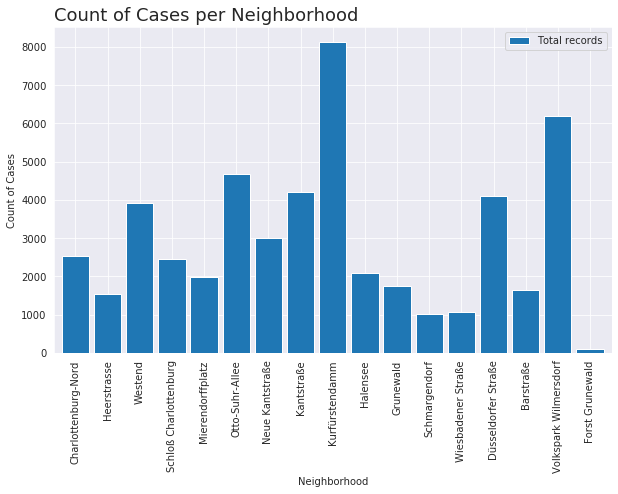


#### Display  pie diagram for Kurfürstendamm

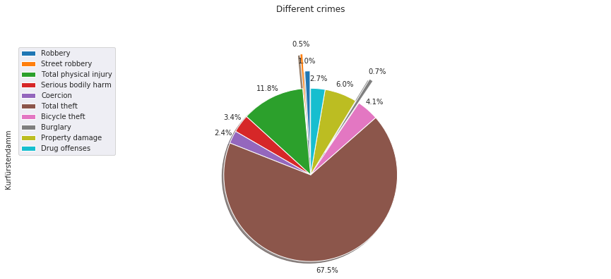


#### Display pie diagramm Volkspark Wilmersdorf


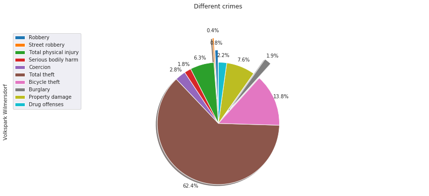


#### Creating a crime weather map of Charlottenburg-Wilmersdorf

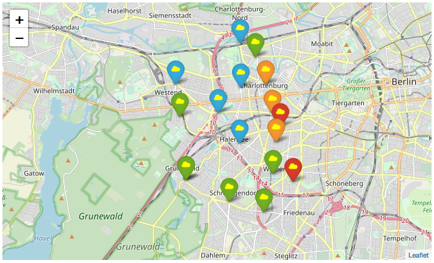

1) Read:very high crime rate;

2) Orange: high crime rate; 

3) Blue: moderate crime rate; 

4) Green - very low crime rate;

#### Visualize school data

<div>
<table border="1" class="dataframe">
  <thead>
    <tr style="text-align: right;">
      <th></th>
      <th>Postcode</th>
      <th>Grade</th>
      <th>Borough</th>
      <th>Neighborhood</th>
      <th>Longitude</th>
      <th>Latitude</th>
    </tr>
  </thead>
  <tbody>
    <tr>
      <th>0</th>
      <td>10589</td>
      <td>2.75</td>
      <td>Charlottenburg-Wilmersdorf</td>
      <td>Charlottenburg-Nord</td>
      <td>13.308494</td>
      <td>52.529399</td>
    </tr>
    <tr>
      <th>1</th>
      <td>14193</td>
      <td>2.28</td>
      <td>Charlottenburg-Wilmersdorf</td>
      <td>Schmargendorf</td>
      <td>13.232888</td>
      <td>52.476342</td>
    </tr>
    <tr>
      <th>2</th>
      <td>14193</td>
      <td>2.51</td>
      <td>Charlottenburg-Wilmersdorf</td>
      <td>Schmargendorf</td>
      <td>13.232888</td>
      <td>52.476342</td>
    </tr>
  </tbody>
</table>
</div>

#### Display map of the grammar schools in the borough


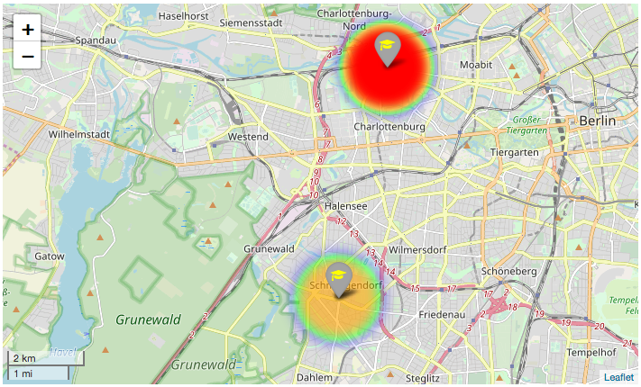

1) Read: lower average grade of graduates;

2) Orange: higher average grade of graduates; 


#### Visualize rental monthly costs data in Charlottenburg-Wilmersdorf

<div>
<table border="1" class="dataframe">
  <thead>
    <tr style="text-align: right;">
      <th></th>
      <th>Neighborhood</th>
      <th>Rental costs</th>
      <th>Borough</th>
      <th>Postcode</th>
      <th>Longitude</th>
      <th>Latitude</th>
    </tr>
  </thead>
  <tbody>
    <tr>
      <th>0</th>
      <td>Charlottenburg</td>
      <td>15.61</td>
      <td>Charlottenburg-Wilmersdorf</td>
      <td>10585</td>
      <td>13.30767</td>
      <td>52.516531</td>
    </tr>
    <tr>
      <th>1</th>
      <td>Grunewald</td>
      <td>16.53</td>
      <td>Charlottenburg-Wilmersdorf</td>
      <td>10711</td>
      <td>13.26580</td>
      <td>52.483379</td>
    </tr>
    <tr>
      <th>2</th>
      <td>Halensee</td>
      <td>14.94</td>
      <td>Charlottenburg-Wilmersdorf</td>
      <td>10709</td>
      <td>13.29569</td>
      <td>52.495972</td>
    </tr>
    <tr>
      <th>3</th>
      <td>Schmargendorf</td>
      <td>14.34</td>
      <td>Charlottenburg-Wilmersdorf</td>
      <td>14193</td>
      <td>13.29005</td>
      <td>52.475800</td>
    </tr>
    <tr>
      <th>4</th>
      <td>Westend</td>
      <td>13.20</td>
      <td>Charlottenburg-Wilmersdorf</td>
      <td>14050</td>
      <td>13.25981</td>
      <td>52.516201</td>
    </tr>
    <tr>
      <th>5</th>
      <td>Wilmersdorf</td>
      <td>14.71</td>
      <td>Charlottenburg-Wilmersdorf</td>
      <td>10707</td>
      <td>13.32037</td>
      <td>52.482980</td>
    </tr>
  </tbody>
</table>
</div>


#### Display map of the grammar schools in the borough


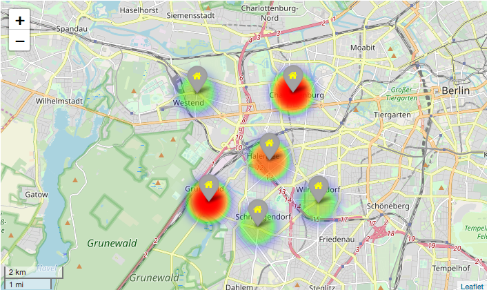

1) Read: high rental costs;

2) Orange: moderate rental costs; 

3) Green: low rental costs.


#### Visualize the venue data

<div>
<table border="1" class="dataframe">
  <thead>
    <tr style="text-align: right;">
      <th></th>
      <th>name</th>
      <th>categories</th>
      <th>lat</th>
      <th>lng</th>
    </tr>
  </thead>
  <tbody>
    <tr>
      <th>0</th>
      <td>Lietzenseepark</td>
      <td>Park</td>
      <td>52.504977</td>
      <td>13.287041</td>
    </tr>
    <tr>
      <th>1</th>
      <td>Cups</td>
      <td>Café</td>
      <td>52.497388</td>
      <td>13.291307</td>
    </tr>
    <tr>
      <th>2</th>
      <td>Fressnapf</td>
      <td>Pet Store</td>
      <td>52.499663</td>
      <td>13.288616</td>
    </tr>
    <tr>
      <th>3</th>
      <td>Fleischerei Bünger</td>
      <td>Butcher</td>
      <td>52.496390</td>
      <td>13.292842</td>
    </tr>
    <tr>
      <th>4</th>
      <td>Aspria Berlin Ku'damm</td>
      <td>Hotel</td>
      <td>52.500597</td>
      <td>13.294459</td>
    </tr>
  </tbody>
</table>
</div>


#### Create map of CW using latitude and longitude values

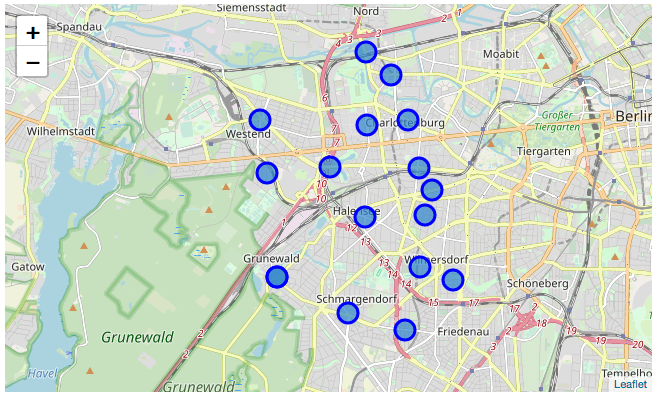


<div>
<table border="1" class="dataframe">
  <thead>
    <tr style="text-align: right;">
      <th></th>
      <th>Neighborhood Latitude</th>
      <th>Neighborhood Longitude</th>
      <th>Venue</th>
      <th>Venue Latitude</th>
      <th>Venue Longitude</th>
      <th>Venue Category</th>
    </tr>
    <tr>
      <th>Neighborhood</th>
      <th></th>
      <th></th>
      <th></th>
      <th></th>
      <th></th>
      <th></th>
    </tr>
  </thead>
  <tbody>
    <tr>
      <th>Barstraße</th>
      <td>16</td>
      <td>16</td>
      <td>16</td>
      <td>16</td>
      <td>16</td>
      <td>16</td>
    </tr>
    <tr>
      <th>Charlottenburg-Nord</th>
      <td>6</td>
      <td>6</td>
      <td>6</td>
      <td>6</td>
      <td>6</td>
      <td>6</td>
    </tr>
    <tr>
      <th>Düsseldorfer Straße</th>
      <td>54</td>
      <td>54</td>
      <td>54</td>
      <td>54</td>
      <td>54</td>
      <td>54</td>
    </tr>
    <tr>
      <th>Forst Grunewald</th>
      <td>10</td>
      <td>10</td>
      <td>10</td>
      <td>10</td>
      <td>10</td>
      <td>10</td>
    </tr>
    <tr>
      <th>Grunewald</th>
      <td>10</td>
      <td>10</td>
      <td>10</td>
      <td>10</td>
      <td>10</td>
      <td>10</td>
    </tr>
    <tr>
      <th>Halensee</th>
      <td>32</td>
      <td>32</td>
      <td>32</td>
      <td>32</td>
      <td>32</td>
      <td>32</td>
    </tr>
    <tr>
      <th>Heerstrasse</th>
      <td>8</td>
      <td>8</td>
      <td>8</td>
      <td>8</td>
      <td>8</td>
      <td>8</td>
    </tr>
    <tr>
      <th>Kantstraße</th>
      <td>62</td>
      <td>62</td>
      <td>62</td>
      <td>62</td>
      <td>62</td>
      <td>62</td>
    </tr>
    <tr>
      <th>Kurfürstendamm</th>
      <td>100</td>
      <td>100</td>
      <td>100</td>
      <td>100</td>
      <td>100</td>
      <td>100</td>
    </tr>
    <tr>
      <th>Mierendorffplatz</th>
      <td>22</td>
      <td>22</td>
      <td>22</td>
      <td>22</td>
      <td>22</td>
      <td>22</td>
    </tr>
    <tr>
      <th>Neue Kantstraße</th>
      <td>22</td>
      <td>22</td>
      <td>22</td>
      <td>22</td>
      <td>22</td>
      <td>22</td>
    </tr>
    <tr>
      <th>Otto-Suhr-Allee</th>
      <td>27</td>
      <td>27</td>
      <td>27</td>
      <td>27</td>
      <td>27</td>
      <td>27</td>
    </tr>
    <tr>
      <th>Schloß Charlottenburg</th>
      <td>45</td>
      <td>45</td>
      <td>45</td>
      <td>45</td>
      <td>45</td>
      <td>45</td>
    </tr>
    <tr>
      <th>Schmargendorf</th>
      <td>17</td>
      <td>17</td>
      <td>17</td>
      <td>17</td>
      <td>17</td>
      <td>17</td>
    </tr>
    <tr>
      <th>Volkspark Wilmersdorf</th>
      <td>43</td>
      <td>43</td>
      <td>43</td>
      <td>43</td>
      <td>43</td>
      <td>43</td>
    </tr>
    <tr>
      <th>Westend</th>
      <td>21</td>
      <td>21</td>
      <td>21</td>
      <td>21</td>
      <td>21</td>
      <td>21</td>
    </tr>
    <tr>
      <th>Wiesbadener Straße</th>
      <td>11</td>
      <td>11</td>
      <td>11</td>
      <td>11</td>
      <td>11</td>
      <td>11</td>
    </tr>
  </tbody>
</table>
</div>


#### display the total count of  venues in every neighborhood

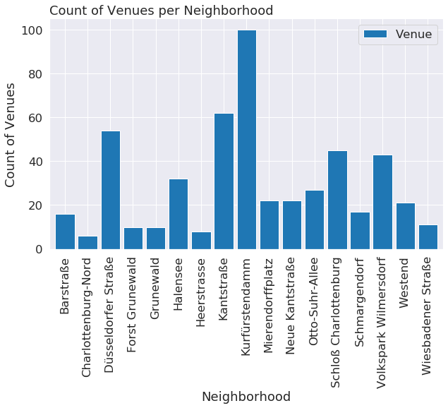


# Methodology
I use the following machine learning methods: k-nearest neighbors algorithm (k-NN), linear regression, k-means clustering and agglomerative clustering. Below a brief description of used methods is given.

*k-nearest neighbors algorithm or k-NN* (source: https://en.wikipedia.org/wiki/K-nearest_neighbors_algorithm) is a non-parametric method used for classification and regression. In both cases, the input consists of the k closest training examples in the feature space. The output depends on whether k-NN is used for classification or regression:
     1. In k-NN classification, the output is a class membership. An object is classified by a plurality vote of its neighbors, with the object being assigned to the class most common among its k nearest neighbors (k is a positive integer, typically small). If k = 1, then the object is simply assigned to the class of that single nearest neighbor.
     2. In k-NN regression, the output is the property value for the object. This value is the average of the values of k nearest neighbors.

k-NN is a type of instance-based learning, or lazy learning, where the function is only approximated locally and all computation is deferred until classification. The neighbors are taken from a set of objects for which the class (for k-NN classification) or the object property value (for k-NN regression) is known. This can be thought of as the training set for the algorithm, though no explicit training step is required. A peculiarity of the k-NN algorithm is that it is sensitive to the local structure of the data. 

*Linear regression* (source: https://en.wikipedia.org/wiki/Linear_regression) is a linear approach to modeling the relationship between a scalar response (or dependent variable) and one or more explanatory variables (or independent variables). In linear regression, the relationships are modeled using linear predictor functions whose unknown model parameters are estimated from the data. Such models are called linear models. Most commonly, the conditional mean of the response given the values of the explanatory variables (or predictors) is assumed to be an affine function of those values; less commonly, the conditional median or some other quantile is used. Like all forms of regression analysis, linear regression focuses on the conditional probability distribution of the response given the values of the predictors, rather than on the joint probability distribution of all of these variables, which is the domain of multivariate analysis. 

*k-means clustering* (source: https://en.wikipedia.org/wiki/K-means_clustering) is  method of vector quantization, originally from signal processing, that is popular for cluster analysis in data mining. k-means clustering aims to partition n observations into k clusters in which each observation belongs to the cluster with the nearest mean, serving as a prototype of the cluster. This results in a partitioning of the data space into Voronoi cells. k-Means minimizes within-cluster variances (squared Euclidean distances), but not regular Euclidean distances, which would be the more difficult Weber problem: the mean optimizes squared errors, whereas only the geometric median minimizes Euclidean distances. Better Euclidean solutions can for example be found using k-medians and k-medoids. 

*Hierarchical cluster analysis or HCA* (source: https://en.wikipedia.org/wiki/Hierarchical_clustering) is a method of cluster analysis which seeks to build a hierarchy of clusters. Strategies for hierarchical clustering generally fall into two types:
    1. Agglomerative: This is a "bottom-up" approach: each observation starts in its own cluster, and pairs of clusters are merged as one moves up the hierarchy.
    2. Divisive: This is a "top-down" approach: all observations start in one cluster, and splits are performed recursively as one moves down the hierarchy.

In general, the merges and splits are determined in a greedy manner. The results of hierarchical clustering are usually presented in a dendrogram. 

#### Modeling and Results
First, the crime data were clustered into four classes based on the total crime record in the particular neighborhood. Then the total crime records between 2012 and 2018 were used for linear regression to extract the regression coefficients. Neighborhoods with either negative or almost zero coefficient were clustered into one group. Neighborhoods with the positive slope were clustered into other group. Then the school data were used to calculate the distances between every neighborhoods and all schools in the borough. Afterwards, the neighborhood were clustered into classes depending on the distance, totally two classes: close and far-away. The rental costs data were first used to train kNN model based on the available records (six label in total). Then kNN model was used to predict the rental monthly cost for other neighborhoods. At the final stage, the venue data were loaded and grouped based on the activity and neighborhood. Crime, school, and rental data were added to the venue data. The merged data, cw_grouped, were used for k-means and hierarchical clustering. The number of clusters was five in both cases.

#### load crime data prepared at the data preparation step

<div>
<table border="1" class="dataframe">
  <thead>
    <tr style="text-align: right;">
      <th></th>
      <th>Latitude</th>
      <th>Longitude</th>
      <th>Borough</th>
      <th>Neighborhood</th>
    </tr>
  </thead>
  <tbody>
    <tr>
      <th>14</th>
      <td>52.48547</td>
      <td>13.31476</td>
      <td>Charlottenburg-Wilmersdorf</td>
      <td>Barstraße</td>
    </tr>
    <tr>
      <th>0</th>
      <td>52.53045</td>
      <td>13.29610</td>
      <td>Charlottenburg-Wilmersdorf</td>
      <td>Charlottenburg-Nord</td>
    </tr>
    <tr>
      <th>13</th>
      <td>52.49644</td>
      <td>13.31653</td>
      <td>Charlottenburg-Wilmersdorf</td>
      <td>Düsseldorfer Straße</td>
    </tr>
  </tbody>
</table>
</div>


#### load rental data prepared at the data preparation step


<div>
<table border="1" class="dataframe">
  <thead>
    <tr style="text-align: right;">
      <th></th>
      <th>Neighborhood</th>
      <th>Rental costs</th>
      <th>Borough</th>
      <th>Postcode</th>
      <th>Longitude</th>
      <th>Latitude</th>
    </tr>
  </thead>
  <tbody>
    <tr>
      <th>0</th>
      <td>Charlottenburg</td>
      <td>15.61</td>
      <td>Charlottenburg-Wilmersdorf</td>
      <td>10585</td>
      <td>13.30767</td>
      <td>52.516531</td>
    </tr>
    <tr>
      <th>1</th>
      <td>Grunewald</td>
      <td>16.53</td>
      <td>Charlottenburg-Wilmersdorf</td>
      <td>10711</td>
      <td>13.26580</td>
      <td>52.483379</td>
    </tr>
    <tr>
      <th>2</th>
      <td>Halensee</td>
      <td>14.94</td>
      <td>Charlottenburg-Wilmersdorf</td>
      <td>10709</td>
      <td>13.29569</td>
      <td>52.495972</td>
    </tr>
  </tbody>
</table>
</div>


#### load school data  prepared at the data preparation step

<div>
<table border="1" class="dataframe">
  <thead>
    <tr style="text-align: right;">
      <th></th>
      <th>Postcode</th>
      <th>Grade</th>
      <th>Borough</th>
      <th>Neighborhood</th>
      <th>Longitude</th>
      <th>Latitude</th>
    </tr>
  </thead>
  <tbody>
    <tr>
      <th>0</th>
      <td>10589</td>
      <td>2.75</td>
      <td>Charlottenburg-Wilmersdorf</td>
      <td>Charlottenburg-Nord</td>
      <td>13.308494</td>
      <td>52.529399</td>
    </tr>
    <tr>
      <th>1</th>
      <td>14193</td>
      <td>2.28</td>
      <td>Charlottenburg-Wilmersdorf</td>
      <td>Schmargendorf</td>
      <td>13.290050</td>
      <td>52.475800</td>
    </tr>
    <tr>
      <th>2</th>
      <td>14193</td>
      <td>2.51</td>
      <td>Charlottenburg-Wilmersdorf</td>
      <td>Schmargendorf</td>
      <td>13.290050</td>
      <td>52.475800</td>
    </tr>
  </tbody>
</table>
</div>


#### Create a column based on the distance to a school by  calculating distances to schools for every neighborhood, then threshold based on the distance radius

```python
print(weightedSchools)
```

    [0, 1, 0, 0, 0, 0, 0, 0, 0, 1, 0, 1, 0, 1, 0, 0, 1]


#### Create a column based on the average rental costs using kNN method


```python
weightedRents[0:5]
```


    array([3, 1, 3, 2, 2])


#### Prediction of the crime in the corresponding neighborhood
<div>
<table border="1" class="dataframe">
  <thead>
    <tr style="text-align: right;">
      <th></th>
      <th>Year 2012</th>
      <th>Year 2013</th>
      <th>Year 2014</th>
      <th>Year 2015</th>
      <th>Year 2016</th>
      <th>Year 2017</th>
      <th>Year 2018</th>
    </tr>
    <tr>
      <th>Neighborhood</th>
      <th></th>
      <th></th>
      <th></th>
      <th></th>
      <th></th>
      <th></th>
      <th></th>
    </tr>
  </thead>
  <tbody>
    <tr>
      <th>Barstraße</th>
      <td>1634.0</td>
      <td>1726.0</td>
      <td>1696.0</td>
      <td>1732.0</td>
      <td>1604.0</td>
      <td>1596.0</td>
      <td>1634.0</td>
    </tr>
    <tr>
      <th>Charlottenburg-Nord</th>
      <td>2532.0</td>
      <td>2730.0</td>
      <td>2913.0</td>
      <td>2945.0</td>
      <td>3169.0</td>
      <td>2846.0</td>
      <td>2532.0</td>
    </tr>
    <tr>
      <th>Düsseldorfer Straße</th>
      <td>4094.0</td>
      <td>3855.0</td>
      <td>4059.0</td>
      <td>4483.0</td>
      <td>3961.0</td>
      <td>3940.0</td>
      <td>4094.0</td>
    </tr>
    <tr>
      <th>Forst Grunewald</th>
      <td>105.0</td>
      <td>147.0</td>
      <td>92.0</td>
      <td>108.0</td>
      <td>131.0</td>
      <td>72.0</td>
      <td>105.0</td>
    </tr>
    <tr>
      <th>Grunewald</th>
      <td>1754.0</td>
      <td>1667.0</td>
      <td>1652.0</td>
      <td>1679.0</td>
      <td>1630.0</td>
      <td>1675.0</td>
      <td>1754.0</td>
    </tr>
  </tbody>
</table>
</div>


#### comparing polynomial regressions of 1 and 3.th order

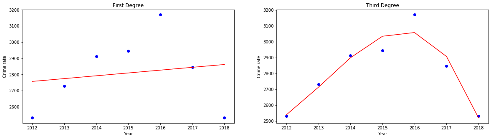


#### The better fit is provided by a polynomial of the third degree. However, a trend is better to see by linear regression

    [-12.57142857142857, 17.428571428571416, 2.5714285714285707, -3.9642857142857135, -0.21428571428571508, -19.64285714285714, -4.285714285714285, -43.85714285714285, -110.32142857142856, 15.64285714285714, 21.678571428571423, -2.4999999999999982, 0.6785714285714284, -14.678571428571429, 271.25, 40.21428571428571, -5.821428571428573]


#### we would like to have either a negative coef or one with a small positive slope


    [0, 3, 2, 1, 1, 0, 1, 0, 0, 3, 3, 1, 2, 0, 3, 3, 0]


#### Explore Neighborhoods in CW: Segmenting


```python
cw_venues=pd.read_pickle('cw_venues.pkl')
cw_venues.head()
```


<div>
<table border="1" class="dataframe">
  <thead>
    <tr style="text-align: right;">
      <th></th>
      <th>Neighborhood</th>
      <th>Neighborhood Latitude</th>
      <th>Neighborhood Longitude</th>
      <th>Venue</th>
      <th>Venue Latitude</th>
      <th>Venue Longitude</th>
      <th>Venue Category</th>
    </tr>
  </thead>
  <tbody>
    <tr>
      <th>0</th>
      <td>Charlottenburg-Nord</td>
      <td>52.53045</td>
      <td>13.2961</td>
      <td>Ristorante Dante</td>
      <td>52.526276</td>
      <td>13.297480</td>
      <td>Italian Restaurant</td>
    </tr>
    <tr>
      <th>1</th>
      <td>Charlottenburg-Nord</td>
      <td>52.53045</td>
      <td>13.2961</td>
      <td>Belvedere</td>
      <td>52.527567</td>
      <td>13.295475</td>
      <td>Museum</td>
    </tr>
    <tr>
      <th>2</th>
      <td>Charlottenburg-Nord</td>
      <td>52.53045</td>
      <td>13.2961</td>
      <td>H Tegeler Weg / S Jungfernheide</td>
      <td>52.530291</td>
      <td>13.296355</td>
      <td>Bus Stop</td>
    </tr>
    <tr>
      <th>3</th>
      <td>Charlottenburg-Nord</td>
      <td>52.53045</td>
      <td>13.2961</td>
      <td>Curry König</td>
      <td>52.530841</td>
      <td>13.299841</td>
      <td>Fast Food Restaurant</td>
    </tr>
    <tr>
      <th>4</th>
      <td>Charlottenburg-Nord</td>
      <td>52.53045</td>
      <td>13.2961</td>
      <td>Back Lady</td>
      <td>52.530452</td>
      <td>13.299959</td>
      <td>Bakery</td>
    </tr>
  </tbody>
</table>
</div>


```python
# one hot encoding
cw_onehot = pd.get_dummies(cw_venues[['Venue Category']], prefix="", prefix_sep="")

# add neighborhood column back to dataframe
cw_onehot['Neighborhood'] = cw_venues['Neighborhood'] 

# move neighborhood column to the first column
fixed_columns = [cw_onehot.columns[-1]] + list(cw_onehot.columns[:-1])
cw_onehot = cw_onehot[fixed_columns]

cw_onehot.head()
```


<div>
<table border="1" class="dataframe">
  <thead>
    <tr style="text-align: right;">
      <th></th>
      <th>Neighborhood</th>
      <th>ATM</th>
      <th>Art Museum</th>
      <th>Asian Restaurant</th>
      <th>Bakery</th>
      <th>Bank</th>
      <th>Bar</th>
      <th>Bavarian Restaurant</th>
      <th>Bistro</th>
      <th>Boarding House</th>
      <th>Bookstore</th>
      <th>Boutique</th>
      <th>Brasserie</th>
      <th>Breakfast Spot</th>
      <th>Buffet</th>
      <th>Burger Joint</th>
      <th>Bus Stop</th>
      <th>Butcher</th>
      <th>Café</th>
      <th>Candy Store</th>
      <th>Chinese Restaurant</th>
      <th>Climbing Gym</th>
      <th>Clothing Store</th>
      <th>Cocktail Bar</th>
      <th>Coffee Shop</th>
      <th>Deli / Bodega</th>
      <th>Department Store</th>
      <th>Dessert Shop</th>
      <th>Diner</th>
      <th>Doner Restaurant</th>
      <th>Donut Shop</th>
      <th>Drugstore</th>
      <th>Eastern European Restaurant</th>
      <th>Fabric Shop</th>
      <th>Falafel Restaurant</th>
      <th>Farmers Market</th>
      <th>Fast Food Restaurant</th>
      <th>Filipino Restaurant</th>
      <th>Flower Shop</th>
      <th>Food Truck</th>
      <th>French Restaurant</th>
      <th>Furniture / Home Store</th>
      <th>Gas Station</th>
      <th>German Restaurant</th>
      <th>Gourmet Shop</th>
      <th>Greek Restaurant</th>
      <th>Gym</th>
      <th>Gym / Fitness Center</th>
      <th>Halal Restaurant</th>
      <th>Health &amp; Beauty Service</th>
      <th>Hookah Bar</th>
      <th>Hot Spring</th>
      <th>Hotel</th>
      <th>Ice Cream Shop</th>
      <th>Indian Restaurant</th>
      <th>Indie Movie Theater</th>
      <th>Indonesian Restaurant</th>
      <th>Italian Restaurant</th>
      <th>Japanese Restaurant</th>
      <th>Jazz Club</th>
      <th>Juice Bar</th>
      <th>Kids Store</th>
      <th>Korean Restaurant</th>
      <th>Laser Tag</th>
      <th>Lebanese Restaurant</th>
      <th>Light Rail Station</th>
      <th>Liquor Store</th>
      <th>Mattress Store</th>
      <th>Mediterranean Restaurant</th>
      <th>Metro Station</th>
      <th>Mexican Restaurant</th>
      <th>Middle Eastern Restaurant</th>
      <th>Movie Theater</th>
      <th>Moving Target</th>
      <th>Museum</th>
      <th>Noodle House</th>
      <th>Opera House</th>
      <th>Organic Grocery</th>
      <th>Park</th>
      <th>Pastry Shop</th>
      <th>Perfume Shop</th>
      <th>Persian Restaurant</th>
      <th>Peruvian Restaurant</th>
      <th>Pet Café</th>
      <th>Pet Store</th>
      <th>Pharmacy</th>
      <th>Piano Bar</th>
      <th>Pie Shop</th>
      <th>Pizza Place</th>
      <th>Platform</th>
      <th>Playground</th>
      <th>Plaza</th>
      <th>Pool</th>
      <th>Portuguese Restaurant</th>
      <th>Pub</th>
      <th>Restaurant</th>
      <th>Sandwich Place</th>
      <th>Scenic Lookout</th>
      <th>Schnitzel Restaurant</th>
      <th>Seafood Restaurant</th>
      <th>Snack Place</th>
      <th>Soup Place</th>
      <th>South American Restaurant</th>
      <th>Spa</th>
      <th>Spanish Restaurant</th>
      <th>Sports Club</th>
      <th>Stadium</th>
      <th>Steakhouse</th>
      <th>Street Food Gathering</th>
      <th>Supermarket</th>
      <th>Sushi Restaurant</th>
      <th>Swabian Restaurant</th>
      <th>Szechuan Restaurant</th>
      <th>Tapas Restaurant</th>
      <th>Taverna</th>
      <th>Tennis Court</th>
      <th>Thai Restaurant</th>
      <th>Toy / Game Store</th>
      <th>Trattoria/Osteria</th>
      <th>Turkish Restaurant</th>
      <th>Vietnamese Restaurant</th>
      <th>Whisky Bar</th>
      <th>Wine Shop</th>
    </tr>
  </thead>
  <tbody>
    <tr>
      <th>0</th>
      <td>Charlottenburg-Nord</td>
      <td>0</td>
      <td>0</td>
      <td>0</td>
      <td>0</td>
      <td>0</td>
      <td>0</td>
      <td>0</td>
      <td>0</td>
      <td>0</td>
      <td>0</td>
      <td>0</td>
      <td>0</td>
      <td>0</td>
      <td>0</td>
      <td>0</td>
      <td>0</td>
      <td>0</td>
      <td>0</td>
      <td>0</td>
      <td>0</td>
      <td>0</td>
      <td>0</td>
      <td>0</td>
      <td>0</td>
      <td>0</td>
      <td>0</td>
      <td>0</td>
      <td>0</td>
      <td>0</td>
      <td>0</td>
      <td>0</td>
      <td>0</td>
      <td>0</td>
      <td>0</td>
      <td>0</td>
      <td>0</td>
      <td>0</td>
      <td>0</td>
      <td>0</td>
      <td>0</td>
      <td>0</td>
      <td>0</td>
      <td>0</td>
      <td>0</td>
      <td>0</td>
      <td>0</td>
      <td>0</td>
      <td>0</td>
      <td>0</td>
      <td>0</td>
      <td>0</td>
      <td>0</td>
      <td>0</td>
      <td>0</td>
      <td>0</td>
      <td>0</td>
      <td>1</td>
      <td>0</td>
      <td>0</td>
      <td>0</td>
      <td>0</td>
      <td>0</td>
      <td>0</td>
      <td>0</td>
      <td>0</td>
      <td>0</td>
      <td>0</td>
      <td>0</td>
      <td>0</td>
      <td>0</td>
      <td>0</td>
      <td>0</td>
      <td>0</td>
      <td>0</td>
      <td>0</td>
      <td>0</td>
      <td>0</td>
      <td>0</td>
      <td>0</td>
      <td>0</td>
      <td>0</td>
      <td>0</td>
      <td>0</td>
      <td>0</td>
      <td>0</td>
      <td>0</td>
      <td>0</td>
      <td>0</td>
      <td>0</td>
      <td>0</td>
      <td>0</td>
      <td>0</td>
      <td>0</td>
      <td>0</td>
      <td>0</td>
      <td>0</td>
      <td>0</td>
      <td>0</td>
      <td>0</td>
      <td>0</td>
      <td>0</td>
      <td>0</td>
      <td>0</td>
      <td>0</td>
      <td>0</td>
      <td>0</td>
      <td>0</td>
      <td>0</td>
      <td>0</td>
      <td>0</td>
      <td>0</td>
      <td>0</td>
      <td>0</td>
      <td>0</td>
      <td>0</td>
      <td>0</td>
      <td>0</td>
      <td>0</td>
      <td>0</td>
      <td>0</td>
      <td>0</td>
      <td>0</td>
    </tr>
    <tr>
      <th>1</th>
      <td>Charlottenburg-Nord</td>
      <td>0</td>
      <td>0</td>
      <td>0</td>
      <td>0</td>
      <td>0</td>
      <td>0</td>
      <td>0</td>
      <td>0</td>
      <td>0</td>
      <td>0</td>
      <td>0</td>
      <td>0</td>
      <td>0</td>
      <td>0</td>
      <td>0</td>
      <td>0</td>
      <td>0</td>
      <td>0</td>
      <td>0</td>
      <td>0</td>
      <td>0</td>
      <td>0</td>
      <td>0</td>
      <td>0</td>
      <td>0</td>
      <td>0</td>
      <td>0</td>
      <td>0</td>
      <td>0</td>
      <td>0</td>
      <td>0</td>
      <td>0</td>
      <td>0</td>
      <td>0</td>
      <td>0</td>
      <td>0</td>
      <td>0</td>
      <td>0</td>
      <td>0</td>
      <td>0</td>
      <td>0</td>
      <td>0</td>
      <td>0</td>
      <td>0</td>
      <td>0</td>
      <td>0</td>
      <td>0</td>
      <td>0</td>
      <td>0</td>
      <td>0</td>
      <td>0</td>
      <td>0</td>
      <td>0</td>
      <td>0</td>
      <td>0</td>
      <td>0</td>
      <td>0</td>
      <td>0</td>
      <td>0</td>
      <td>0</td>
      <td>0</td>
      <td>0</td>
      <td>0</td>
      <td>0</td>
      <td>0</td>
      <td>0</td>
      <td>0</td>
      <td>0</td>
      <td>0</td>
      <td>0</td>
      <td>0</td>
      <td>0</td>
      <td>0</td>
      <td>1</td>
      <td>0</td>
      <td>0</td>
      <td>0</td>
      <td>0</td>
      <td>0</td>
      <td>0</td>
      <td>0</td>
      <td>0</td>
      <td>0</td>
      <td>0</td>
      <td>0</td>
      <td>0</td>
      <td>0</td>
      <td>0</td>
      <td>0</td>
      <td>0</td>
      <td>0</td>
      <td>0</td>
      <td>0</td>
      <td>0</td>
      <td>0</td>
      <td>0</td>
      <td>0</td>
      <td>0</td>
      <td>0</td>
      <td>0</td>
      <td>0</td>
      <td>0</td>
      <td>0</td>
      <td>0</td>
      <td>0</td>
      <td>0</td>
      <td>0</td>
      <td>0</td>
      <td>0</td>
      <td>0</td>
      <td>0</td>
      <td>0</td>
      <td>0</td>
      <td>0</td>
      <td>0</td>
      <td>0</td>
      <td>0</td>
      <td>0</td>
      <td>0</td>
      <td>0</td>
      <td>0</td>
      <td>0</td>
    </tr>
    <tr>
      <th>2</th>
      <td>Charlottenburg-Nord</td>
      <td>0</td>
      <td>0</td>
      <td>0</td>
      <td>0</td>
      <td>0</td>
      <td>0</td>
      <td>0</td>
      <td>0</td>
      <td>0</td>
      <td>0</td>
      <td>0</td>
      <td>0</td>
      <td>0</td>
      <td>0</td>
      <td>0</td>
      <td>1</td>
      <td>0</td>
      <td>0</td>
      <td>0</td>
      <td>0</td>
      <td>0</td>
      <td>0</td>
      <td>0</td>
      <td>0</td>
      <td>0</td>
      <td>0</td>
      <td>0</td>
      <td>0</td>
      <td>0</td>
      <td>0</td>
      <td>0</td>
      <td>0</td>
      <td>0</td>
      <td>0</td>
      <td>0</td>
      <td>0</td>
      <td>0</td>
      <td>0</td>
      <td>0</td>
      <td>0</td>
      <td>0</td>
      <td>0</td>
      <td>0</td>
      <td>0</td>
      <td>0</td>
      <td>0</td>
      <td>0</td>
      <td>0</td>
      <td>0</td>
      <td>0</td>
      <td>0</td>
      <td>0</td>
      <td>0</td>
      <td>0</td>
      <td>0</td>
      <td>0</td>
      <td>0</td>
      <td>0</td>
      <td>0</td>
      <td>0</td>
      <td>0</td>
      <td>0</td>
      <td>0</td>
      <td>0</td>
      <td>0</td>
      <td>0</td>
      <td>0</td>
      <td>0</td>
      <td>0</td>
      <td>0</td>
      <td>0</td>
      <td>0</td>
      <td>0</td>
      <td>0</td>
      <td>0</td>
      <td>0</td>
      <td>0</td>
      <td>0</td>
      <td>0</td>
      <td>0</td>
      <td>0</td>
      <td>0</td>
      <td>0</td>
      <td>0</td>
      <td>0</td>
      <td>0</td>
      <td>0</td>
      <td>0</td>
      <td>0</td>
      <td>0</td>
      <td>0</td>
      <td>0</td>
      <td>0</td>
      <td>0</td>
      <td>0</td>
      <td>0</td>
      <td>0</td>
      <td>0</td>
      <td>0</td>
      <td>0</td>
      <td>0</td>
      <td>0</td>
      <td>0</td>
      <td>0</td>
      <td>0</td>
      <td>0</td>
      <td>0</td>
      <td>0</td>
      <td>0</td>
      <td>0</td>
      <td>0</td>
      <td>0</td>
      <td>0</td>
      <td>0</td>
      <td>0</td>
      <td>0</td>
      <td>0</td>
      <td>0</td>
      <td>0</td>
      <td>0</td>
      <td>0</td>
      <td>0</td>
    </tr>
    <tr>
      <th>3</th>
      <td>Charlottenburg-Nord</td>
      <td>0</td>
      <td>0</td>
      <td>0</td>
      <td>0</td>
      <td>0</td>
      <td>0</td>
      <td>0</td>
      <td>0</td>
      <td>0</td>
      <td>0</td>
      <td>0</td>
      <td>0</td>
      <td>0</td>
      <td>0</td>
      <td>0</td>
      <td>0</td>
      <td>0</td>
      <td>0</td>
      <td>0</td>
      <td>0</td>
      <td>0</td>
      <td>0</td>
      <td>0</td>
      <td>0</td>
      <td>0</td>
      <td>0</td>
      <td>0</td>
      <td>0</td>
      <td>0</td>
      <td>0</td>
      <td>0</td>
      <td>0</td>
      <td>0</td>
      <td>0</td>
      <td>0</td>
      <td>1</td>
      <td>0</td>
      <td>0</td>
      <td>0</td>
      <td>0</td>
      <td>0</td>
      <td>0</td>
      <td>0</td>
      <td>0</td>
      <td>0</td>
      <td>0</td>
      <td>0</td>
      <td>0</td>
      <td>0</td>
      <td>0</td>
      <td>0</td>
      <td>0</td>
      <td>0</td>
      <td>0</td>
      <td>0</td>
      <td>0</td>
      <td>0</td>
      <td>0</td>
      <td>0</td>
      <td>0</td>
      <td>0</td>
      <td>0</td>
      <td>0</td>
      <td>0</td>
      <td>0</td>
      <td>0</td>
      <td>0</td>
      <td>0</td>
      <td>0</td>
      <td>0</td>
      <td>0</td>
      <td>0</td>
      <td>0</td>
      <td>0</td>
      <td>0</td>
      <td>0</td>
      <td>0</td>
      <td>0</td>
      <td>0</td>
      <td>0</td>
      <td>0</td>
      <td>0</td>
      <td>0</td>
      <td>0</td>
      <td>0</td>
      <td>0</td>
      <td>0</td>
      <td>0</td>
      <td>0</td>
      <td>0</td>
      <td>0</td>
      <td>0</td>
      <td>0</td>
      <td>0</td>
      <td>0</td>
      <td>0</td>
      <td>0</td>
      <td>0</td>
      <td>0</td>
      <td>0</td>
      <td>0</td>
      <td>0</td>
      <td>0</td>
      <td>0</td>
      <td>0</td>
      <td>0</td>
      <td>0</td>
      <td>0</td>
      <td>0</td>
      <td>0</td>
      <td>0</td>
      <td>0</td>
      <td>0</td>
      <td>0</td>
      <td>0</td>
      <td>0</td>
      <td>0</td>
      <td>0</td>
      <td>0</td>
      <td>0</td>
      <td>0</td>
      <td>0</td>
    </tr>
    <tr>
      <th>4</th>
      <td>Charlottenburg-Nord</td>
      <td>0</td>
      <td>0</td>
      <td>0</td>
      <td>1</td>
      <td>0</td>
      <td>0</td>
      <td>0</td>
      <td>0</td>
      <td>0</td>
      <td>0</td>
      <td>0</td>
      <td>0</td>
      <td>0</td>
      <td>0</td>
      <td>0</td>
      <td>0</td>
      <td>0</td>
      <td>0</td>
      <td>0</td>
      <td>0</td>
      <td>0</td>
      <td>0</td>
      <td>0</td>
      <td>0</td>
      <td>0</td>
      <td>0</td>
      <td>0</td>
      <td>0</td>
      <td>0</td>
      <td>0</td>
      <td>0</td>
      <td>0</td>
      <td>0</td>
      <td>0</td>
      <td>0</td>
      <td>0</td>
      <td>0</td>
      <td>0</td>
      <td>0</td>
      <td>0</td>
      <td>0</td>
      <td>0</td>
      <td>0</td>
      <td>0</td>
      <td>0</td>
      <td>0</td>
      <td>0</td>
      <td>0</td>
      <td>0</td>
      <td>0</td>
      <td>0</td>
      <td>0</td>
      <td>0</td>
      <td>0</td>
      <td>0</td>
      <td>0</td>
      <td>0</td>
      <td>0</td>
      <td>0</td>
      <td>0</td>
      <td>0</td>
      <td>0</td>
      <td>0</td>
      <td>0</td>
      <td>0</td>
      <td>0</td>
      <td>0</td>
      <td>0</td>
      <td>0</td>
      <td>0</td>
      <td>0</td>
      <td>0</td>
      <td>0</td>
      <td>0</td>
      <td>0</td>
      <td>0</td>
      <td>0</td>
      <td>0</td>
      <td>0</td>
      <td>0</td>
      <td>0</td>
      <td>0</td>
      <td>0</td>
      <td>0</td>
      <td>0</td>
      <td>0</td>
      <td>0</td>
      <td>0</td>
      <td>0</td>
      <td>0</td>
      <td>0</td>
      <td>0</td>
      <td>0</td>
      <td>0</td>
      <td>0</td>
      <td>0</td>
      <td>0</td>
      <td>0</td>
      <td>0</td>
      <td>0</td>
      <td>0</td>
      <td>0</td>
      <td>0</td>
      <td>0</td>
      <td>0</td>
      <td>0</td>
      <td>0</td>
      <td>0</td>
      <td>0</td>
      <td>0</td>
      <td>0</td>
      <td>0</td>
      <td>0</td>
      <td>0</td>
      <td>0</td>
      <td>0</td>
      <td>0</td>
      <td>0</td>
      <td>0</td>
      <td>0</td>
      <td>0</td>
      <td>0</td>
    </tr>
  </tbody>
</table>
</div>


#### group rows by neighborhood and by taking the mean of the frequency of occurrence of each category

<div>
<table border="1" class="dataframe">
  <thead>
    <tr style="text-align: right;">
      <th></th>
      <th>Neighborhood</th>
      <th>ATM</th>
      <th>Art Museum</th>
      <th>Asian Restaurant</th>
      <th>Bakery</th>
      <th>Bank</th>
      <th>Bar</th>
      <th>Bavarian Restaurant</th>
      <th>Bistro</th>
      <th>Boarding House</th>
      <th>Bookstore</th>
      <th>Boutique</th>
      <th>Brasserie</th>
      <th>Breakfast Spot</th>
      <th>Buffet</th>
      <th>Burger Joint</th>
      <th>Bus Stop</th>
      <th>Butcher</th>
      <th>Café</th>
      <th>Candy Store</th>
      <th>Chinese Restaurant</th>
      <th>Climbing Gym</th>
      <th>Clothing Store</th>
      <th>Cocktail Bar</th>
      <th>Coffee Shop</th>
      <th>Deli / Bodega</th>
      <th>Department Store</th>
      <th>Dessert Shop</th>
      <th>Diner</th>
      <th>Doner Restaurant</th>
      <th>Donut Shop</th>
      <th>Drugstore</th>
      <th>Eastern European Restaurant</th>
      <th>Fabric Shop</th>
      <th>Falafel Restaurant</th>
      <th>Farmers Market</th>
      <th>Fast Food Restaurant</th>
      <th>Filipino Restaurant</th>
      <th>Flower Shop</th>
      <th>Food Truck</th>
      <th>French Restaurant</th>
      <th>Furniture / Home Store</th>
      <th>Gas Station</th>
      <th>German Restaurant</th>
      <th>Gourmet Shop</th>
      <th>Greek Restaurant</th>
      <th>Gym</th>
      <th>Gym / Fitness Center</th>
      <th>Halal Restaurant</th>
      <th>Health &amp; Beauty Service</th>
      <th>Hookah Bar</th>
      <th>Hot Spring</th>
      <th>Hotel</th>
      <th>Ice Cream Shop</th>
      <th>Indian Restaurant</th>
      <th>Indie Movie Theater</th>
      <th>Indonesian Restaurant</th>
      <th>Italian Restaurant</th>
      <th>Japanese Restaurant</th>
      <th>Jazz Club</th>
      <th>Juice Bar</th>
      <th>Kids Store</th>
      <th>Korean Restaurant</th>
      <th>Laser Tag</th>
      <th>Lebanese Restaurant</th>
      <th>Light Rail Station</th>
      <th>Liquor Store</th>
      <th>Mattress Store</th>
      <th>Mediterranean Restaurant</th>
      <th>Metro Station</th>
      <th>Mexican Restaurant</th>
      <th>Middle Eastern Restaurant</th>
      <th>Movie Theater</th>
      <th>Moving Target</th>
      <th>Museum</th>
      <th>Noodle House</th>
      <th>Opera House</th>
      <th>Organic Grocery</th>
      <th>Park</th>
      <th>Pastry Shop</th>
      <th>Perfume Shop</th>
      <th>Persian Restaurant</th>
      <th>Peruvian Restaurant</th>
      <th>Pet Café</th>
      <th>Pet Store</th>
      <th>Pharmacy</th>
      <th>Piano Bar</th>
      <th>Pie Shop</th>
      <th>Pizza Place</th>
      <th>Platform</th>
      <th>Playground</th>
      <th>Plaza</th>
      <th>Pool</th>
      <th>Portuguese Restaurant</th>
      <th>Pub</th>
      <th>Restaurant</th>
      <th>Sandwich Place</th>
      <th>Scenic Lookout</th>
      <th>Schnitzel Restaurant</th>
      <th>Seafood Restaurant</th>
      <th>Snack Place</th>
      <th>Soup Place</th>
      <th>South American Restaurant</th>
      <th>Spa</th>
      <th>Spanish Restaurant</th>
      <th>Sports Club</th>
      <th>Stadium</th>
      <th>Steakhouse</th>
      <th>Street Food Gathering</th>
      <th>Supermarket</th>
      <th>Sushi Restaurant</th>
      <th>Swabian Restaurant</th>
      <th>Szechuan Restaurant</th>
      <th>Tapas Restaurant</th>
      <th>Taverna</th>
      <th>Tennis Court</th>
      <th>Thai Restaurant</th>
      <th>Toy / Game Store</th>
      <th>Trattoria/Osteria</th>
      <th>Turkish Restaurant</th>
      <th>Vietnamese Restaurant</th>
      <th>Whisky Bar</th>
      <th>Wine Shop</th>
    </tr>
  </thead>
  <tbody>
    <tr>
      <th>0</th>
      <td>Barstraße</td>
      <td>0.0</td>
      <td>0.0</td>
      <td>0.0</td>
      <td>0.062500</td>
      <td>0.0</td>
      <td>0.000000</td>
      <td>0.0625</td>
      <td>0.0</td>
      <td>0.0</td>
      <td>0.0</td>
      <td>0.000000</td>
      <td>0.0</td>
      <td>0.0</td>
      <td>0.0</td>
      <td>0.0</td>
      <td>0.000000</td>
      <td>0.0</td>
      <td>0.000000</td>
      <td>0.0</td>
      <td>0.000000</td>
      <td>0.0625</td>
      <td>0.000000</td>
      <td>0.0</td>
      <td>0.0</td>
      <td>0.0</td>
      <td>0.0</td>
      <td>0.000000</td>
      <td>0.000000</td>
      <td>0.0625</td>
      <td>0.0</td>
      <td>0.0625</td>
      <td>0.0</td>
      <td>0.0</td>
      <td>0.000000</td>
      <td>0.0</td>
      <td>0.000000</td>
      <td>0.0</td>
      <td>0.0</td>
      <td>0.0</td>
      <td>0.0</td>
      <td>0.0</td>
      <td>0.0625</td>
      <td>0.000000</td>
      <td>0.000000</td>
      <td>0.000000</td>
      <td>0.0</td>
      <td>0.0</td>
      <td>0.0</td>
      <td>0.000000</td>
      <td>0.0</td>
      <td>0.0625</td>
      <td>0.125000</td>
      <td>0.0625</td>
      <td>0.0625</td>
      <td>0.0625</td>
      <td>0.000000</td>
      <td>0.062500</td>
      <td>0.0625</td>
      <td>0.0</td>
      <td>0.000000</td>
      <td>0.0</td>
      <td>0.0</td>
      <td>0.0</td>
      <td>0.000000</td>
      <td>0.0</td>
      <td>0.0</td>
      <td>0.0</td>
      <td>0.0</td>
      <td>0.0</td>
      <td>0.0625</td>
      <td>0.0</td>
      <td>0.0</td>
      <td>0.0625</td>
      <td>0.000000</td>
      <td>0.0</td>
      <td>0.0</td>
      <td>0.0</td>
      <td>0.000000</td>
      <td>0.000000</td>
      <td>0.0</td>
      <td>0.0</td>
      <td>0.0</td>
      <td>0.0</td>
      <td>0.0</td>
      <td>0.000000</td>
      <td>0.0</td>
      <td>0.0</td>
      <td>0.0</td>
      <td>0.000000</td>
      <td>0.0</td>
      <td>0.000000</td>
      <td>0.0</td>
      <td>0.000000</td>
      <td>0.0</td>
      <td>0.000000</td>
      <td>0.0</td>
      <td>0.0</td>
      <td>0.0</td>
      <td>0.0</td>
      <td>0.0</td>
      <td>0.0</td>
      <td>0.000000</td>
      <td>0.000000</td>
      <td>0.000000</td>
      <td>0.0</td>
      <td>0.0</td>
      <td>0.0</td>
      <td>0.000000</td>
      <td>0.000000</td>
      <td>0.000000</td>
      <td>0.0</td>
      <td>0.0</td>
      <td>0.000000</td>
      <td>0.0</td>
      <td>0.0</td>
      <td>0.000000</td>
      <td>0.0</td>
      <td>0.0</td>
      <td>0.0</td>
      <td>0.000000</td>
      <td>0.0</td>
      <td>0.000000</td>
    </tr>
    <tr>
      <th>1</th>
      <td>Charlottenburg-Nord</td>
      <td>0.0</td>
      <td>0.0</td>
      <td>0.0</td>
      <td>0.166667</td>
      <td>0.0</td>
      <td>0.000000</td>
      <td>0.0000</td>
      <td>0.0</td>
      <td>0.0</td>
      <td>0.0</td>
      <td>0.000000</td>
      <td>0.0</td>
      <td>0.0</td>
      <td>0.0</td>
      <td>0.0</td>
      <td>0.166667</td>
      <td>0.0</td>
      <td>0.000000</td>
      <td>0.0</td>
      <td>0.000000</td>
      <td>0.0000</td>
      <td>0.000000</td>
      <td>0.0</td>
      <td>0.0</td>
      <td>0.0</td>
      <td>0.0</td>
      <td>0.000000</td>
      <td>0.000000</td>
      <td>0.0000</td>
      <td>0.0</td>
      <td>0.0000</td>
      <td>0.0</td>
      <td>0.0</td>
      <td>0.000000</td>
      <td>0.0</td>
      <td>0.166667</td>
      <td>0.0</td>
      <td>0.0</td>
      <td>0.0</td>
      <td>0.0</td>
      <td>0.0</td>
      <td>0.0000</td>
      <td>0.000000</td>
      <td>0.000000</td>
      <td>0.000000</td>
      <td>0.0</td>
      <td>0.0</td>
      <td>0.0</td>
      <td>0.000000</td>
      <td>0.0</td>
      <td>0.0000</td>
      <td>0.000000</td>
      <td>0.0000</td>
      <td>0.0000</td>
      <td>0.0000</td>
      <td>0.000000</td>
      <td>0.166667</td>
      <td>0.0000</td>
      <td>0.0</td>
      <td>0.000000</td>
      <td>0.0</td>
      <td>0.0</td>
      <td>0.0</td>
      <td>0.000000</td>
      <td>0.0</td>
      <td>0.0</td>
      <td>0.0</td>
      <td>0.0</td>
      <td>0.0</td>
      <td>0.0000</td>
      <td>0.0</td>
      <td>0.0</td>
      <td>0.0000</td>
      <td>0.166667</td>
      <td>0.0</td>
      <td>0.0</td>
      <td>0.0</td>
      <td>0.000000</td>
      <td>0.000000</td>
      <td>0.0</td>
      <td>0.0</td>
      <td>0.0</td>
      <td>0.0</td>
      <td>0.0</td>
      <td>0.000000</td>
      <td>0.0</td>
      <td>0.0</td>
      <td>0.0</td>
      <td>0.166667</td>
      <td>0.0</td>
      <td>0.000000</td>
      <td>0.0</td>
      <td>0.000000</td>
      <td>0.0</td>
      <td>0.000000</td>
      <td>0.0</td>
      <td>0.0</td>
      <td>0.0</td>
      <td>0.0</td>
      <td>0.0</td>
      <td>0.0</td>
      <td>0.000000</td>
      <td>0.000000</td>
      <td>0.000000</td>
      <td>0.0</td>
      <td>0.0</td>
      <td>0.0</td>
      <td>0.000000</td>
      <td>0.000000</td>
      <td>0.000000</td>
      <td>0.0</td>
      <td>0.0</td>
      <td>0.000000</td>
      <td>0.0</td>
      <td>0.0</td>
      <td>0.000000</td>
      <td>0.0</td>
      <td>0.0</td>
      <td>0.0</td>
      <td>0.000000</td>
      <td>0.0</td>
      <td>0.000000</td>
    </tr>
    <tr>
      <th>2</th>
      <td>Düsseldorfer Straße</td>
      <td>0.0</td>
      <td>0.0</td>
      <td>0.0</td>
      <td>0.055556</td>
      <td>0.0</td>
      <td>0.037037</td>
      <td>0.0000</td>
      <td>0.0</td>
      <td>0.0</td>
      <td>0.0</td>
      <td>0.037037</td>
      <td>0.0</td>
      <td>0.0</td>
      <td>0.0</td>
      <td>0.0</td>
      <td>0.000000</td>
      <td>0.0</td>
      <td>0.037037</td>
      <td>0.0</td>
      <td>0.018519</td>
      <td>0.0000</td>
      <td>0.018519</td>
      <td>0.0</td>
      <td>0.0</td>
      <td>0.0</td>
      <td>0.0</td>
      <td>0.037037</td>
      <td>0.018519</td>
      <td>0.0000</td>
      <td>0.0</td>
      <td>0.0000</td>
      <td>0.0</td>
      <td>0.0</td>
      <td>0.018519</td>
      <td>0.0</td>
      <td>0.000000</td>
      <td>0.0</td>
      <td>0.0</td>
      <td>0.0</td>
      <td>0.0</td>
      <td>0.0</td>
      <td>0.0000</td>
      <td>0.037037</td>
      <td>0.018519</td>
      <td>0.018519</td>
      <td>0.0</td>
      <td>0.0</td>
      <td>0.0</td>
      <td>0.018519</td>
      <td>0.0</td>
      <td>0.0000</td>
      <td>0.148148</td>
      <td>0.0000</td>
      <td>0.0000</td>
      <td>0.0000</td>
      <td>0.018519</td>
      <td>0.055556</td>
      <td>0.0000</td>
      <td>0.0</td>
      <td>0.018519</td>
      <td>0.0</td>
      <td>0.0</td>
      <td>0.0</td>
      <td>0.018519</td>
      <td>0.0</td>
      <td>0.0</td>
      <td>0.0</td>
      <td>0.0</td>
      <td>0.0</td>
      <td>0.0000</td>
      <td>0.0</td>
      <td>0.0</td>
      <td>0.0000</td>
      <td>0.000000</td>
      <td>0.0</td>
      <td>0.0</td>
      <td>0.0</td>
      <td>0.018519</td>
      <td>0.018519</td>
      <td>0.0</td>
      <td>0.0</td>
      <td>0.0</td>
      <td>0.0</td>
      <td>0.0</td>
      <td>0.018519</td>
      <td>0.0</td>
      <td>0.0</td>
      <td>0.0</td>
      <td>0.000000</td>
      <td>0.0</td>
      <td>0.037037</td>
      <td>0.0</td>
      <td>0.018519</td>
      <td>0.0</td>
      <td>0.018519</td>
      <td>0.0</td>
      <td>0.0</td>
      <td>0.0</td>
      <td>0.0</td>
      <td>0.0</td>
      <td>0.0</td>
      <td>0.018519</td>
      <td>0.018519</td>
      <td>0.018519</td>
      <td>0.0</td>
      <td>0.0</td>
      <td>0.0</td>
      <td>0.018519</td>
      <td>0.018519</td>
      <td>0.037037</td>
      <td>0.0</td>
      <td>0.0</td>
      <td>0.018519</td>
      <td>0.0</td>
      <td>0.0</td>
      <td>0.018519</td>
      <td>0.0</td>
      <td>0.0</td>
      <td>0.0</td>
      <td>0.055556</td>
      <td>0.0</td>
      <td>0.018519</td>
    </tr>
  </tbody>
</table>
</div>


```python
cw_grouped.sort_values(by=['Neighborhood'])
cw_grouped.head(3)
```


<div>
<table border="1" class="dataframe">
  <thead>
    <tr style="text-align: right;">
      <th></th>
      <th>Neighborhood</th>
      <th>ATM</th>
      <th>Art Museum</th>
      <th>Asian Restaurant</th>
      <th>Bakery</th>
      <th>Bank</th>
      <th>Bar</th>
      <th>Bavarian Restaurant</th>
      <th>Bistro</th>
      <th>Boarding House</th>
      <th>Bookstore</th>
      <th>Boutique</th>
      <th>Brasserie</th>
      <th>Breakfast Spot</th>
      <th>Buffet</th>
      <th>Burger Joint</th>
      <th>Bus Stop</th>
      <th>Butcher</th>
      <th>Café</th>
      <th>Candy Store</th>
      <th>Chinese Restaurant</th>
      <th>Climbing Gym</th>
      <th>Clothing Store</th>
      <th>Cocktail Bar</th>
      <th>Coffee Shop</th>
      <th>Deli / Bodega</th>
      <th>Department Store</th>
      <th>Dessert Shop</th>
      <th>Diner</th>
      <th>Doner Restaurant</th>
      <th>Donut Shop</th>
      <th>Drugstore</th>
      <th>Eastern European Restaurant</th>
      <th>Fabric Shop</th>
      <th>Falafel Restaurant</th>
      <th>Farmers Market</th>
      <th>Fast Food Restaurant</th>
      <th>Filipino Restaurant</th>
      <th>Flower Shop</th>
      <th>Food Truck</th>
      <th>French Restaurant</th>
      <th>Furniture / Home Store</th>
      <th>Gas Station</th>
      <th>German Restaurant</th>
      <th>Gourmet Shop</th>
      <th>Greek Restaurant</th>
      <th>Gym</th>
      <th>Gym / Fitness Center</th>
      <th>Halal Restaurant</th>
      <th>Health &amp; Beauty Service</th>
      <th>Hookah Bar</th>
      <th>Hot Spring</th>
      <th>Hotel</th>
      <th>Ice Cream Shop</th>
      <th>Indian Restaurant</th>
      <th>Indie Movie Theater</th>
      <th>Indonesian Restaurant</th>
      <th>Italian Restaurant</th>
      <th>Japanese Restaurant</th>
      <th>Jazz Club</th>
      <th>Juice Bar</th>
      <th>Kids Store</th>
      <th>Korean Restaurant</th>
      <th>Laser Tag</th>
      <th>Lebanese Restaurant</th>
      <th>Light Rail Station</th>
      <th>Liquor Store</th>
      <th>Mattress Store</th>
      <th>Mediterranean Restaurant</th>
      <th>Metro Station</th>
      <th>Mexican Restaurant</th>
      <th>Middle Eastern Restaurant</th>
      <th>Movie Theater</th>
      <th>Moving Target</th>
      <th>Museum</th>
      <th>Noodle House</th>
      <th>Opera House</th>
      <th>Organic Grocery</th>
      <th>Park</th>
      <th>Pastry Shop</th>
      <th>Perfume Shop</th>
      <th>Persian Restaurant</th>
      <th>Peruvian Restaurant</th>
      <th>Pet Café</th>
      <th>Pet Store</th>
      <th>Pharmacy</th>
      <th>Piano Bar</th>
      <th>Pie Shop</th>
      <th>Pizza Place</th>
      <th>Platform</th>
      <th>Playground</th>
      <th>Plaza</th>
      <th>Pool</th>
      <th>Portuguese Restaurant</th>
      <th>Pub</th>
      <th>Restaurant</th>
      <th>Sandwich Place</th>
      <th>Scenic Lookout</th>
      <th>Schnitzel Restaurant</th>
      <th>Seafood Restaurant</th>
      <th>Snack Place</th>
      <th>Soup Place</th>
      <th>South American Restaurant</th>
      <th>Spa</th>
      <th>Spanish Restaurant</th>
      <th>Sports Club</th>
      <th>Stadium</th>
      <th>Steakhouse</th>
      <th>Street Food Gathering</th>
      <th>Supermarket</th>
      <th>Sushi Restaurant</th>
      <th>Swabian Restaurant</th>
      <th>Szechuan Restaurant</th>
      <th>Tapas Restaurant</th>
      <th>Taverna</th>
      <th>Tennis Court</th>
      <th>Thai Restaurant</th>
      <th>Toy / Game Store</th>
      <th>Trattoria/Osteria</th>
      <th>Turkish Restaurant</th>
      <th>Vietnamese Restaurant</th>
      <th>Whisky Bar</th>
      <th>Wine Shop</th>
    </tr>
  </thead>
  <tbody>
    <tr>
      <th>0</th>
      <td>Barstraße</td>
      <td>0.0</td>
      <td>0.0</td>
      <td>0.0</td>
      <td>0.062500</td>
      <td>0.0</td>
      <td>0.000000</td>
      <td>0.0625</td>
      <td>0.0</td>
      <td>0.0</td>
      <td>0.0</td>
      <td>0.000000</td>
      <td>0.0</td>
      <td>0.0</td>
      <td>0.0</td>
      <td>0.0</td>
      <td>0.000000</td>
      <td>0.0</td>
      <td>0.000000</td>
      <td>0.0</td>
      <td>0.000000</td>
      <td>0.0625</td>
      <td>0.000000</td>
      <td>0.0</td>
      <td>0.0</td>
      <td>0.0</td>
      <td>0.0</td>
      <td>0.000000</td>
      <td>0.000000</td>
      <td>0.0625</td>
      <td>0.0</td>
      <td>0.0625</td>
      <td>0.0</td>
      <td>0.0</td>
      <td>0.000000</td>
      <td>0.0</td>
      <td>0.000000</td>
      <td>0.0</td>
      <td>0.0</td>
      <td>0.0</td>
      <td>0.0</td>
      <td>0.0</td>
      <td>0.0625</td>
      <td>0.000000</td>
      <td>0.000000</td>
      <td>0.000000</td>
      <td>0.0</td>
      <td>0.0</td>
      <td>0.0</td>
      <td>0.000000</td>
      <td>0.0</td>
      <td>0.0625</td>
      <td>0.125000</td>
      <td>0.0625</td>
      <td>0.0625</td>
      <td>0.0625</td>
      <td>0.000000</td>
      <td>0.062500</td>
      <td>0.0625</td>
      <td>0.0</td>
      <td>0.000000</td>
      <td>0.0</td>
      <td>0.0</td>
      <td>0.0</td>
      <td>0.000000</td>
      <td>0.0</td>
      <td>0.0</td>
      <td>0.0</td>
      <td>0.0</td>
      <td>0.0</td>
      <td>0.0625</td>
      <td>0.0</td>
      <td>0.0</td>
      <td>0.0625</td>
      <td>0.000000</td>
      <td>0.0</td>
      <td>0.0</td>
      <td>0.0</td>
      <td>0.000000</td>
      <td>0.000000</td>
      <td>0.0</td>
      <td>0.0</td>
      <td>0.0</td>
      <td>0.0</td>
      <td>0.0</td>
      <td>0.000000</td>
      <td>0.0</td>
      <td>0.0</td>
      <td>0.0</td>
      <td>0.000000</td>
      <td>0.0</td>
      <td>0.000000</td>
      <td>0.0</td>
      <td>0.000000</td>
      <td>0.0</td>
      <td>0.000000</td>
      <td>0.0</td>
      <td>0.0</td>
      <td>0.0</td>
      <td>0.0</td>
      <td>0.0</td>
      <td>0.0</td>
      <td>0.000000</td>
      <td>0.000000</td>
      <td>0.000000</td>
      <td>0.0</td>
      <td>0.0</td>
      <td>0.0</td>
      <td>0.000000</td>
      <td>0.000000</td>
      <td>0.000000</td>
      <td>0.0</td>
      <td>0.0</td>
      <td>0.000000</td>
      <td>0.0</td>
      <td>0.0</td>
      <td>0.000000</td>
      <td>0.0</td>
      <td>0.0</td>
      <td>0.0</td>
      <td>0.000000</td>
      <td>0.0</td>
      <td>0.000000</td>
    </tr>
    <tr>
      <th>1</th>
      <td>Charlottenburg-Nord</td>
      <td>0.0</td>
      <td>0.0</td>
      <td>0.0</td>
      <td>0.166667</td>
      <td>0.0</td>
      <td>0.000000</td>
      <td>0.0000</td>
      <td>0.0</td>
      <td>0.0</td>
      <td>0.0</td>
      <td>0.000000</td>
      <td>0.0</td>
      <td>0.0</td>
      <td>0.0</td>
      <td>0.0</td>
      <td>0.166667</td>
      <td>0.0</td>
      <td>0.000000</td>
      <td>0.0</td>
      <td>0.000000</td>
      <td>0.0000</td>
      <td>0.000000</td>
      <td>0.0</td>
      <td>0.0</td>
      <td>0.0</td>
      <td>0.0</td>
      <td>0.000000</td>
      <td>0.000000</td>
      <td>0.0000</td>
      <td>0.0</td>
      <td>0.0000</td>
      <td>0.0</td>
      <td>0.0</td>
      <td>0.000000</td>
      <td>0.0</td>
      <td>0.166667</td>
      <td>0.0</td>
      <td>0.0</td>
      <td>0.0</td>
      <td>0.0</td>
      <td>0.0</td>
      <td>0.0000</td>
      <td>0.000000</td>
      <td>0.000000</td>
      <td>0.000000</td>
      <td>0.0</td>
      <td>0.0</td>
      <td>0.0</td>
      <td>0.000000</td>
      <td>0.0</td>
      <td>0.0000</td>
      <td>0.000000</td>
      <td>0.0000</td>
      <td>0.0000</td>
      <td>0.0000</td>
      <td>0.000000</td>
      <td>0.166667</td>
      <td>0.0000</td>
      <td>0.0</td>
      <td>0.000000</td>
      <td>0.0</td>
      <td>0.0</td>
      <td>0.0</td>
      <td>0.000000</td>
      <td>0.0</td>
      <td>0.0</td>
      <td>0.0</td>
      <td>0.0</td>
      <td>0.0</td>
      <td>0.0000</td>
      <td>0.0</td>
      <td>0.0</td>
      <td>0.0000</td>
      <td>0.166667</td>
      <td>0.0</td>
      <td>0.0</td>
      <td>0.0</td>
      <td>0.000000</td>
      <td>0.000000</td>
      <td>0.0</td>
      <td>0.0</td>
      <td>0.0</td>
      <td>0.0</td>
      <td>0.0</td>
      <td>0.000000</td>
      <td>0.0</td>
      <td>0.0</td>
      <td>0.0</td>
      <td>0.166667</td>
      <td>0.0</td>
      <td>0.000000</td>
      <td>0.0</td>
      <td>0.000000</td>
      <td>0.0</td>
      <td>0.000000</td>
      <td>0.0</td>
      <td>0.0</td>
      <td>0.0</td>
      <td>0.0</td>
      <td>0.0</td>
      <td>0.0</td>
      <td>0.000000</td>
      <td>0.000000</td>
      <td>0.000000</td>
      <td>0.0</td>
      <td>0.0</td>
      <td>0.0</td>
      <td>0.000000</td>
      <td>0.000000</td>
      <td>0.000000</td>
      <td>0.0</td>
      <td>0.0</td>
      <td>0.000000</td>
      <td>0.0</td>
      <td>0.0</td>
      <td>0.000000</td>
      <td>0.0</td>
      <td>0.0</td>
      <td>0.0</td>
      <td>0.000000</td>
      <td>0.0</td>
      <td>0.000000</td>
    </tr>
    <tr>
      <th>2</th>
      <td>Düsseldorfer Straße</td>
      <td>0.0</td>
      <td>0.0</td>
      <td>0.0</td>
      <td>0.055556</td>
      <td>0.0</td>
      <td>0.037037</td>
      <td>0.0000</td>
      <td>0.0</td>
      <td>0.0</td>
      <td>0.0</td>
      <td>0.037037</td>
      <td>0.0</td>
      <td>0.0</td>
      <td>0.0</td>
      <td>0.0</td>
      <td>0.000000</td>
      <td>0.0</td>
      <td>0.037037</td>
      <td>0.0</td>
      <td>0.018519</td>
      <td>0.0000</td>
      <td>0.018519</td>
      <td>0.0</td>
      <td>0.0</td>
      <td>0.0</td>
      <td>0.0</td>
      <td>0.037037</td>
      <td>0.018519</td>
      <td>0.0000</td>
      <td>0.0</td>
      <td>0.0000</td>
      <td>0.0</td>
      <td>0.0</td>
      <td>0.018519</td>
      <td>0.0</td>
      <td>0.000000</td>
      <td>0.0</td>
      <td>0.0</td>
      <td>0.0</td>
      <td>0.0</td>
      <td>0.0</td>
      <td>0.0000</td>
      <td>0.037037</td>
      <td>0.018519</td>
      <td>0.018519</td>
      <td>0.0</td>
      <td>0.0</td>
      <td>0.0</td>
      <td>0.018519</td>
      <td>0.0</td>
      <td>0.0000</td>
      <td>0.148148</td>
      <td>0.0000</td>
      <td>0.0000</td>
      <td>0.0000</td>
      <td>0.018519</td>
      <td>0.055556</td>
      <td>0.0000</td>
      <td>0.0</td>
      <td>0.018519</td>
      <td>0.0</td>
      <td>0.0</td>
      <td>0.0</td>
      <td>0.018519</td>
      <td>0.0</td>
      <td>0.0</td>
      <td>0.0</td>
      <td>0.0</td>
      <td>0.0</td>
      <td>0.0000</td>
      <td>0.0</td>
      <td>0.0</td>
      <td>0.0000</td>
      <td>0.000000</td>
      <td>0.0</td>
      <td>0.0</td>
      <td>0.0</td>
      <td>0.018519</td>
      <td>0.018519</td>
      <td>0.0</td>
      <td>0.0</td>
      <td>0.0</td>
      <td>0.0</td>
      <td>0.0</td>
      <td>0.018519</td>
      <td>0.0</td>
      <td>0.0</td>
      <td>0.0</td>
      <td>0.000000</td>
      <td>0.0</td>
      <td>0.037037</td>
      <td>0.0</td>
      <td>0.018519</td>
      <td>0.0</td>
      <td>0.018519</td>
      <td>0.0</td>
      <td>0.0</td>
      <td>0.0</td>
      <td>0.0</td>
      <td>0.0</td>
      <td>0.0</td>
      <td>0.018519</td>
      <td>0.018519</td>
      <td>0.018519</td>
      <td>0.0</td>
      <td>0.0</td>
      <td>0.0</td>
      <td>0.018519</td>
      <td>0.018519</td>
      <td>0.037037</td>
      <td>0.0</td>
      <td>0.0</td>
      <td>0.018519</td>
      <td>0.0</td>
      <td>0.0</td>
      <td>0.018519</td>
      <td>0.0</td>
      <td>0.0</td>
      <td>0.0</td>
      <td>0.055556</td>
      <td>0.0</td>
      <td>0.018519</td>
    </tr>
  </tbody>
</table>
</div>


#### print each neighborhood along with the top common venues

```

    ----Barstraße----
       venue  freq
    0  Hotel  0.12
    
    
    ----Charlottenburg-Nord----
                      venue  freq
    0  Fast Food Restaurant  0.17
    
    
    ----Düsseldorfer Straße----
       venue  freq
    0  Hotel  0.15
    
    
    ----Forst Grunewald----
                    venue  freq
    0  Italian Restaurant   0.2
    
    
    ----Grunewald----
                    venue  freq
    0  Italian Restaurant   0.2
    
    
    ----Halensee----
           venue  freq
    0  Drugstore  0.06
    
    
    ----Heerstrasse----
                    venue  freq
    0  Light Rail Station  0.12
    
    
    ----Kantstraße----
                   venue  freq
    0  German Restaurant  0.06
    
    
    ----Kurfürstendamm----
       venue  freq
    0  Hotel  0.08
    
    
    ----Mierendorffplatz----
             venue  freq
    0  Supermarket  0.14
    
    
    ----Neue Kantstraße----
       venue  freq
    0  Hotel  0.14
    
    
    ----Otto-Suhr-Allee----
                    venue  freq
    0  Chinese Restaurant  0.11
    
    
    ----Schloß Charlottenburg----
      venue  freq
    0  Café  0.11
    
    
    ----Schmargendorf----
                venue  freq
    0  Ice Cream Shop  0.12
    
    
    ----Volkspark Wilmersdorf----
        venue  freq
    0  Bakery  0.12
    
    
    ----Westend----
                    venue  freq
    0  Italian Restaurant   0.1
    
    
    ----Wiesbadener Straße----
             venue  freq
    0  Supermarket  0.18
    
   
```

#### add schools, rental, crime columns


<div>
<table border="1" class="dataframe">
  <thead>
    <tr style="text-align: right;">
      <th></th>
      <th>Neighborhood</th>
      <th>ATM</th>
      <th>Art Museum</th>
      <th>Asian Restaurant</th>
      <th>Bakery</th>
      <th>Bank</th>
      <th>Bar</th>
      <th>Bavarian Restaurant</th>
      <th>Bistro</th>
      <th>Boarding House</th>
      <th>Bookstore</th>
      <th>Boutique</th>
      <th>Brasserie</th>
      <th>Breakfast Spot</th>
      <th>Buffet</th>
      <th>Burger Joint</th>
      <th>Bus Stop</th>
      <th>Butcher</th>
      <th>Café</th>
      <th>Candy Store</th>
      <th>Chinese Restaurant</th>
      <th>Climbing Gym</th>
      <th>Clothing Store</th>
      <th>Cocktail Bar</th>
      <th>Coffee Shop</th>
      <th>Deli / Bodega</th>
      <th>Department Store</th>
      <th>Dessert Shop</th>
      <th>Diner</th>
      <th>Doner Restaurant</th>
      <th>Donut Shop</th>
      <th>Drugstore</th>
      <th>Eastern European Restaurant</th>
      <th>Fabric Shop</th>
      <th>Falafel Restaurant</th>
      <th>Farmers Market</th>
      <th>Fast Food Restaurant</th>
      <th>Filipino Restaurant</th>
      <th>Flower Shop</th>
      <th>Food Truck</th>
      <th>French Restaurant</th>
      <th>Furniture / Home Store</th>
      <th>Gas Station</th>
      <th>German Restaurant</th>
      <th>Gourmet Shop</th>
      <th>Greek Restaurant</th>
      <th>Gym</th>
      <th>Gym / Fitness Center</th>
      <th>Halal Restaurant</th>
      <th>Health &amp; Beauty Service</th>
      <th>Hookah Bar</th>
      <th>Hot Spring</th>
      <th>Hotel</th>
      <th>Ice Cream Shop</th>
      <th>Indian Restaurant</th>
      <th>Indie Movie Theater</th>
      <th>Indonesian Restaurant</th>
      <th>Italian Restaurant</th>
      <th>Japanese Restaurant</th>
      <th>Jazz Club</th>
      <th>Juice Bar</th>
      <th>Kids Store</th>
      <th>Korean Restaurant</th>
      <th>Laser Tag</th>
      <th>Lebanese Restaurant</th>
      <th>Light Rail Station</th>
      <th>Liquor Store</th>
      <th>Mattress Store</th>
      <th>Mediterranean Restaurant</th>
      <th>Metro Station</th>
      <th>Mexican Restaurant</th>
      <th>Middle Eastern Restaurant</th>
      <th>Movie Theater</th>
      <th>Moving Target</th>
      <th>Museum</th>
      <th>Noodle House</th>
      <th>Opera House</th>
      <th>Organic Grocery</th>
      <th>Park</th>
      <th>Pastry Shop</th>
      <th>Perfume Shop</th>
      <th>Persian Restaurant</th>
      <th>Peruvian Restaurant</th>
      <th>Pet Café</th>
      <th>Pet Store</th>
      <th>Pharmacy</th>
      <th>Piano Bar</th>
      <th>Pie Shop</th>
      <th>Pizza Place</th>
      <th>Platform</th>
      <th>Playground</th>
      <th>Plaza</th>
      <th>Pool</th>
      <th>Portuguese Restaurant</th>
      <th>Pub</th>
      <th>Restaurant</th>
      <th>Sandwich Place</th>
      <th>Scenic Lookout</th>
      <th>Schnitzel Restaurant</th>
      <th>Seafood Restaurant</th>
      <th>Snack Place</th>
      <th>Soup Place</th>
      <th>South American Restaurant</th>
      <th>Spa</th>
      <th>Spanish Restaurant</th>
      <th>Sports Club</th>
      <th>Stadium</th>
      <th>Steakhouse</th>
      <th>Street Food Gathering</th>
      <th>Supermarket</th>
      <th>Sushi Restaurant</th>
      <th>Swabian Restaurant</th>
      <th>Szechuan Restaurant</th>
      <th>Tapas Restaurant</th>
      <th>Taverna</th>
      <th>Tennis Court</th>
      <th>Thai Restaurant</th>
      <th>Toy / Game Store</th>
      <th>Trattoria/Osteria</th>
      <th>Turkish Restaurant</th>
      <th>Vietnamese Restaurant</th>
      <th>Whisky Bar</th>
      <th>Wine Shop</th>
      <th>Schools</th>
      <th>Crimes</th>
      <th>Predics</th>
      <th>Rentals</th>
    </tr>
  </thead>
  <tbody>
    <tr>
      <th>0</th>
      <td>Barstraße</td>
      <td>0.0</td>
      <td>0.0</td>
      <td>0.0</td>
      <td>0.062500</td>
      <td>0.0</td>
      <td>0.000000</td>
      <td>0.0625</td>
      <td>0.0</td>
      <td>0.0</td>
      <td>0.0</td>
      <td>0.000000</td>
      <td>0.0</td>
      <td>0.0</td>
      <td>0.0</td>
      <td>0.0</td>
      <td>0.000000</td>
      <td>0.0</td>
      <td>0.000000</td>
      <td>0.0</td>
      <td>0.000000</td>
      <td>0.0625</td>
      <td>0.000000</td>
      <td>0.0</td>
      <td>0.0</td>
      <td>0.0</td>
      <td>0.0</td>
      <td>0.000000</td>
      <td>0.000000</td>
      <td>0.0625</td>
      <td>0.0</td>
      <td>0.0625</td>
      <td>0.0</td>
      <td>0.0</td>
      <td>0.000000</td>
      <td>0.0</td>
      <td>0.000000</td>
      <td>0.0</td>
      <td>0.0</td>
      <td>0.0</td>
      <td>0.0</td>
      <td>0.0</td>
      <td>0.0625</td>
      <td>0.000000</td>
      <td>0.000000</td>
      <td>0.000000</td>
      <td>0.0</td>
      <td>0.0</td>
      <td>0.0</td>
      <td>0.000000</td>
      <td>0.0</td>
      <td>0.0625</td>
      <td>0.125000</td>
      <td>0.0625</td>
      <td>0.0625</td>
      <td>0.0625</td>
      <td>0.000000</td>
      <td>0.062500</td>
      <td>0.0625</td>
      <td>0.0</td>
      <td>0.000000</td>
      <td>0.0</td>
      <td>0.0</td>
      <td>0.0</td>
      <td>0.000000</td>
      <td>0.0</td>
      <td>0.0</td>
      <td>0.0</td>
      <td>0.0</td>
      <td>0.0</td>
      <td>0.0625</td>
      <td>0.0</td>
      <td>0.0</td>
      <td>0.0625</td>
      <td>0.000000</td>
      <td>0.0</td>
      <td>0.0</td>
      <td>0.0</td>
      <td>0.000000</td>
      <td>0.000000</td>
      <td>0.0</td>
      <td>0.0</td>
      <td>0.0</td>
      <td>0.0</td>
      <td>0.0</td>
      <td>0.000000</td>
      <td>0.0</td>
      <td>0.0</td>
      <td>0.0</td>
      <td>0.000000</td>
      <td>0.0</td>
      <td>0.000000</td>
      <td>0.0</td>
      <td>0.000000</td>
      <td>0.0</td>
      <td>0.000000</td>
      <td>0.0</td>
      <td>0.0</td>
      <td>0.0</td>
      <td>0.0</td>
      <td>0.0</td>
      <td>0.0</td>
      <td>0.000000</td>
      <td>0.000000</td>
      <td>0.000000</td>
      <td>0.0</td>
      <td>0.0</td>
      <td>0.0</td>
      <td>0.000000</td>
      <td>0.000000</td>
      <td>0.000000</td>
      <td>0.0</td>
      <td>0.0</td>
      <td>0.000000</td>
      <td>0.0</td>
      <td>0.0</td>
      <td>0.000000</td>
      <td>0.0</td>
      <td>0.0</td>
      <td>0.0</td>
      <td>0.000000</td>
      <td>0.0</td>
      <td>0.000000</td>
      <td>0</td>
      <td>0</td>
      <td>0</td>
      <td>0.500000</td>
    </tr>
    <tr>
      <th>1</th>
      <td>Charlottenburg-Nord</td>
      <td>0.0</td>
      <td>0.0</td>
      <td>0.0</td>
      <td>0.166667</td>
      <td>0.0</td>
      <td>0.000000</td>
      <td>0.0000</td>
      <td>0.0</td>
      <td>0.0</td>
      <td>0.0</td>
      <td>0.000000</td>
      <td>0.0</td>
      <td>0.0</td>
      <td>0.0</td>
      <td>0.0</td>
      <td>0.166667</td>
      <td>0.0</td>
      <td>0.000000</td>
      <td>0.0</td>
      <td>0.000000</td>
      <td>0.0000</td>
      <td>0.000000</td>
      <td>0.0</td>
      <td>0.0</td>
      <td>0.0</td>
      <td>0.0</td>
      <td>0.000000</td>
      <td>0.000000</td>
      <td>0.0000</td>
      <td>0.0</td>
      <td>0.0000</td>
      <td>0.0</td>
      <td>0.0</td>
      <td>0.000000</td>
      <td>0.0</td>
      <td>0.166667</td>
      <td>0.0</td>
      <td>0.0</td>
      <td>0.0</td>
      <td>0.0</td>
      <td>0.0</td>
      <td>0.0000</td>
      <td>0.000000</td>
      <td>0.000000</td>
      <td>0.000000</td>
      <td>0.0</td>
      <td>0.0</td>
      <td>0.0</td>
      <td>0.000000</td>
      <td>0.0</td>
      <td>0.0000</td>
      <td>0.000000</td>
      <td>0.0000</td>
      <td>0.0000</td>
      <td>0.0000</td>
      <td>0.000000</td>
      <td>0.166667</td>
      <td>0.0000</td>
      <td>0.0</td>
      <td>0.000000</td>
      <td>0.0</td>
      <td>0.0</td>
      <td>0.0</td>
      <td>0.000000</td>
      <td>0.0</td>
      <td>0.0</td>
      <td>0.0</td>
      <td>0.0</td>
      <td>0.0</td>
      <td>0.0000</td>
      <td>0.0</td>
      <td>0.0</td>
      <td>0.0000</td>
      <td>0.166667</td>
      <td>0.0</td>
      <td>0.0</td>
      <td>0.0</td>
      <td>0.000000</td>
      <td>0.000000</td>
      <td>0.0</td>
      <td>0.0</td>
      <td>0.0</td>
      <td>0.0</td>
      <td>0.0</td>
      <td>0.000000</td>
      <td>0.0</td>
      <td>0.0</td>
      <td>0.0</td>
      <td>0.166667</td>
      <td>0.0</td>
      <td>0.000000</td>
      <td>0.0</td>
      <td>0.000000</td>
      <td>0.0</td>
      <td>0.000000</td>
      <td>0.0</td>
      <td>0.0</td>
      <td>0.0</td>
      <td>0.0</td>
      <td>0.0</td>
      <td>0.0</td>
      <td>0.000000</td>
      <td>0.000000</td>
      <td>0.000000</td>
      <td>0.0</td>
      <td>0.0</td>
      <td>0.0</td>
      <td>0.000000</td>
      <td>0.000000</td>
      <td>0.000000</td>
      <td>0.0</td>
      <td>0.0</td>
      <td>0.000000</td>
      <td>0.0</td>
      <td>0.0</td>
      <td>0.000000</td>
      <td>0.0</td>
      <td>0.0</td>
      <td>0.0</td>
      <td>0.000000</td>
      <td>0.0</td>
      <td>0.000000</td>
      <td>1</td>
      <td>1</td>
      <td>3</td>
      <td>0.166667</td>
    </tr>
    <tr>
      <th>2</th>
      <td>Düsseldorfer Straße</td>
      <td>0.0</td>
      <td>0.0</td>
      <td>0.0</td>
      <td>0.055556</td>
      <td>0.0</td>
      <td>0.037037</td>
      <td>0.0000</td>
      <td>0.0</td>
      <td>0.0</td>
      <td>0.0</td>
      <td>0.037037</td>
      <td>0.0</td>
      <td>0.0</td>
      <td>0.0</td>
      <td>0.0</td>
      <td>0.000000</td>
      <td>0.0</td>
      <td>0.037037</td>
      <td>0.0</td>
      <td>0.018519</td>
      <td>0.0000</td>
      <td>0.018519</td>
      <td>0.0</td>
      <td>0.0</td>
      <td>0.0</td>
      <td>0.0</td>
      <td>0.037037</td>
      <td>0.018519</td>
      <td>0.0000</td>
      <td>0.0</td>
      <td>0.0000</td>
      <td>0.0</td>
      <td>0.0</td>
      <td>0.018519</td>
      <td>0.0</td>
      <td>0.000000</td>
      <td>0.0</td>
      <td>0.0</td>
      <td>0.0</td>
      <td>0.0</td>
      <td>0.0</td>
      <td>0.0000</td>
      <td>0.037037</td>
      <td>0.018519</td>
      <td>0.018519</td>
      <td>0.0</td>
      <td>0.0</td>
      <td>0.0</td>
      <td>0.018519</td>
      <td>0.0</td>
      <td>0.0000</td>
      <td>0.148148</td>
      <td>0.0000</td>
      <td>0.0000</td>
      <td>0.0000</td>
      <td>0.018519</td>
      <td>0.055556</td>
      <td>0.0000</td>
      <td>0.0</td>
      <td>0.018519</td>
      <td>0.0</td>
      <td>0.0</td>
      <td>0.0</td>
      <td>0.018519</td>
      <td>0.0</td>
      <td>0.0</td>
      <td>0.0</td>
      <td>0.0</td>
      <td>0.0</td>
      <td>0.0000</td>
      <td>0.0</td>
      <td>0.0</td>
      <td>0.0000</td>
      <td>0.000000</td>
      <td>0.0</td>
      <td>0.0</td>
      <td>0.0</td>
      <td>0.018519</td>
      <td>0.018519</td>
      <td>0.0</td>
      <td>0.0</td>
      <td>0.0</td>
      <td>0.0</td>
      <td>0.0</td>
      <td>0.018519</td>
      <td>0.0</td>
      <td>0.0</td>
      <td>0.0</td>
      <td>0.000000</td>
      <td>0.0</td>
      <td>0.037037</td>
      <td>0.0</td>
      <td>0.018519</td>
      <td>0.0</td>
      <td>0.018519</td>
      <td>0.0</td>
      <td>0.0</td>
      <td>0.0</td>
      <td>0.0</td>
      <td>0.0</td>
      <td>0.0</td>
      <td>0.018519</td>
      <td>0.018519</td>
      <td>0.018519</td>
      <td>0.0</td>
      <td>0.0</td>
      <td>0.0</td>
      <td>0.018519</td>
      <td>0.018519</td>
      <td>0.037037</td>
      <td>0.0</td>
      <td>0.0</td>
      <td>0.018519</td>
      <td>0.0</td>
      <td>0.0</td>
      <td>0.018519</td>
      <td>0.0</td>
      <td>0.0</td>
      <td>0.0</td>
      <td>0.055556</td>
      <td>0.0</td>
      <td>0.018519</td>
      <td>0</td>
      <td>2</td>
      <td>2</td>
      <td>0.500000</td>
    </tr>
  </tbody>
</table>
</div>


#### create the new dataframe and display the top 5 venues for each neighborhood

<div>
<table border="1" class="dataframe">
  <thead>
    <tr style="text-align: right;">
      <th></th>
      <th>Neighborhood</th>
      <th>1st Most Common Venue</th>
      <th>2nd Most Common Venue</th>
      <th>3rd Most Common Venue</th>
      <th>4th Most Common Venue</th>
      <th>5th Most Common Venue</th>
      <th>6th Most Common Venue</th>
      <th>7th Most Common Venue</th>
      <th>8th Most Common Venue</th>
      <th>9th Most Common Venue</th>
      <th>10th Most Common Venue</th>
    </tr>
  </thead>
  <tbody>
    <tr>
      <th>0</th>
      <td>Barstraße</td>
      <td>Rentals</td>
      <td>Hotel</td>
      <td>Mexican Restaurant</td>
      <td>Climbing Gym</td>
      <td>Gas Station</td>
      <td>Doner Restaurant</td>
      <td>Hot Spring</td>
      <td>Moving Target</td>
      <td>Ice Cream Shop</td>
      <td>Indian Restaurant</td>
    </tr>
    <tr>
      <th>1</th>
      <td>Charlottenburg-Nord</td>
      <td>Predics</td>
      <td>Crimes</td>
      <td>Schools</td>
      <td>Rentals</td>
      <td>Platform</td>
      <td>Bakery</td>
      <td>Italian Restaurant</td>
      <td>Bus Stop</td>
      <td>Fast Food Restaurant</td>
      <td>Museum</td>
    </tr>
    <tr>
      <th>2</th>
      <td>Düsseldorfer Straße</td>
      <td>Predics</td>
      <td>Crimes</td>
      <td>Rentals</td>
      <td>Hotel</td>
      <td>Vietnamese Restaurant</td>
      <td>Bakery</td>
      <td>Italian Restaurant</td>
      <td>Plaza</td>
      <td>German Restaurant</td>
      <td>Café</td>
    </tr>
    <tr>
      <th>3</th>
      <td>Forst Grunewald</td>
      <td>Predics</td>
      <td>Rentals</td>
      <td>Italian Restaurant</td>
      <td>Hotel</td>
      <td>German Restaurant</td>
      <td>Sports Club</td>
      <td>Café</td>
      <td>Plaza</td>
      <td>Bus Stop</td>
      <td>Supermarket</td>
    </tr>
    <tr>
      <th>4</th>
      <td>Grunewald</td>
      <td>Predics</td>
      <td>Rentals</td>
      <td>Italian Restaurant</td>
      <td>Hotel</td>
      <td>German Restaurant</td>
      <td>Sports Club</td>
      <td>Café</td>
      <td>Plaza</td>
      <td>Bus Stop</td>
      <td>Supermarket</td>
    </tr>
  </tbody>
</table>
</div>


#### Set number of clusters to 5 and run k-means clustering, then check cluster labels 

<div>
<table border="1" class="dataframe">
  <thead>
    <tr style="text-align: right;">
      <th></th>
      <th>Latitude</th>
      <th>Longitude</th>
      <th>Borough</th>
      <th>Neighborhood</th>
      <th>Cluster Labels</th>
      <th>1st Most Common Venue</th>
      <th>2nd Most Common Venue</th>
      <th>3rd Most Common Venue</th>
      <th>4th Most Common Venue</th>
      <th>5th Most Common Venue</th>
      <th>6th Most Common Venue</th>
      <th>7th Most Common Venue</th>
      <th>8th Most Common Venue</th>
      <th>9th Most Common Venue</th>
      <th>10th Most Common Venue</th>
    </tr>
  </thead>
  <tbody>
    <tr>
      <th>14</th>
      <td>52.48547</td>
      <td>13.31476</td>
      <td>Charlottenburg-Wilmersdorf</td>
      <td>Barstraße</td>
      <td>1</td>
      <td>Rentals</td>
      <td>Hotel</td>
      <td>Mexican Restaurant</td>
      <td>Climbing Gym</td>
      <td>Gas Station</td>
      <td>Doner Restaurant</td>
      <td>Hot Spring</td>
      <td>Moving Target</td>
      <td>Ice Cream Shop</td>
      <td>Indian Restaurant</td>
    </tr>
    <tr>
      <th>0</th>
      <td>52.53045</td>
      <td>13.29610</td>
      <td>Charlottenburg-Wilmersdorf</td>
      <td>Charlottenburg-Nord</td>
      <td>0</td>
      <td>Predics</td>
      <td>Crimes</td>
      <td>Schools</td>
      <td>Rentals</td>
      <td>Platform</td>
      <td>Bakery</td>
      <td>Italian Restaurant</td>
      <td>Bus Stop</td>
      <td>Fast Food Restaurant</td>
      <td>Museum</td>
    </tr>
    <tr>
      <th>13</th>
      <td>52.49644</td>
      <td>13.31653</td>
      <td>Charlottenburg-Wilmersdorf</td>
      <td>Düsseldorfer Straße</td>
      <td>3</td>
      <td>Predics</td>
      <td>Crimes</td>
      <td>Rentals</td>
      <td>Hotel</td>
      <td>Vietnamese Restaurant</td>
      <td>Bakery</td>
      <td>Italian Restaurant</td>
      <td>Plaza</td>
      <td>German Restaurant</td>
      <td>Café</td>
    </tr>
    <tr>
      <th>16</th>
      <td>52.48338</td>
      <td>13.26580</td>
      <td>Charlottenburg-Wilmersdorf</td>
      <td>Forst Grunewald</td>
      <td>2</td>
      <td>Predics</td>
      <td>Rentals</td>
      <td>Italian Restaurant</td>
      <td>Hotel</td>
      <td>German Restaurant</td>
      <td>Sports Club</td>
      <td>Café</td>
      <td>Plaza</td>
      <td>Bus Stop</td>
      <td>Supermarket</td>
    </tr>
    <tr>
      <th>10</th>
      <td>52.48338</td>
      <td>13.26580</td>
      <td>Charlottenburg-Wilmersdorf</td>
      <td>Grunewald</td>
      <td>2</td>
      <td>Predics</td>
      <td>Rentals</td>
      <td>Italian Restaurant</td>
      <td>Hotel</td>
      <td>German Restaurant</td>
      <td>Sports Club</td>
      <td>Café</td>
      <td>Plaza</td>
      <td>Bus Stop</td>
      <td>Supermarket</td>
    </tr>
  </tbody>
</table>
</div>


# Results


##### create map of clustered neighborhoods in Charlottenburg-Wilmersdorf

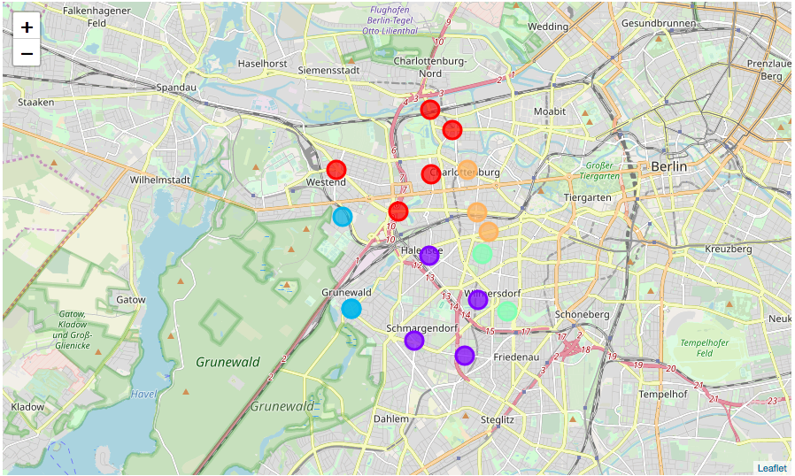

#### Examine Cluster 1
<div>
<table border="1" class="dataframe">
  <thead>
    <tr style="text-align: right;">
      <th></th>
      <th>Longitude</th>
      <th>1st Most Common Venue</th>
      <th>2nd Most Common Venue</th>
      <th>3rd Most Common Venue</th>
      <th>4th Most Common Venue</th>
      <th>5th Most Common Venue</th>
      <th>6th Most Common Venue</th>
      <th>7th Most Common Venue</th>
      <th>8th Most Common Venue</th>
      <th>9th Most Common Venue</th>
      <th>10th Most Common Venue</th>
    </tr>
  </thead>
  <tbody>
    <tr>
      <th>0</th>
      <td>13.29610</td>
      <td>Predics</td>
      <td>Crimes</td>
      <td>Schools</td>
      <td>Rentals</td>
      <td>Platform</td>
      <td>Bakery</td>
      <td>Italian Restaurant</td>
      <td>Bus Stop</td>
      <td>Fast Food Restaurant</td>
      <td>Museum</td>
    </tr>
    <tr>
      <th>4</th>
      <td>13.30473</td>
      <td>Predics</td>
      <td>Schools</td>
      <td>Rentals</td>
      <td>Asian Restaurant</td>
      <td>Supermarket</td>
      <td>Italian Restaurant</td>
      <td>Coffee Shop</td>
      <td>Hotel</td>
      <td>Pet Store</td>
      <td>Park</td>
    </tr>
    <tr>
      <th>6</th>
      <td>13.28370</td>
      <td>Predics</td>
      <td>Crimes</td>
      <td>Rentals</td>
      <td>Hotel</td>
      <td>Boarding House</td>
      <td>Mexican Restaurant</td>
      <td>Doner Restaurant</td>
      <td>Asian Restaurant</td>
      <td>Donut Shop</td>
      <td>Scenic Lookout</td>
    </tr>
    <tr>
      <th>3</th>
      <td>13.29639</td>
      <td>Predics</td>
      <td>Crimes</td>
      <td>Rentals</td>
      <td>Café</td>
      <td>Art Museum</td>
      <td>Trattoria/Osteria</td>
      <td>Ice Cream Shop</td>
      <td>German Restaurant</td>
      <td>Taverna</td>
      <td>Italian Restaurant</td>
    </tr>
    <tr>
      <th>2</th>
      <td>13.25981</td>
      <td>Predics</td>
      <td>Crimes</td>
      <td>Rentals</td>
      <td>Bus Stop</td>
      <td>Café</td>
      <td>Park</td>
      <td>Italian Restaurant</td>
      <td>Bakery</td>
      <td>Plaza</td>
      <td>Metro Station</td>
    </tr>
  </tbody>
</table>
</div>


#### Examine Cluster 2

<div>
<table border="1" class="dataframe">
  <thead>
    <tr style="text-align: right;">
      <th></th>
      <th>Longitude</th>
      <th>1st Most Common Venue</th>
      <th>2nd Most Common Venue</th>
      <th>3rd Most Common Venue</th>
      <th>4th Most Common Venue</th>
      <th>5th Most Common Venue</th>
      <th>6th Most Common Venue</th>
      <th>7th Most Common Venue</th>
      <th>8th Most Common Venue</th>
      <th>9th Most Common Venue</th>
      <th>10th Most Common Venue</th>
    </tr>
  </thead>
  <tbody>
    <tr>
      <th>14</th>
      <td>13.31476</td>
      <td>Rentals</td>
      <td>Hotel</td>
      <td>Mexican Restaurant</td>
      <td>Climbing Gym</td>
      <td>Gas Station</td>
      <td>Doner Restaurant</td>
      <td>Hot Spring</td>
      <td>Moving Target</td>
      <td>Ice Cream Shop</td>
      <td>Indian Restaurant</td>
    </tr>
    <tr>
      <th>9</th>
      <td>13.29569</td>
      <td>Crimes</td>
      <td>Rentals</td>
      <td>Supermarket</td>
      <td>Drugstore</td>
      <td>Plaza</td>
      <td>Café</td>
      <td>Italian Restaurant</td>
      <td>Turkish Restaurant</td>
      <td>Soup Place</td>
      <td>Korean Restaurant</td>
    </tr>
    <tr>
      <th>11</th>
      <td>13.29005</td>
      <td>Schools</td>
      <td>Rentals</td>
      <td>Bakery</td>
      <td>Bank</td>
      <td>Café</td>
      <td>Ice Cream Shop</td>
      <td>Italian Restaurant</td>
      <td>Pub</td>
      <td>Bookstore</td>
      <td>Chinese Restaurant</td>
    </tr>
    <tr>
      <th>12</th>
      <td>13.30951</td>
      <td>Schools</td>
      <td>Rentals</td>
      <td>Supermarket</td>
      <td>Italian Restaurant</td>
      <td>Park</td>
      <td>Greek Restaurant</td>
      <td>Gas Station</td>
      <td>French Restaurant</td>
      <td>Flower Shop</td>
      <td>Liquor Store</td>
    </tr>
  </tbody>
</table>
</div>


#### Perform hierarchical Clustering - Agglomerative with number of clusters equal to 5

<div>
<table border="1" class="dataframe">
  <thead>
    <tr style="text-align: right;">
      <th></th>
      <th>Latitude</th>
      <th>Longitude</th>
      <th>Borough</th>
      <th>Neighborhood</th>
      <th>Cluster Labels</th>
      <th>1st Most Common Venue</th>
      <th>2nd Most Common Venue</th>
      <th>3rd Most Common Venue</th>
      <th>4th Most Common Venue</th>
      <th>5th Most Common Venue</th>
      <th>6th Most Common Venue</th>
      <th>7th Most Common Venue</th>
      <th>8th Most Common Venue</th>
      <th>9th Most Common Venue</th>
      <th>10th Most Common Venue</th>
    </tr>
  </thead>
  <tbody>
    <tr>
      <th>14</th>
      <td>52.48547</td>
      <td>13.31476</td>
      <td>Charlottenburg-Wilmersdorf</td>
      <td>Barstraße</td>
      <td>4</td>
      <td>Rentals</td>
      <td>Hotel</td>
      <td>Mexican Restaurant</td>
      <td>Climbing Gym</td>
      <td>Gas Station</td>
      <td>Doner Restaurant</td>
      <td>Hot Spring</td>
      <td>Moving Target</td>
      <td>Ice Cream Shop</td>
      <td>Indian Restaurant</td>
    </tr>
    <tr>
      <th>0</th>
      <td>52.53045</td>
      <td>13.29610</td>
      <td>Charlottenburg-Wilmersdorf</td>
      <td>Charlottenburg-Nord</td>
      <td>0</td>
      <td>Predics</td>
      <td>Crimes</td>
      <td>Schools</td>
      <td>Rentals</td>
      <td>Platform</td>
      <td>Bakery</td>
      <td>Italian Restaurant</td>
      <td>Bus Stop</td>
      <td>Fast Food Restaurant</td>
      <td>Museum</td>
    </tr>
    <tr>
      <th>13</th>
      <td>52.49644</td>
      <td>13.31653</td>
      <td>Charlottenburg-Wilmersdorf</td>
      <td>Düsseldorfer Straße</td>
      <td>2</td>
      <td>Predics</td>
      <td>Crimes</td>
      <td>Rentals</td>
      <td>Hotel</td>
      <td>Vietnamese Restaurant</td>
      <td>Bakery</td>
      <td>Italian Restaurant</td>
      <td>Plaza</td>
      <td>German Restaurant</td>
      <td>Café</td>
    </tr>
  </tbody>
</table>
</div>

##### create map of clustered neighborhoods in Charlottenburg-Wilmersdorf

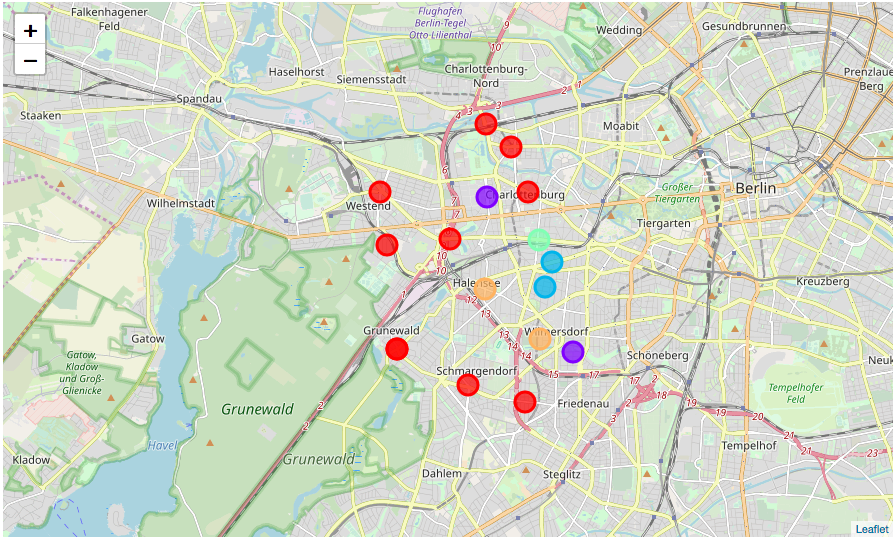

# Discussion
Within the project I combined four different type of information sources: crime, rental, school, venue into a single data set. This data set was used to cluster the neighborhoods in a borough of Berlin, namely Charlottenburg-Wilmersdorf. Using additional information to venues allows one for a more accurate estimate of the temporal accommodation for the new hire. Certainly, clustering the current location of the potential new hire should be done prior and this information should be used for a prediction of the best-fit based on more complex algorithms. Also using data from  different social activities of the client and including more information sources will help to improve the accuracy and reliability of the accommodation prediction.

# Conclusion
I have shown that the modern approach based on the big data could help to find the best possible place for the temporary accommodation based on the following categories: venues,  rental (monthly) costs, crimes, schools. The historical crime data were used not only as firm data but also allowed for including predictions of the total records for different neighborhoods in the clustering process. Visually inspecting the results of both clustering methods suggests to use k-means clustering instead of hierarchical one, as k-means provided a more meaningful result.

I have shown that the business needs, optimizing the rent of the temporary accommodation, are fulfilled. Including a profile of the client based on his current neighborhood could improve the relocation process even more  resulting in a better performance of the letting agency.

# Appendix
In the appendix I provide Jupiter notebooks to the corresponding chapters of the report

1. data preparation: https://github.com/sergiusdell75/Coursera_Capstone/blob/master/bon_data_preparation.ipynb
2. data visualization: https://github.com/sergiusdell75/Coursera_Capstone/blob/master/bon_visualization_statistics.ipynb
3. methodology and results: https://github.com/sergiusdell75/Coursera_Capstone/blob/master/bon_modeling_and_evaluation.ipynb
